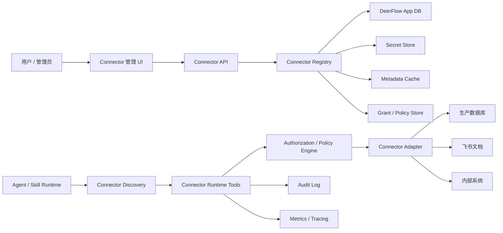
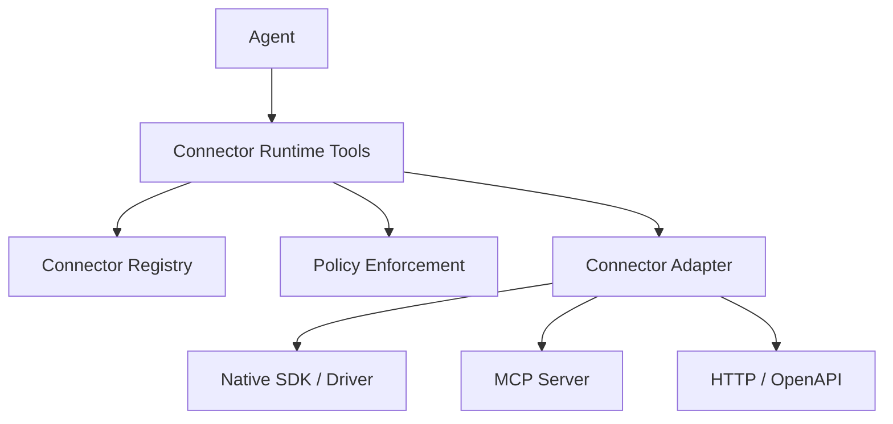

# Connector Platform Design

## 1. 背景

DeerFlow 目前已经具备模型配置、工具配置、MCP 扩展、skills、沙箱、guardrails、用户隔离和应用自身数据库配置等能力。为了让系统真正用于日常工作，下一步需要安全地接入用户的生产业务系统，例如：

- 生产数据库：PostgreSQL、MySQL、SQL Server、ClickHouse、Snowflake 等。
- 文档系统：飞书文档、知识库、内部文档平台。
- 内部系统：CRM、ERP、工单系统、指标平台、审批系统、搜索服务、HTTP/OpenAPI 服务。
- 文件和数据仓库：对象存储、数据湖、BI 数据集。

这些外部系统具备几个共同特征：

- 用户会动态添加、修改、禁用连接。
- 同一个用户或团队会配置多个连接。
- 不同连接拥有不同的认证方式、权限范围和风险等级。
- skill 和 agent 需要使用这些连接，但不应该直接接触真实密钥。
- 生产数据访问需要审计、权限控制、脱敏、限流和失败隔离。

因此，本设计建议引入一套平台级的 Connector 体系。Connector 不是简单的环境变量，也不是某个 skill 内部的私有配置，而是 DeerFlow 中可被管理、授权、发现、调用和审计的一等资源。

## 2. 目标

### 2.1 产品目标

- 用户可以在 UI 或 API 中动态添加多个外部系统连接。
- 用户可以测试连接、查看健康状态、查看可访问资源。
- 用户可以把连接授权给指定 agent、skill、用户、团队或线程。
- agent 可以在运行时发现当前上下文可用的连接能力。
- skill 可以声明自己需要的连接能力，而不是硬编码具体连接信息。
- 管理员可以查看连接使用记录和风险操作记录。

### 2.2 工程目标

- 连接密钥不进入 prompt，不直接暴露给 LLM、skill 文本或普通工具结果。
- 连接调用统一经过权限、策略、审计、限流和错误处理。
- 支持多种 ConnectorType，并允许逐步扩展。
- 支持 MCP 作为底层实现之一，但不把 MCP 配置直接暴露为产品抽象。
- 生产数据库默认只读，并通过代码级限制防止危险 SQL。
- 与现有 DeerFlow 配置、skills、MCP、guardrails、用户隔离体系兼容。

## 3. 非目标

第一版不追求以下能力：

- 不实现所有数据库类型。
- 不实现通用 ETL 或长期数据同步平台。
- 不让 agent 获得原始数据库密码、OAuth token 或 API key。
- 不提供无限制 SQL 执行能力。
- 不把 DeerFlow 自身的 `database:` 配置复用为业务数据连接。
- 不要求所有 connector 都基于 MCP。

## 4. 设计结论

推荐方案是：

> 对用户暴露 Connector，对系统内部使用 SecretRef 和环境变量解析密钥。

环境变量只解决密钥来源问题，例如 `$PROD_ORDERS_DB_PASSWORD`。Connector 解决的是资源管理问题，例如这个连接叫什么、属于谁、能做什么、授权给谁、访问哪些表、如何审计、如何脱敏、是否启用。

## 5. 核心概念

### 5.1 ConnectorType

Connector 类型，描述一类外部系统的能力和适配器。例如：

- `postgres`
- `mysql`
- `lark_doc`
- `internal_http`
- `openapi`
- `s3`

ConnectorType 是系统或插件注册的静态定义，通常由代码或插件提供。

### 5.2 ConnectorInstance

用户创建的具体连接实例。例如：

- `prod_orders_db`
- `crm_readonly`
- `finance_lark_docs`
- `ticketing_api`

ConnectorInstance 是运行时动态资源，应该存储在 DeerFlow 应用数据库中，而不是写死在 `config.yaml`。

### 5.3 CredentialRef

密钥引用。ConnectorInstance 不直接保存明文密码或 token，而是保存一个引用：

- 本地部署：引用加密存储或环境变量。
- 企业部署：引用 KMS、Vault、云 Secret Manager。
- OAuth 类型：引用 access token、refresh token 和过期时间。

### 5.4 Capability

Connector 对外暴露的能力。agent/skill 不应该关心底层系统细节，而应该通过能力调用资源。

常见 capability：

- `database.query`
- `database.schema.inspect`
- `database.table.sample`
- `document.search`
- `document.read`
- `document.write`
- `api.call`
- `file.read`
- `file.write`

### 5.5 Grant

授权关系。Grant 描述谁可以使用哪个 connector 的哪些 capability。

授权主体可以是：

- 用户
- 团队
- agent
- skill
- thread
- channel 会话

### 5.6 Policy

连接级或授权级策略。Policy 描述访问边界，例如：

- 只读或可写。
- 允许访问哪些 schema、table、document space、API path。
- 最大返回行数。
- 查询超时时间。
- 是否需要审批。
- 是否脱敏。
- 是否允许导出文件。

## 6. 总体架构



系统分为四层：

1. 控制面：创建、更新、测试、禁用、授权 connector。
2. 注册与治理层：保存 connector 元数据、密钥引用、策略、grant、schema cache、审计日志。
3. 运行时工具层：给 agent 暴露统一工具，例如 `list_connectors`、`query_database`、`search_documents`。
4. 适配器层：每种 ConnectorType 的具体实现，例如 Postgres、飞书文档、内部 API。

## 7. 和现有系统的关系

### 7.1 不复用 `database:`

现有 `config.yaml` 中的 `database:` 是 DeerFlow 自身状态存储，用于 checkpointer、runs、thread metadata、feedback 等应用数据。

业务生产数据库不应该混入该配置。原因：

- 生命周期不同：系统库由管理员配置，业务库由用户动态添加。
- 安全边界不同：系统库是内部状态，业务库是外部敏感数据源。
- 权限模型不同：系统库服务 DeerFlow，业务库服务用户任务。
- 数量模型不同：系统库通常一个，业务库可能很多。

### 7.2 和 MCP 的关系

MCP 可以作为 Connector 的一种底层执行方式，但不应该成为用户侧唯一抽象。

推荐关系：



这样做的好处：

- 用户理解的是连接资源，而不是 MCP server 进程。
- 系统可以统一做授权、审计、脱敏和限流。
- 某些 connector 可用 MCP 实现，某些 connector 可直接用 SDK 或 HTTP。
- 未来替换底层实现时，不影响 skill 和 agent 的调用方式。

### 7.3 和 Skill 的关系

skill 声明能力需求，不声明密钥和连接 URL。

示例：

```yaml
name: ops-analysis
requires:
  connectors:
    - capability: database.query
      purpose: 分析订单、收入、库存和用户行为
    - capability: document.read
      purpose: 读取业务知识库和指标口径文档
```

运行时系统根据当前用户、agent、skill 和 thread 的授权，注入可用连接摘要。

## 8. 数据模型

### 8.1 ConnectorType

ConnectorType 可以由代码注册，也可以由插件注册。第一版建议用代码注册，后续再支持插件化注册。

```json
{
  "type": "postgres",
  "category": "database",
  "display_name": "PostgreSQL",
  "adapter": "deerflow.connectors.postgres:PostgresConnector",
  "auth_modes": ["connection_url", "password"],
  "capabilities": [
    "database.query",
    "database.schema.inspect",
    "database.table.sample"
  ],
  "config_schema": {
    "host": {"type": "string", "required": true},
    "port": {"type": "integer", "default": 5432},
    "database": {"type": "string", "required": true},
    "ssl": {"type": "boolean", "default": true}
  },
  "credential_schema": {
    "username": {"type": "string", "required": true},
    "password": {"type": "secret", "required": true}
  }
}
```

### 8.2 ConnectorInstance

```json
{
  "id": "conn_prod_orders",
  "tenant_id": "tenant_001",
  "owner_id": "user_123",
  "name": "prod_orders_db",
  "display_name": "生产订单库",
  "type": "postgres",
  "status": "active",
  "config": {
    "host": "10.0.1.20",
    "port": 5432,
    "database": "orders",
    "ssl": true
  },
  "credential_ref": "secret_conn_prod_orders",
  "default_policy": {
    "mode": "read_only",
    "allowed_schemas": ["mart", "public"],
    "blocked_tables": ["user_passwords", "payment_cards"],
    "max_rows": 10000,
    "statement_timeout_ms": 30000,
    "pii_policy": "mask"
  },
  "created_at": "2026-06-03T10:00:00Z",
  "updated_at": "2026-06-03T10:00:00Z"
}
```

### 8.3 ConnectorCredential

第一版可以采用应用数据库加密存储，或仅保存环境变量引用。推荐抽象成 SecretStore 接口，避免后续迁移困难。

```json
{
  "id": "secret_conn_prod_orders",
  "tenant_id": "tenant_001",
  "provider": "env",
  "ref": "PROD_ORDERS_DATABASE_URL",
  "created_at": "2026-06-03T10:00:00Z",
  "rotated_at": "2026-06-03T10:00:00Z"
}
```

对于本地或单机部署，也可以是：

```json
{
  "id": "secret_conn_prod_orders",
  "tenant_id": "tenant_001",
  "provider": "encrypted_db",
  "encrypted_payload": "...",
  "key_id": "local-master-key"
}
```

### 8.4 ConnectorGrant

```json
{
  "id": "grant_001",
  "connector_id": "conn_prod_orders",
  "subject_type": "skill",
  "subject_id": "data-analysis",
  "capabilities": ["database.query", "database.schema.inspect"],
  "policy_override": {
    "allowed_schemas": ["mart"],
    "max_rows": 5000
  },
  "expires_at": null,
  "created_by": "user_123"
}
```

### 8.5 ConnectorAuditLog

```json
{
  "id": "audit_001",
  "connector_id": "conn_prod_orders",
  "thread_id": "thread_abc",
  "run_id": "run_xyz",
  "user_id": "user_123",
  "agent_id": "lead_agent",
  "skill_name": "data-analysis",
  "capability": "database.query",
  "operation": "query",
  "request_summary": {
    "sql_hash": "sha256:...",
    "tables": ["mart.orders", "mart.revenue_daily"]
  },
  "result_summary": {
    "row_count": 120,
    "elapsed_ms": 560
  },
  "decision": "allow",
  "policy_id": "policy_readonly_v1",
  "created_at": "2026-06-03T10:00:00Z"
}
```

## 9. API 设计

### 9.1 Connector Type API

```http
GET /api/connector-types
GET /api/connector-types/{type}
```

用途：

- 前端渲染创建表单。
- 展示支持的 connector 类型和能力。
- 校验用户提交配置。

### 9.2 Connector Instance API

```http
POST /api/connectors
GET /api/connectors
GET /api/connectors/{connector_id}
PATCH /api/connectors/{connector_id}
DELETE /api/connectors/{connector_id}
POST /api/connectors/{connector_id}/disable
POST /api/connectors/{connector_id}/enable
```

创建请求示例：

```json
{
  "name": "prod_orders_db",
  "display_name": "生产订单库",
  "type": "postgres",
  "config": {
    "host": "10.0.1.20",
    "port": 5432,
    "database": "orders",
    "ssl": true
  },
  "credential": {
    "provider": "env",
    "ref": "PROD_ORDERS_DATABASE_URL"
  },
  "default_policy": {
    "mode": "read_only",
    "allowed_schemas": ["mart", "public"],
    "max_rows": 10000,
    "statement_timeout_ms": 30000
  }
}
```

### 9.3 Test 和 Introspection API

```http
POST /api/connectors/{connector_id}/test
POST /api/connectors/{connector_id}/introspect
GET /api/connectors/{connector_id}/resources
GET /api/connectors/{connector_id}/schema
```

响应示例：

```json
{
  "status": "ok",
  "latency_ms": 42,
  "capabilities": ["database.query", "database.schema.inspect"],
  "resources": {
    "schemas": ["public", "mart"],
    "tables": [
      {"schema": "mart", "name": "orders"},
      {"schema": "mart", "name": "revenue_daily"}
    ]
  }
}
```

### 9.4 Grant API

```http
POST /api/connectors/{connector_id}/grants
GET /api/connectors/{connector_id}/grants
PATCH /api/connectors/{connector_id}/grants/{grant_id}
DELETE /api/connectors/{connector_id}/grants/{grant_id}
```

### 9.5 Audit API

```http
GET /api/connectors/{connector_id}/audit
GET /api/connector-audit
```

查询维度：

- connector
- user
- agent
- skill
- thread
- capability
- decision
- time range

## 10. Runtime Tool 设计

### 10.1 工具列表

第一版建议提供少量统一工具，而不是每个 connector 动态生成大量工具。

```text
list_connectors
inspect_connector
query_database
sample_database_table
search_documents
read_document
call_connector_action
```

原因：

- 避免连接数量增加后工具上下文膨胀。
- 降低模型选错工具的概率。
- 统一权限、审计和错误处理。
- 后续可以通过 tool_search 做延迟发现。

### 10.2 list_connectors

返回当前上下文可用 connector 的安全摘要。

输入：

```json
{
  "capability": "database.query"
}
```

输出：

```json
{
  "connectors": [
    {
      "id": "conn_prod_orders",
      "name": "prod_orders_db",
      "display_name": "生产订单库",
      "type": "postgres",
      "capabilities": ["database.query", "database.schema.inspect"],
      "policy_summary": {
        "mode": "read_only",
        "max_rows": 10000,
        "allowed_schemas": ["mart", "public"]
      }
    }
  ]
}
```

不返回：

- 密码
- token
- host 细节
- 完整连接 URL

### 10.3 inspect_connector

用于查看 schema、文档空间、API resources 等元数据。

输入：

```json
{
  "connector_id": "conn_prod_orders",
  "resource_type": "schema"
}
```

输出：

```json
{
  "schemas": [
    {
      "name": "mart",
      "tables": [
        {
          "name": "orders",
          "columns": [
            {"name": "order_id", "type": "bigint"},
            {"name": "created_at", "type": "timestamp"},
            {"name": "amount", "type": "numeric"}
          ]
        }
      ]
    }
  ],
  "cached_at": "2026-06-03T10:00:00Z"
}
```

### 10.4 query_database

输入：

```json
{
  "connector_id": "conn_prod_orders",
  "sql": "select date(created_at) as dt, count(*) as orders from mart.orders group by 1 order by 1 desc limit 30",
  "reason": "分析最近 30 天订单趋势"
}
```

执行链路：

1. 根据 runtime context 解析 user、thread、agent、skill。
2. 校验 connector 是否存在且 active。
3. 校验当前主体是否有 `database.query` capability。
4. 合并 connector default_policy 和 grant policy_override。
5. SQL AST 校验。
6. 注入只读事务、timeout、max rows。
7. 执行查询。
8. 对结果做脱敏和大小控制。
9. 写 audit log。
10. 返回结构化结果。

输出：

```json
{
  "columns": [
    {"name": "dt", "type": "date"},
    {"name": "orders", "type": "integer"}
  ],
  "rows": [
    ["2026-06-03", 1204],
    ["2026-06-02", 1188]
  ],
  "row_count": 30,
  "truncated": false,
  "elapsed_ms": 420
}
```

## 11. 权限模型

### 11.1 授权判断

授权判断输入：

- `user_id`
- `tenant_id`
- `thread_id`
- `agent_id`
- `skill_name`
- `connector_id`
- `capability`
- `operation_args`

授权判断输出：

```json
{
  "allow": true,
  "effective_policy": {
    "mode": "read_only",
    "allowed_schemas": ["mart"],
    "max_rows": 5000,
    "statement_timeout_ms": 30000
  },
  "reason": "skill grant matched"
}
```

### 11.2 Policy 合并规则

Policy 建议采用从宽到窄的合并方式：

1. 系统默认策略。
2. ConnectorType 默认策略。
3. ConnectorInstance default_policy。
4. ConnectorGrant policy_override。
5. Runtime 临时策略。

合并原则：

- 风险限制取更严格值。
- allowlist 取交集。
- blocklist 取并集。
- max_rows 取更小值。
- timeout 取更小值。
- read_only 不能被低层策略提升为 write。

### 11.3 授权粒度

第一版建议支持：

- 用户拥有者自动拥有管理权限。
- 管理员可以管理租户内 connector。
- skill grant 用于“这个 skill 可以使用哪些连接能力”。
- thread grant 用于临时授权。

后续支持：

- 团队级授权。
- channel 级授权。
- 审批后临时授权。
- 基于数据分类的授权。

## 12. 数据库 Connector 设计

### 12.1 默认安全策略

生产数据库 connector 必须默认只读。

建议默认策略：

```json
{
  "mode": "read_only",
  "allow_write": false,
  "allow_ddl": false,
  "max_rows": 10000,
  "statement_timeout_ms": 30000,
  "allow_multi_statement": false,
  "require_limit": true,
  "pii_policy": "mask"
}
```

### 12.2 SQL 安全校验

不能只靠 prompt 约束 SQL。工具层必须做代码级校验。

建议：

- 使用 SQL parser 解析 AST。
- 只允许 `SELECT` / `WITH SELECT`。
- 禁止多语句。
- 禁止 `INSERT`、`UPDATE`、`DELETE`、`MERGE`、`DROP`、`ALTER`、`CREATE`、`TRUNCATE`。
- 禁止危险函数和扩展命令。
- 校验 schema/table allowlist。
- 自动追加或校验 `LIMIT`。
- 强制只读事务。

Postgres 示例执行前置：

```sql
SET LOCAL statement_timeout = '30000ms';
SET TRANSACTION READ ONLY;
```

### 12.3 Schema Introspection

数据库连接创建或手动刷新时，系统可以缓存：

- schema
- table
- column
- primary key
- row count estimate
- column comments
- table comments
- sample rows

缓存用途：

- 给 agent 理解数据结构。
- 减少实时 introspection 压力。
- 支持搜索表和字段。
- 支持生成更准确 SQL。

需要注意：

- sample rows 必须经过脱敏。
- 元数据 cache 要记录更新时间。
- 用户可以关闭 sample rows。

### 12.4 结果返回策略

结果集可能很大，不能无限塞进模型上下文。

建议：

- 小结果直接返回结构化 rows。
- 中等结果落到 thread 文件，并返回摘要和文件引用。
- 大结果拒绝或要求用户缩小范围。
- 对可视化分析场景，可以返回临时 CSV artifact。

默认限制：

- 最大行数：10000。
- 最大返回字节数：例如 2MB。
- 最大单字段长度：例如 4096 字符。

## 13. 文档 Connector 设计

以飞书文档为例，能力可以包括：

- `document.search`
- `document.read`
- `document.write`
- `document.export`
- `document.comment`

文档 connector 的策略字段：

```json
{
  "allowed_spaces": ["product_kb"],
  "allowed_folder_tokens": ["fld_xxx"],
  "allow_write": false,
  "max_documents_per_query": 20,
  "export_enabled": false
}
```

运行时工具：

```text
search_documents(connector_id, query, limit)
read_document(connector_id, document_id)
write_document(connector_id, document_id, patch)
```

安全要求：

- OAuth token 不进入 prompt。
- 文档内容可以进入上下文，但需要遵循权限。
- 写操作默认关闭。
- 写操作建议支持 human approval 或 guardrails。
- 需要记录读取和写入审计。

## 14. 内部系统 Connector 设计

内部系统一般通过 HTTP、OpenAPI、RPC 或公司 SDK 调用。

建议支持两类：

### 14.1 Internal HTTP Connector

适合简单内部 API：

```json
{
  "type": "internal_http",
  "config": {
    "base_url": "https://internal.example.com",
    "auth_type": "bearer"
  },
  "policy": {
    "allowed_methods": ["GET", "POST"],
    "allowed_paths": ["/api/orders/search", "/api/users/profile"],
    "blocked_paths": ["/api/admin/*"],
    "timeout_ms": 10000
  }
}
```

### 14.2 OpenAPI Connector

适合有 OpenAPI schema 的系统：

- 上传或引用 OpenAPI spec。
- 系统解析 endpoint、request schema、response schema。
- 根据 policy 过滤可见 endpoint。
- 生成 `call_connector_action` 的 action catalog。

agent 不直接构造任意 URL，而是调用被授权 action。

## 15. Guardrails 集成

Connector Runtime Tools 应该继续经过 DeerFlow 现有 guardrails middleware。

同时 connector 内部也要有自己的 policy enforcement。两层职责不同：

- Guardrails：判断这个 agent 是否允许调用某类工具。
- Connector Policy：判断这个主体是否允许访问某个 connector 的某个资源。

例如：

```text
guardrails 允许 query_database 工具
connector policy 再判断是否允许查询 prod_orders_db 的 mart.orders 表
```

两层都必须存在。不能只依赖其中一层。

## 16. Secret Store 设计

### 16.1 Secret Provider

定义统一接口：

```python
class SecretStore:
    def get_secret(self, ref: str, context: SecretContext) -> SecretValue:
        ...

    def put_secret(self, payload: dict, context: SecretContext) -> str:
        ...

    def rotate_secret(self, ref: str, payload: dict, context: SecretContext) -> None:
        ...
```

第一版可支持：

- `env`：从环境变量读取。
- `encrypted_db`：应用数据库加密存储。

后续支持：

- HashiCorp Vault。
- AWS Secrets Manager。
- Azure Key Vault。
- GCP Secret Manager。
- Kubernetes Secret。

### 16.2 密钥使用原则

- 密钥只在 adapter 执行时取出。
- 密钥不进入 LLM prompt。
- 密钥不写入 audit log。
- 密钥不返回给前端。
- 连接测试错误不能泄露密码或 token。
- 日志中需要做 secret redaction。

## 17. UI 设计

### 17.1 Connector 列表页

显示：

- 名称
- 类型
- 状态
- 最近使用时间
- 健康状态
- 授权数量
- 创建人

操作：

- 新建连接
- 测试连接
- 查看详情
- 禁用/启用
- 删除
- 查看审计

### 17.2 创建连接页

步骤：

1. 选择 ConnectorType。
2. 填写基础配置。
3. 填写或引用密钥。
4. 测试连接。
5. 配置默认策略。
6. 授权给 skill、agent 或用户。

### 17.3 详情页

模块：

- 基础信息。
- 连接健康状态。
- 能力列表。
- 资源浏览，例如 schema/table 或文档空间。
- Policy 配置。
- Grant 列表。
- Audit log。

## 18. 错误处理

错误需要分层：

### 18.1 用户可理解错误

返回给 agent 或 UI：

- connector 不存在。
- connector 已禁用。
- 当前用户无权访问。
- 查询超时。
- SQL 不符合只读策略。
- 访问了未授权 schema/table。
- 返回结果过大。

### 18.2 内部错误

写入日志和 tracing：

- 密钥读取失败。
- adapter 初始化失败。
- MCP server 启动失败。
- OAuth refresh 失败。
- 网络连接失败。

### 18.3 Agent 友好错误

工具返回应该告诉 agent 如何修正：

```json
{
  "error": {
    "code": "connector.sql.table_not_allowed",
    "message": "当前连接不允许访问 private.users 表。可访问 schema: mart, public。",
    "recoverable": true
  }
}
```

## 19. 可观测性

每次 connector 调用应记录：

- connector id
- connector type
- capability
- user id
- agent id
- skill name
- thread id
- run id
- latency
- result size
- decision
- error code

指标：

- 调用次数。
- 成功率。
- 平均延迟。
- P95/P99 延迟。
- 拒绝次数。
- 查询超时次数。
- 大结果截断次数。
- OAuth refresh 失败次数。

## 20. 多租户和用户隔离

所有 connector 相关数据必须带 `tenant_id` 或等价 owner scope。

隔离要求：

- 用户只能看到自己有权限的 connector。
- agent 只能使用当前上下文授权的 connector。
- thread 临时授权不能泄露到其他 thread。
- schema cache 和 audit log 也要按租户隔离。
- 删除用户或租户时，需要处理 connector 和 secret 生命周期。

## 21. 配置方式

### 21.1 静态系统配置

用于声明系统支持哪些 connector type，以及启用哪些 secret provider。

可以放在 `config.yaml`：

```yaml
connectors:
  enabled: true
  secret_store:
    provider: encrypted_db
  default_policy:
    database:
      mode: read_only
      max_rows: 10000
      statement_timeout_ms: 30000
```

### 21.2 动态用户配置

用户创建的 ConnectorInstance 存在应用数据库中，不写入 `config.yaml`。

原因：

- 用户会随时添加、删除、修改。
- 多用户多租户需要隔离。
- UI 需要实时展示和管理。
- 修改后不应该要求重启服务。

## 22. 运行时注入给 Agent 的上下文

系统不把完整 connector 配置塞进 prompt，只注入安全摘要。

示例：

```text
当前可用连接资源：

1. prod_orders_db
   类型：PostgreSQL
   能力：database.query, database.schema.inspect
   范围：只读；允许 schema: mart, public；最多返回 10000 行
   用途：订单、收入、履约分析

2. product_docs
   类型：飞书文档
   能力：document.search, document.read
   范围：产品知识库，只读
   用途：查询指标口径和业务说明
```

不注入：

- host
- port
- username
- password
- token
- 完整 URL
- 内部网络细节

## 23. 分阶段落地

### Phase 1：数据库只读分析 MVP

目标：

- 建立 Connector 数据模型。
- 支持动态创建多个 PostgreSQL/MySQL 连接。
- 支持连接测试。
- 支持 schema introspection。
- 支持 `list_connectors`、`inspect_connector`、`query_database`。
- 支持只读 SQL、安全校验、行数限制、超时。
- 支持基础 grant 和 audit。

不做：

- 写操作。
- OAuth connector。
- 复杂审批。
- 大规模数据同步。

### Phase 2：Skill 和 Agent 授权集成

目标：

- skill 可以声明 connector capability requirements。
- 运行时根据 skill、agent、user、thread 注入可用 connector。
- 支持 grant policy override。
- 支持 connector tool_search 延迟发现。

### Phase 3：文档类 Connector

目标：

- 支持飞书文档 connector。
- 支持 document search/read。
- 支持文档空间和文件夹级授权。
- 支持 OAuth 或 app credential。

### Phase 4：内部系统 / OpenAPI Connector

目标：

- 支持 internal_http。
- 支持 OpenAPI schema 导入。
- 支持 action catalog。
- 支持 path/method 级 policy。

### Phase 5：企业治理能力

目标：

- 团队共享。
- 审批流。
- 临时授权。
- Secret rotation。
- 更细粒度数据分类和脱敏。
- 审计报表。
- 异常访问告警。

## 24. 目录和模块建议

后端建议新增：

```text
backend/packages/harness/deerflow/connectors/
  __init__.py
  types.py
  registry.py
  service.py
  policy.py
  secrets.py
  audit.py
  tools.py
  adapters/
    __init__.py
    base.py
    postgres.py
    mysql.py
    lark_doc.py
    internal_http.py

backend/packages/harness/deerflow/config/
  connectors_config.py

backend/app/gateway/routers/
  connectors.py
```

测试建议：

```text
backend/tests/test_connectors_config.py
backend/tests/test_connectors_registry.py
backend/tests/test_connectors_policy.py
backend/tests/test_connectors_tools.py
backend/tests/test_postgres_connector_sql_safety.py
backend/tests/test_connectors_router.py
backend/tests/test_connectors_user_isolation.py
```

## 25. Adapter 接口草案

```python
from typing import Protocol, Any


class ConnectorAdapter(Protocol):
    type: str

    async def test(self, instance: ConnectorInstance, secrets: dict[str, Any]) -> ConnectorTestResult:
        ...

    async def introspect(self, instance: ConnectorInstance, secrets: dict[str, Any]) -> ConnectorMetadata:
        ...

    async def execute(
        self,
        instance: ConnectorInstance,
        capability: str,
        args: dict[str, Any],
        policy: EffectivePolicy,
        context: ConnectorRuntimeContext,
    ) -> ConnectorResult:
        ...
```

数据库 adapter 可进一步拆出：

```python
class DatabaseConnectorAdapter(ConnectorAdapter, Protocol):
    async def query(
        self,
        instance: ConnectorInstance,
        sql: str,
        policy: DatabasePolicy,
        context: ConnectorRuntimeContext,
    ) -> QueryResult:
        ...
```

## 26. 风险和缓解

| 风险 | 说明 | 缓解 |
|---|---|---|
| 生产数据泄露 | agent 查询了敏感字段或大批量数据 | allowlist、脱敏、max rows、审计、只读账号 |
| 危险 SQL | LLM 生成写入或 DDL SQL | AST 校验、只读事务、只读账号 |
| 工具上下文膨胀 | 连接太多导致工具和提示过大 | 统一工具、按 capability 发现、tool_search |
| 权限绕过 | skill 直接读取密钥或调用底层 MCP | 密钥隔离、connector tools 统一入口、guardrails |
| 动态配置不一致 | 用户修改连接后运行时仍使用旧配置 | registry 读最新配置、短 TTL cache |
| 内部系统副作用 | HTTP connector 调用写接口 | method/path policy、默认只读、审批 |
| 审计信息过敏 | audit log 保存了 SQL 明文或敏感值 | 保存 hash 和摘要，敏感字段 redaction |

## 27. 备选方案对比

### 27.1 方案 A：配置变量直接给 skill

示例：

```yaml
PROD_DB_URL: $PROD_DB_URL
```

优点：

- 实现快。
- 对单用户单连接场景足够简单。

缺点：

- skill 容易接触密钥。
- 多连接管理困难。
- 无统一授权模型。
- 无统一审计和脱敏。
- 用户动态添加连接不自然。
- 难以支持飞书文档、内部系统等非数据库资源。

结论：不推荐作为主架构，只适合作为 SecretRef 的底层实现。

### 27.2 方案 B：直接暴露 MCP 配置

优点：

- 复用现有 MCP 生态。
- 可以快速接入部分数据库或外部工具。

缺点：

- MCP server 不是用户友好的连接资源模型。
- 动态用户配置、多租户和权限管理困难。
- 不同 MCP server 的权限和审计能力不一致。
- 难以统一 UI 和治理。

结论：MCP 可作为 adapter 的实现方式，不建议作为产品层主抽象。

### 27.3 方案 C：Connector Platform

优点：

- 支持动态、多实例、多类型。
- 权限、审计、密钥、安全策略统一。
- skill 和 agent 使用能力抽象，解耦底层系统。
- 可逐步支持数据库、文档、内部 API。
- 适合长期产品化。

缺点：

- 第一版建设成本更高。
- 需要设计数据模型和管理 API。
- 需要维护 adapter 层。

结论：推荐。

## 28. 开放问题

需要进一步确认：

1. 第一版是否只支持 Postgres，还是同时支持 MySQL。
2. Secret 第一版使用环境变量引用，还是应用数据库加密存储。
3. 是否需要团队/租户模型作为第一版硬要求。
4. 是否需要 UI 创建连接，还是先提供 API。
5. 数据库查询结果是否允许落文件。
6. 是否需要 human approval 才能访问某些高风险 connector。
7. SQL 审计保存完整 SQL，还是保存脱敏 SQL 和 hash。
8. 飞书文档 connector 是否复用现有 lark skill/cli 能力，还是单独实现 adapter。

## 29. 推荐第一版范围

建议第一版聚焦：

- Connector Registry。
- SecretRef。
- Postgres 只读 connector。
- 连接测试。
- schema introspection。
- `list_connectors`。
- `inspect_connector`。
- `query_database`。
- skill/agent/user 级基础 grant。
- SQL 安全校验。
- 基础 audit log。

第一版成功标准：

- 用户可以动态添加两个以上生产库连接。
- agent 能根据当前授权选择正确连接。
- skill 不接触真实密钥。
- 所有数据库查询都可审计。
- 写 SQL 和越权 table 查询会被代码拒绝。
- connector 修改后无需重启即可生效。

## 30. 总结

Connector Platform 应该成为 DeerFlow 连接外部业务系统的统一入口。它把“连接配置、密钥、权限、策略、审计、运行时调用”集中治理，同时给 skill 和 agent 暴露稳定的能力抽象。

短期可以先用数据库只读分析场景验证价值；长期可以自然扩展到飞书文档、内部系统、OpenAPI、对象存储和更多企业数据源。

最终形态不是让用户把变量塞进 skill，而是让用户管理 connector，让 skill 使用被授权的 capability。
