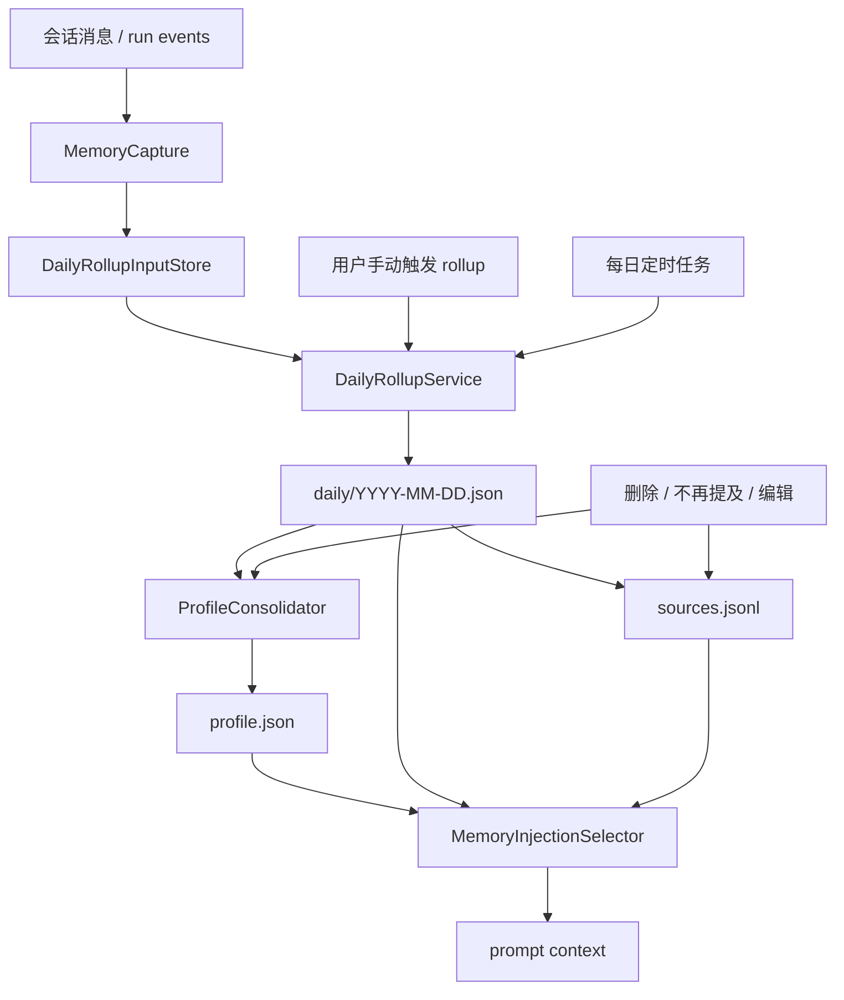
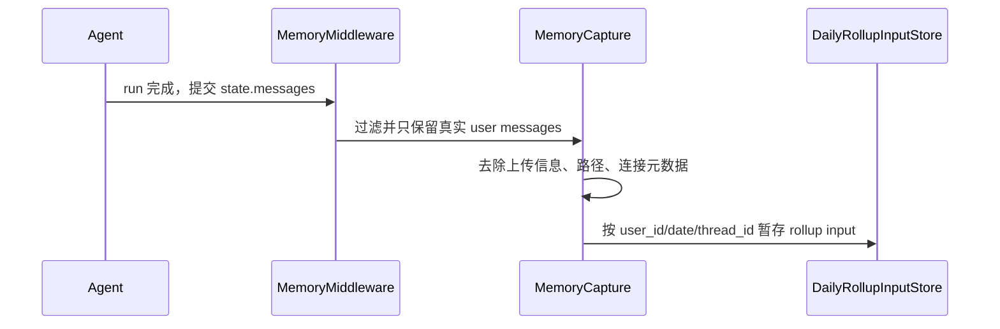
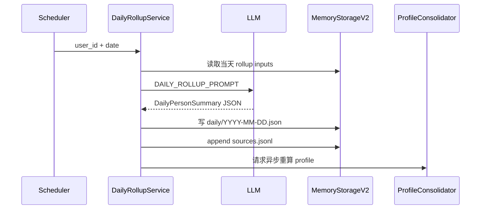
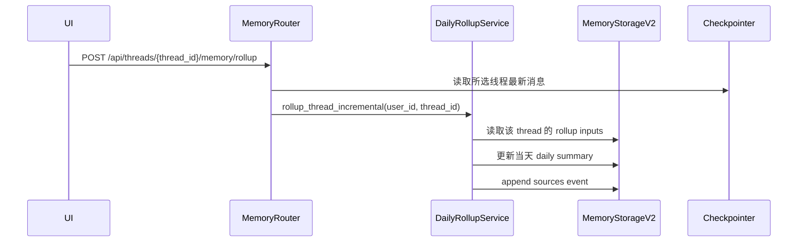
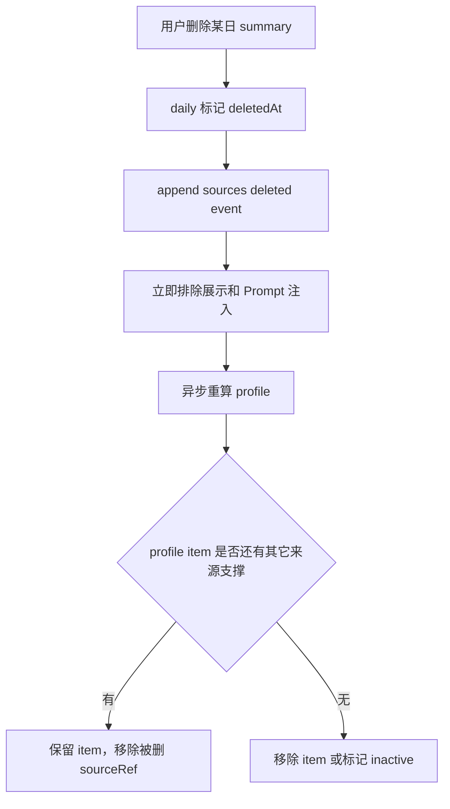
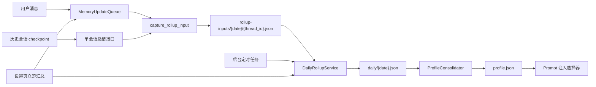

# 每日按人记忆系统架构设计

## 背景

本文档基于产品需求文档 [`docs/product/2026-06-05-memory-daily-person-summary.md`](../product/2026-06-05-memory-daily-person-summary.md)，设计一套以“每日按人总结”为核心的新记忆系统，用于替换当前 `MemoryUpdater -> memory.json` 直接滚动写入的旧记忆机制。

新系统的核心目标是：

- 以用户级记忆为唯一隔离维度，不做 agent 级记忆隔离。
- 每日定时 rollup；每个会话/线程支持用户手动触发 rollup。
- 前端展示“每日总结 + 长期画像”。
- 默认软删除每日总结，并异步重算长期画像。
- 记忆内容以用户画像、兴趣爱好、偏好、关注点、近期概览、skill 使用习惯为主，不记录具体任务结果、问题细节、连接信息和环境元数据。

## 当前系统概览

当前记忆系统主要由以下组件构成：

- `MemoryMiddleware`：在 agent 运行完成后捕获会话消息。
- `MemoryUpdateQueue`：按 debounce 聚合会话更新。
- `MemoryUpdater`：通过 LLM 直接更新 `memory.json` 中的 `user/history/facts`。
- `FileMemoryStorage`：提供按用户隔离的 JSON 文件读写。
- `format_memory_for_injection()`：将旧记忆结构格式化进 `<memory>`。
- `/api/memory`：提供旧记忆结构的查询、清空、导入导出和 fact CRUD。

主要问题：

- 会话级信息直接压缩进长期画像，缺少可审阅的证据层。
- 旧 facts 来源弱，难以解释“某条记忆为什么存在”。
- 时间衰减和临时上下文过期能力不足。
- 删除某段历史和更新长期画像之间没有清晰关系。
- 安全边界主要依赖 prompt 和过滤，缺少结构化策略层。

## 目标架构



核心分层：

- **捕获层**：只收集会话中适合进入 rollup 的用户真实输入，不采集助手回答和已注入记忆，不直接写长期记忆。
- **每日证据层**：按 `user_id + local_date` 生成 `DailyPersonSummary`。
- **长期画像层**：从每日总结中合并稳定偏好和用户画像，生成 `profile.json`。
- **来源索引层**：记录 daily summary、profile item、删除、编辑、不再提及之间的关系。
- **注入选择层**：按 token 预算、相关性、新鲜度和 suppression 规则生成 Prompt 记忆上下文。
- **兼容层**：迁移期将新结构映射为旧 `/api/memory` 响应，避免前端和调用方一次性断裂。

## 模块设计

### `memory.models`

定义新记忆系统的 Pydantic/domain models：

- `DailyPersonSummary`
- `MemoryProfile`
- `MemoryProfileItem`
- `MemorySourceRef`
- `MemorySuppression`
- `MemoryRollupRequest`
- `MemoryConsolidationResult`

这些模型应与 API response 共用或可稳定转换，避免路由层重复定义结构。

### `memory.storage_v2`

提供新文件布局的原子读写：

```text
users/{user_id}/memory/profile.json
users/{user_id}/memory/daily/{YYYY-MM-DD}.json
users/{user_id}/memory/sources.jsonl
users/{user_id}/memory/legacy-memory.json
users/{user_id}/memory/tombstones.jsonl
```

职责：

- 所有路径必须由 `user_id` 解析，禁止外部传入任意路径。
- JSON 文件写入使用临时文件 + replace，保持现有 `FileMemoryStorage` 的原子写风格。
- `sources.jsonl` 和 `tombstones.jsonl` 采用 append-only，便于审计。
- 读取 profile 和 daily 时过滤软删除记录。
- 提供轻量缓存，但以文件 mtime 作为失效依据。

### `memory.capture`

替代旧系统里“捕获后立即进入 `MemoryUpdater`”的写法。

职责：

- 从 `MemoryMiddleware` 接收过滤后的 messages。
- 只保留 `human/user` 消息，并移除 `<system-reminder>`、`<memory>` 等注入上下文。
- 不使用助手回复作为用户记忆证据。
- 去除 upload-only 内容和会话级临时文件信息。
- 生成 rollup 输入片段，按 `user_id + date + thread_id` 暂存。
- 保留最小来源信息：`thread_id`、`run_id`、时间、消息角色、去敏后的文本摘要。

第一版可以复用现有 `MemoryUpdateQueue` 的触发点，但处理目标从 `MemoryUpdater.update_memory()` 改为 `DailyRollupInputStore.add()`.

### `memory.rollup`

生成每日总结。

入口：

- 每日定时任务触发：处理某用户某日期的所有可用 rollup 输入。
- 会话/线程手动触发：处理指定 `thread_id`，并更新当天 summary。

职责：

- 调用 LLM 使用 `DAILY_ROLLUP_PROMPT`。
- 执行安全边界：只保留用户画像、偏好、兴趣、关注点、近期概览、skill 使用习惯。
- 对连接信息、路径、URL、密钥、数据库信息、文件元数据、具体结果、具体问题细节做拒存或抽象化。
- 生成或更新 `daily/{YYYY-MM-DD}.json`。
- 写入来源索引。

手动 rollup 建议是幂等的：同一 `thread_id` 多次触发，应覆盖或合并该线程在当天 daily summary 中的贡献，而不是重复追加。

### `memory.consolidation`

从每日总结生成长期画像。

职责：

- 读取未删除、未被 suppression 禁止参与合并的 daily summaries。
- 识别长期稳定的兴趣、偏好、画像、关注主题、skill 使用习惯。
- 生成 `profile.json`。
- 对仅由被删除来源支撑的 profile item 做移除。
- 对多来源支撑的 profile item 移除被删来源引用后继续保留。
- 维护 `topOfMind` 视图，用于表达用户最近关注点和近期大致在做什么。

第一版合并策略建议：

- 明确偏好或画像可单日进入 profile。
- 近期关注点和 skill 使用习惯优先进入 `topOfMind`，不直接作为永久事实。
- 低置信、单次且非偏好的信息只保留在 daily summary。
- `corrections` 可进入高优先级 profile item，但必须遵守安全边界，不记录具体问题细节。

### `memory.selection`

构造 Prompt 注入内容。

输入：

- 当前用户 `profile.json`
- 最近 1-7 天 daily summaries
- `sources.jsonl`
- `tombstones.jsonl`
- 当前请求文本
- `max_injection_tokens`

第一版选择策略：

- `profile.json` 总是优先注入。
- `corrections` 和 suppression 规则高优先级。
- daily snippets 使用规则、关键词、recency 选择，不引入 embedding/vector index。
- 不注入来源全文，只在必要时提供短 source id。
- 严格限制 token 预算，避免 Prompt 膨胀。

### `memory.migration`

从旧系统迁移。

建议默认策略：

- 首次启用新系统时，自动备份旧 `memory.json` 为 `legacy-memory.json`。
- 将旧 `user/history/facts` 转换为 `profile.json`。
- 旧 facts 缺少证据时，统一标记来源为 `legacy`。
- 不尝试从历史线程中重建旧事实来源，避免成本和误判。
- 迁移过程可重复运行，必须幂等。

## 数据模型

### `DailyPersonSummary`

```json
{
  "version": "1.0",
  "id": "daily_2026-06-05_default",
  "personId": "default",
  "date": "2026-06-05",
  "timezone": "Asia/Shanghai",
  "summary": "用户最近主要关注 DeerFlow 记忆系统设计，并偏好中文文档。",
  "interests": [],
  "preferences": [],
  "profileSignals": [],
  "recentFocus": [],
  "skillUsagePatterns": [],
  "corrections": [],
  "sourceThreads": [],
  "sourceRuns": [],
  "status": "active",
  "deletedAt": null,
  "updatedAt": ""
}
```

字段说明：

- `interests`：兴趣爱好和长期关注领域。
- `preferences`：表达风格、工作方式、工具使用偏好。
- `profileSignals`：可进入长期画像的候选信号。
- `recentFocus`：最近大致在做什么，只保留概览。
- `skillUsagePatterns`：skill、工具、文档、代码流程使用习惯。
- `corrections`：需要避免重复的抽象纠正，不记录具体问题细节。
- `status`：`active | deleted`。

相比产品文档中的初版字段，设计层建议把 `workContext/durableFacts/temporaryContext/openLoops` 收敛为更符合安全边界的字段，减少“具体任务结果和问题细节”进入结构的诱惑。

### `MemoryProfile`

```json
{
  "version": "1.0",
  "personId": "default",
  "updatedAt": "",
  "overview": "",
  "interests": [],
  "preferences": [],
  "communicationStyle": [],
  "skillUsagePatterns": [],
  "topOfMind": [],
  "corrections": [],
  "suppressions": []
}
```

`topOfMind` 单独维护，用于表达用户最近关注点和近期大致活动。它不是具体任务日志，不应包含具体结果、具体问题、连接信息或元数据。

### `MemoryProfileItem`

```json
{
  "id": "profile_pref_abc123",
  "type": "preference",
  "content": "用户偏好将产品、设计、执行类文档默认保存为中文。",
  "confidence": 0.95,
  "sourceRefs": [
    {
      "type": "daily",
      "id": "daily_2026-06-05_default"
    }
  ],
  "createdAt": "",
  "updatedAt": "",
  "status": "active"
}
```

### `MemorySourceEvent`

`sources.jsonl` 每行一条事件：

```json
{
  "eventId": "src_abc123",
  "eventType": "created|updated|deleted|suppressed|migrated",
  "targetType": "daily|profile_item",
  "targetId": "daily_2026-06-05_default",
  "userId": "default",
  "threadId": "thread_123",
  "runId": "run_456",
  "sourceKind": "rollup|manual|scheduled|legacy",
  "createdAt": ""
}
```

### `MemorySuppression`

```json
{
  "id": "sup_abc123",
  "scope": "profile_item|topic|daily",
  "targetId": "profile_pref_abc123",
  "reason": "user_do_not_mention",
  "createdAt": "",
  "createdBy": "user"
}
```

`suppression` 只影响注入和主动提及，不等同于删除来源。

## 关键流程

### 会话捕获



### 每日定时 rollup



### 手动会话 rollup



### 删除每日总结



## API 设计

### 新 API

```text
GET    /api/memory/profile
GET    /api/memory/daily?date=YYYY-MM-DD
GET    /api/memory/daily?limit=30
POST   /api/memory/daily/rollup
DELETE /api/memory/daily/{date}
POST   /api/memory/daily/{date}/restore
DELETE /api/memory/daily/{date}/purge
POST   /api/memory/consolidate
POST   /api/memory/migrate-legacy
POST   /api/memory/suppressions
DELETE /api/memory/suppressions/{id}
```

### 兼容 API

旧 `/api/memory` 在迁移期保留，但数据来源改为：

- 优先读取 `profile.json` 并转换为旧 `MemoryResponse`。
- 如果新 profile 不存在且旧 `memory.json` 存在，触发迁移或返回旧数据。
- fact CRUD 在迁移期应映射为 profile item CRUD 或 manual source event，不再直接写旧 `memory.json`。

### 手动 rollup request

```json
{
  "date": "2026-06-05",
  "threadId": "thread_123",
  "force": false
}
```

`date` 可选；未提供时按用户当前时区和 thread 时间推导。

## 调度设计

每日定时任务建议复用现有 Gateway scheduler 能力，而不是引入新的定时框架。

第一版调度策略：

- 默认在用户本地日期结束后触发。
- 如果无法确定用户时区，使用系统配置时区。
- 定时任务只处理有 rollup input 的用户和日期。
- rollup 失败应记录失败事件，下一次调度可重试。

后续可增加：

- 空闲后自动 rollup。
- 批量补偿 rollup。
- 用户自定义 rollup 时间。

## Prompt 与安全策略

### Rollup Prompt 安全规则

`DAILY_ROLLUP_PROMPT` 必须明确：

- 只总结用户画像、兴趣爱好、偏好、关注主题、近期概览、skill 使用习惯。
- 禁止记录具体任务结果、具体问题细节、失败原因、排查过程、业务数据内容。
- 禁止记录连接信息、账号、路径、URL、密钥、token、数据库信息、文件元数据、运行环境元数据。
- 对夹带敏感细节但有长期价值的信息做抽象化。
- 输出必须是 JSON，不允许 markdown 和解释性文本。

### 注入安全规则

注入前必须再次过滤：

- 排除 `deleted` daily summary。
- 排除 suppression 命中的 profile item 或 topic。
- 排除包含高风险模式的文本，例如 URL、token、连接串、绝对路径、数据库 host。
- 对 daily snippets 使用短摘要，不注入来源全文。

## 配置设计

新增或扩展 `memory` 配置：

```yaml
memory:
  enabled: true
  injection_enabled: true
  max_injection_tokens: 2000
  v2_enabled: true
  daily_rollup_enabled: true
  daily_rollup_time: "23:55"
  retention_days: null
  migrate_legacy_on_startup: true
  relevance_strategy: "rules"
  max_daily_snippets: 3
  max_daily_snippet_tokens: 600
```

说明：

- `retention_days: null` 表示默认永久本地保留。
- `relevance_strategy: rules` 表示第一版不启用 vector index。
- `migrate_legacy_on_startup` 默认建议为 true，但迁移必须先备份。

## ADR

### ADR-001：以每日总结作为主证据层

**决策**：所有新记忆先进入每日总结，再由合并器生成长期画像。

**原因**：每日总结可审阅、可删除、可作为来源证据，比直接写长期画像更容易解释和纠错。

**代价**：链路变长，新增 rollup 和 consolidation 两类后台任务。

### ADR-002：第一版只做用户级记忆

**决策**：不实现 agent 级记忆隔离。

**原因**：当前定位是通用 agent，使用场景由当前会话显式指令控制。用户级记忆更简单，也更符合第一版产品目标。

**代价**：无法为不同 agent 保留独立偏好。未来如果重新引入，应作为 profile namespace 扩展，而不是恢复旧 `agent_name` 写入路径。

### ADR-003：软删除每日总结，并异步重算长期画像

**决策**：删除 daily summary 默认是软删除；删除后立即退出展示、注入和合并，profile 异步重算。

**原因**：避免误删多来源共同支持的长期记忆，同时给用户可恢复空间。

**代价**：实现需要维护 sourceRef，并保证重算幂等。

### ADR-004：第一版使用规则相关性，不引入向量索引

**决策**：Prompt 注入的 daily snippet 选择使用规则、关键词和 recency。

**原因**：第一版 daily summary 规模有限，规则方案更可解释、实现成本更低，也更容易遵守安全边界。

**代价**：相关性召回不如 embedding。未来可在 `relevance_strategy` 后接 vector index。

### ADR-005：旧记忆自动备份并迁移

**决策建议**：首次启用新系统时自动备份旧 `memory.json` 为 `legacy-memory.json`，再生成 `profile.json`。

**原因**：替换旧系统时不应丢失已有偏好和用户画像；自动迁移减少升级摩擦。

**代价**：旧 facts 缺少来源，只能标记为 `legacy`，来源解释弱于新数据。

### ADR-006：`profile.json` 不强绑定旧 `user/history/facts`

**决策建议**：新 profile 使用面向用户画像的结构；兼容层负责转换旧 API。

**原因**：旧结构容易鼓励具体历史记录和事实堆积，新结构应体现安全边界。

**代价**：迁移期需要维护转换逻辑。

## 迁移计划

1. 新增 v2 storage 和 models，不改变旧 API 行为。
2. 实现 legacy backup：存在旧 `memory.json` 时复制为 `legacy-memory.json`。
3. 实现 legacy import：旧 `user.workContext/personalContext/topOfMind` 转为 profile overview/topOfMind/preferences；旧 facts 转为 `legacy` source profile item。
4. 新增 daily rollup 写入，但暂不切换 Prompt 注入。
5. 实现 profile consolidation。
6. 将 `_get_memory_context()` 切换为 v2 selector，旧格式作为 fallback。
7. 前端 Memory 页展示 daily summaries 和 profile。
8. 下线旧 `MemoryUpdater` 直接写入链路，保留导入导出兼容能力。

## 失败模式与处理

| 失败模式 | 影响 | 处理 |
| --- | --- | --- |
| rollup LLM 输出非法 JSON | 当天 summary 不更新 | 记录失败事件，保留上一次 summary，允许手动重试 |
| 定时任务错过 | 当天无 summary | 下次调度补偿处理未 rollup 日期 |
| profile 重算失败 | 长期画像滞后 | daily summary 已保存，后续重试 consolidation |
| 用户删除 daily 后重算失败 | profile 可能短暂含旧内容 | 注入层必须立即排除 deleted sourceRefs |
| 旧迁移失败 | 新 profile 不完整 | 保留 `legacy-memory.json`，继续使用旧 fallback |
| 安全过滤漏掉敏感元数据 | 可能泄漏到 memory | rollup 前、rollup prompt、注入前三层过滤；测试覆盖高风险模式 |

## 验证策略

后端测试：

- daily summary 存储按 `user_id + date` 隔离。
- 手动 rollup 幂等。
- 每日定时 rollup 只处理有输入的用户。
- 删除 daily 后不再展示、不再注入、不再参与 profile 重算。
- 多来源 profile item 在删除一个来源后仍保留。
- 单来源 profile item 在来源删除后移除。
- legacy migration 备份和转换幂等。
- upload、路径、URL、连接串、token、数据库 host 不进入 daily/profile。
- suppression 命中后不注入。

前端验证：

- Memory 页面同时展示长期画像和每日总结。
- 删除、恢复、彻底删除状态清晰。
- 手动 rollup 按线程触发后刷新当天 summary。
- 旧 `/api/memory` 兼容响应在迁移期不破坏现有页面。

Prompt 验证：

- 新线程能继承稳定偏好。
- 临时计划和具体问题细节不会进入 Prompt。
- corrections 优先级高于普通偏好。
- token 预算生效。

## 后续待确认

以下内容可以使用建议默认值进入实现，但最好在执行计划前确认：

- `retention_days` 默认是否永久保留。
- 旧 `memory.json` 是否默认自动备份并迁移。
- `profile.json` 已采用新结构，旧结构由兼容层转换。
- 每次 Prompt 中 daily snippets 的 token 预算默认值是否采用 600。
- “不再提及”是否只影响注入和主动提及，不删除来源。

## 2026-06-06 落地架构更新

### 当前实际链路



当前主存储路径：

```text
users/{user_id}/memory/profile.json
users/{user_id}/memory/daily/{YYYY-MM-DD}.json
users/{user_id}/memory/rollup-inputs/{YYYY-MM-DD}/{thread_id}.json
users/{user_id}/memory/sources.jsonl
users/{user_id}/memory/tombstones.jsonl
```

### 已实现模块

| 模块 | 职责 |
| --- | --- |
| `memory.models` | 定义每日总结、长期画像、来源事件和 rollup 输入模型 |
| `memory.storage_v2` | 用户级 v2 文件存储、软删除、恢复、彻底删除和全部清空 |
| `memory.capture` | 捕获并清洗用户消息，写入线程级 rollup 输入 |
| `memory.rollup` | 汇总整天输入，或将单会话增量合并到当天总结 |
| `memory.consolidation` | 从有效每日总结重建长期画像，并保留手动记忆 |
| `memory.selection` | 按 token 预算生成 Prompt 记忆上下文 |
| `memory.migration` | 从旧 `memory.json` 迁移到 v2 profile |
| `memory.compat` | 将 v2 profile 映射为旧 `/api/memory` 响应和 fact CRUD |
| `memory_scheduler` | 周期扫描并执行待处理的每日汇总 |

### 捕获边界修正

早期实现直接复用了完整会话格式化逻辑，可能把以下内容错误地当成新记忆证据：

- 助手回复中对用户旧记忆的复述。
- 注入到用户消息中的 `<system-reminder>` 和 `<memory>`。
- 只有问候但没有新增信息的会话。

当前捕获规则调整为：

1. 只保留角色为 `human` 或 `user` 的消息。
2. 捕获前删除 `<system-reminder>` 和 `<memory>` 块。
3. 助手消息不进入 rollup 输入。
4. rollup 输出必须至少包含一个结构化记忆信号；只有摘要文本时不落盘。
5. prompt 明确要求事实原子化、跨字段不重复，并区分使用习惯与偏好。

### 单会话增量汇总

新增接口：

```text
POST /api/threads/{thread_id}/memory/rollup
```

处理流程：

1. 使用线程所有权权限检查确认当前用户可读取该会话。
2. 从 checkpointer 读取线程最新完整消息。
3. 仅捕获该会话中的有效用户证据。
4. 生成该会话的结构化摘要。
5. 与当天已有每日总结按分类合并，保留其它会话来源。
6. 重建长期画像。

当前增量合并使用精确文本去重，并使用 `sourceThreads` 实现同一天内的线程级幂等。它解决了覆盖和重复点击问题，但尚未实现跨表达的语义去重。

### 清空全部记忆

`DELETE /api/memory` 在 v2 模式下执行：

1. 清除当前用户尚未处理的队列项，并阻止并发捕获重新写入。
2. 删除当前用户的 v2 `memory` 目录。
3. 删除当前用户旧版 `memory.json`。
4. 删除当前用户各 agent 目录中的旧版 `memory.json`。
5. 前端立即清空长期画像和每日总结缓存。

### ADR-007：自动记忆只使用用户真实表达

**决策**：助手回复、旧记忆注入和系统提醒不得作为自动记忆证据。

**原因**：避免记忆系统总结并强化自己，导致旧信息被误判为用户本次新表达。

**代价**：无法从助手生成内容中推断用户隐含偏好，但证据可信度和可解释性明显提高。

### ADR-008：单会话汇总采用增量合并和线程级幂等

**决策**：历史会话手动汇总只增量合并到当天总结；当天 `sourceThreads` 已包含该线程时直接返回已有总结。

**原因**：避免单会话汇总覆盖当天其它会话记忆，也避免重复点击产生重复内容。

**代价**：同一线程后续新增内容后无法自动刷新，后续需要引入 checkpoint 版本、输入摘要哈希或强制重汇总能力。

### ADR-009：无结构化信号时不创建每日总结

**决策**：只有摘要文本、没有兴趣、偏好、画像、近期关注、使用习惯或纠正信号时，不保存每日总结。

**原因**：防止问候和无信息对话产生“用户最近有新互动”一类无价值记忆。

**代价**：每日总结不是完整活动日志，而是经过筛选的记忆证据层。
