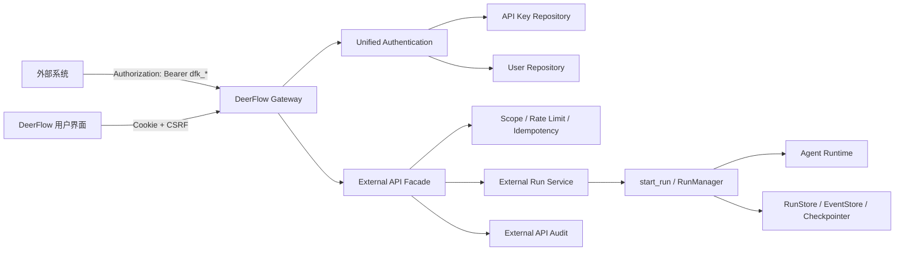
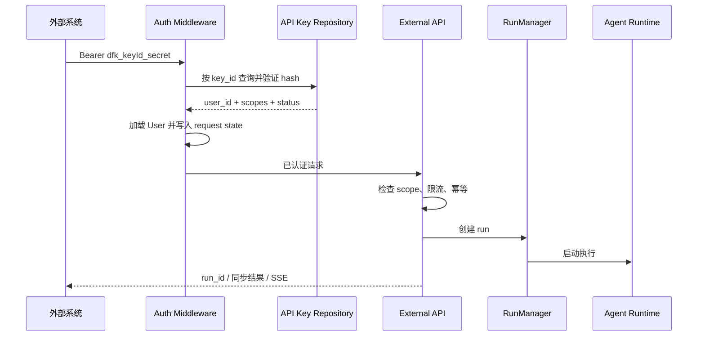

# DeerFlow External API 与用户级 Bearer API Key 方案设计

## 1. 文档状态

- 状态：Accepted
- 日期：2026-06-08
- 目标版本：External API v1
- 实现状态：后端 V1 已完成，等待评审与部署
- 评审范围：外部系统通过用户级 Bearer API Key 调用 DeerFlow Agent 能力
- 非评审范围：本方案暂不包含具体代码实现

## 2. 背景

DeerFlow 当前已经具备完整的 Agent 运行能力：

- Gateway 提供同步等待、SSE 流式、后台运行、取消、消息查询和事件查询接口。
- `RunManager`、`RunStore`、`StreamBridge` 和 Checkpointer 已负责运行生命周期和状态持久化。
- 请求认证成功后，Gateway 会将用户写入 `request.state.user` 和运行时上下文。
- 线程、运行、文件、Agent、记忆和 Sandbox 数据已经按 `user_id` 隔离。

现有接口主要服务于 DeerFlow 前端、LangGraph SDK 和内置 Channel。它们使用浏览器会话认证：

- `access_token` Cookie
- `csrf_token` Cookie
- `X-CSRF-Token` Header

浏览器会话认证不适合长期、稳定的机器对机器调用。外部系统通常希望通过下面的方式访问：

```http
Authorization: Bearer dfk_<key_id>_<secret>
```

因此，需要在保留现有内部运行能力的基础上，增加稳定的 External API 契约和用户级 API Key 认证能力。

## 3. 目标

### 3.1 产品目标

- 每个 DeerFlow 用户可以生成一把用于外部系统调用的 API Key。
- 外部系统可以使用 Bearer API Key 发起对话或异步 Agent 任务。
- 外部系统可以在接口调用时指定一个已授权 Skill，执行面向业务的标准工作流。
- API Key 调用继承所属用户的数据、Agent、记忆、Connector 和线程隔离边界。
- 用户可以查看 API Key 元数据、轮换 Key 和立即吊销 Key。
- 外部 API 使用独立、版本化、稳定的请求响应契约。
- 外部调用可被审计、限流和追踪。

### 3.2 工程目标

- 复用现有 `start_run()`、`RunManager`、`RunStore` 和 `StreamBridge`，不复制 Agent 运行逻辑。
- API Key 验证成功后复用现有用户上下文和所有权校验机制。
- API Key 原文只在创建或轮换时返回一次，数据库不保存明文。
- API Key 只能访问明确允许的 External API，不能访问管理接口。
- Bearer API Key 请求不要求 CSRF，但浏览器 Cookie 请求继续执行现有 CSRF 校验。
- 接口设计支持后续增加多 Key、细粒度 Scope、Webhook 和配额计费。

## 4. 非目标

External API v1 不包含：

- 不把现有 `/api/langgraph/*` 直接定义为长期公开契约。
- 不允许 API Key 调用模型、MCP、Skills、Connector、用户等管理接口；允许调用已授权 Skill，但不能安装、编辑、启停或删除 Skill。
- 不允许 API Key 通过请求体指定或伪造 `user_id`。
- 不向外部系统暴露模型思维过程、敏感工具参数、凭据或内部调试事件。
- 不在首版提供第三方 OAuth2 Client Credentials。
- 不在首版提供团队级、租户级或服务账号级 API Key。
- 不在首版实现可靠 Webhook 投递；Webhook 需要额外处理 SSRF、签名和重试。
- 不在首版承诺跨区域或跨集群的全局限流。

## 5. 核心设计决策

### 5.1 增加独立 External API Facade

对外接口统一放在：

```text
/api/v1/external/*
```

External API Router 只负责：

- 外部契约校验与转换
- API Key Scope 和策略检查
- 幂等、限流和审计
- 对外响应与事件过滤

Agent 实际执行仍调用现有运行服务：

```text
External API Router -> External Run Service -> start_run() -> RunManager -> Agent Runtime
```

不建议让外部系统直接依赖内部 `RunCreateRequest`。内部请求包含 `config`、`context`、`interrupt_before` 等实现细节，长期兼容成本和安全风险较高。

### 5.2 每个用户仅允许一把有效 API Key

External API v1 采用：

> 一个用户最多拥有一把状态为 `active` 的 API Key。

API Key 由用户在设置页面或管理 API 中按需生成，不在用户注册时自动创建。按需生成可以避免产生无人保存、从未使用但长期有效的凭据，并确保完整 Key 只在用户明确操作时展示一次。

用户首次生成 Key 时创建记录；再次生成视为轮换：

1. 创建新 Key。
2. 在同一事务中吊销旧 Key。
3. 返回一次新 Key 原文。
4. 旧 Key 从事务提交后立即失效。

数据模型保留独立 `api_keys` 表，而不是把 Key 字段直接放进 `users` 表。这样可以保留审计记录，并为以后支持多 Key、不同 Scope 和过期策略留出空间。

### 5.3 API Key 只认证 External API

API Key 的权限边界必须由路径和 Scope 双重限制：

- API Key 仅允许访问 `/api/v1/external/*`。
- API Key 不允许访问 `/api/models`、`/api/mcp`、`/api/skills`、`/api/connectors` 等现有接口。
- 用户通过浏览器会话管理自己的 API Key。
- External API 不接受浏览器 Cookie 作为主要机器认证方式。

禁止将 `/api/v1/external` 简单加入全局公共路径。否则遗漏认证装饰器时会产生未授权访问风险。

### 5.4 API Key 映射为现有用户上下文

API Key 验证成功后，认证层加载所属 `User`，并设置：

```python
request.state.user = user
request.state.auth = AuthContext(user=user, permissions=external_permissions)
request.state.auth_method = "api_key"
request.state.api_key_id = key_id
```

同时复用现有 `set_current_user(user)` 上下文逻辑。这样后续运行可以继续使用现有：

- Thread owner 校验
- Run owner 过滤
- 用户级记忆
- 用户级自定义 Agent
- 用户级文件和 Sandbox 路径
- 用户级 Connector 授权

客户端请求中的 `user_id`、`owner_id` 或同类字段一律忽略或拒绝，用户身份只来源于服务端认证结果。

### 5.5 API Key 请求免 CSRF

CSRF 用于防止浏览器自动携带 Cookie 造成跨站请求伪造。Bearer API Key 不会被浏览器自动附带，因此：

- 仅当请求已经通过有效 API Key 认证时，跳过 CSRF。
- Cookie/JWT 请求继续执行现有双提交 Cookie CSRF 校验。
- 不能仅因为请求包含 `Authorization` Header 就跳过 CSRF，必须先验证 API Key。

## 6. 总体架构



### 6.1 请求处理顺序



## 7. API Key 设计

### 7.1 Key 格式

推荐格式：

```text
dfk_<key_id>_<secret>
```

示例：

```text
dfk_01JZQ8TB7F9Y8T1D4V4R_7vJ...省略...
```

字段说明：

- `dfk`：DeerFlow Key 固定前缀，便于识别和密钥扫描。
- `key_id`：公开、不可猜测的 Key 标识，用于数据库定向查询。
- `secret`：至少 256 bit 的密码学安全随机值。

展示时只显示：

```text
dfk_01JZQ8...V4R_****a8Ks
```

### 7.2 存储与验证

数据库不保存完整 Key 和 `secret` 明文。

推荐保存：

```text
secret_hash = HMAC-SHA256(EXTERNAL_API_KEY_PEPPER, secret)
```

验证流程：

1. 严格解析 Key 格式。
2. 使用 `key_id` 查询单条记录。
3. 检查状态、所属用户和过期时间。
4. 使用服务端 Pepper 计算 HMAC。
5. 使用常量时间比较验证 Hash。
6. 更新 `last_used_at`，写入审计事件。

选择 HMAC-SHA256 而不是 bcrypt/Argon2 的原因：

- API Key Secret 是高熵随机值，不是用户选择的低熵密码。
- `key_id` 已允许定向查询，不需要扫描全部 Hash。
- HMAC 验证成本稳定，适合每个 API 请求执行。
- Pepper 可以降低数据库单独泄露后的风险。

`EXTERNAL_API_KEY_PEPPER` 必须是稳定部署密钥。更换 Pepper 会导致现有 Key 全部失效，因此需要按密钥轮换流程管理。

### 7.3 API Key 状态

```text
active | revoked
```

Key 是否可用的完整条件：

```text
status == active
AND revoked_at IS NULL
AND (expires_at IS NULL OR expires_at > now)
AND user still exists
```

### 7.4 Scope

即使首版每用户只有一把 Key，也建议从第一版保存 Scope。

推荐首版 Scope：

| Scope | 能力 |
|---|---|
| `external:conversations:create` | 创建新 Conversation |
| `external:conversations:read` | 查询 Conversation 和历史消息 |
| `external:conversations:write` | 在 Conversation 中发送消息或关闭会话 |
| `external:runs:create` | 创建同步或异步任务 |
| `external:runs:read` | 查询所属任务和事件 |
| `external:runs:cancel` | 取消所属任务 |
| `external:artifacts:read` | 下载所属任务生成物 |
| `external:skills:read` | 查询当前 API Key 可调用的 Skill 摘要 |

首版用户生成 Key 时默认授予全部 External API Scope。API Key 额外保存 `allowed_skills` 白名单；只有白名单中的 Skill 才能通过该 Key 调用。建议生成或轮换 Key 时由用户明确选择可调用 Skill，不默认授权所有 Skill。

### 7.5 Key 管理接口

Key 管理接口仅允许浏览器会话认证，不接受 API Key 自我管理。

#### 查询当前 Key 元数据

```http
GET /api/v1/api-keys/current
```

响应：

```json
{
  "exists": true,
  "id": "01JZQ8TB7F9Y8T1D4V4R",
  "name": "Default external API key",
  "masked_key": "dfk_01JZQ8...V4R_****a8Ks",
  "status": "active",
  "scopes": [
    "external:conversations:create",
    "external:conversations:read",
    "external:conversations:write",
    "external:runs:create",
    "external:runs:read",
    "external:runs:cancel",
    "external:artifacts:read",
    "external:skills:read"
  ],
  "allowed_skills": [
    "sales-report",
    "customer-summary"
  ],
  "created_at": "2026-06-08T10:00:00Z",
  "last_used_at": "2026-06-08T10:10:00Z",
  "expires_at": null
}
```

#### 生成或轮换 Key

```http
POST /api/v1/api-keys/current/rotate
```

响应中的完整 Key 只返回一次：

```json
{
  "api_key": "dfk_01JZQ8TB7F9Y8T1D4V4R_7vJ...",
  "id": "01JZQ8TB7F9Y8T1D4V4R",
  "created_at": "2026-06-08T10:00:00Z",
  "warning": "This API key will not be shown again."
}
```

#### 吊销 Key

```http
DELETE /api/v1/api-keys/current
```

吊销后立即拒绝所有使用该 Key 的新请求。已经开始的 Run 默认继续执行，用户仍可通过浏览器会话取消。

#### 更新 Key 的 Skill 白名单

```http
PUT /api/v1/api-keys/current/policy
```

请求：

```json
{
  "allowed_skills": [
    "sales-report",
    "customer-summary"
  ]
}
```

更新白名单不要求轮换 Secret。移除 Skill 后，使用该 Key 创建的新 Run 立即不能再指定该 Skill；已经开始的 Run 默认继续执行。该接口仅允许浏览器会话认证，并写入安全审计日志。

## 8. External API 契约

### 8.1 统一请求原则

- 外部请求只暴露业务层字段，不暴露内部 `RunnableConfig`。
- `conversation_id` 是 DeerFlow 生成并返回的稳定、不可猜测会话标识。
- 外部系统可以通过 `source + external_conversation_id` 保存自己的业务会话映射。
- `run_id` 是 DeerFlow 生成的一次执行标识。
- `agent` 只能选择 API Key 所属用户可访问的 Agent。
- `skill` 表示本次 Run 独占激活的业务 Skill；省略时使用 Conversation 默认 Skill 或 Agent 默认行为。
- `metadata` 只接受标量和有限大小的 JSON，不允许覆盖内部字段。
- 服务端始终覆盖 `user_id`、内部 `thread_id`、调用来源和追踪字段。

### 8.2 创建新对话

外部系统需要开启全新上下文时，显式创建 Conversation：

```http
POST /api/v1/external/conversations
Authorization: Bearer dfk_<key_id>_<secret>
Idempotency-Key: create-crm-session-789
Content-Type: application/json
```

请求：

```json
{
  "source": "crm",
  "external_conversation_id": "crm-session-789",
  "agent": "lead_agent",
  "default_skill": "customer-summary",
  "metadata": {
    "customer_id": "customer-123"
  }
}
```

响应：

```json
{
  "request_id": "req_01JZ...",
  "conversation_id": "conv_01JZ...",
  "status": "active",
  "agent": "lead_agent",
  "default_skill": "customer-summary",
  "created_at": "2026-06-08T10:00:00Z"
}
```

服务端处理：

1. 验证 API Key 并获得固定 `user_id`。
2. 生成内部 `thread_id` 和公开 `conversation_id`。
3. 创建空 Thread。
4. 保存 `(user_id, source, external_conversation_id) -> conversation_id -> thread_id` 映射。
5. 返回公开 `conversation_id`，不向外部暴露内部 `thread_id`。

`source` 和 `external_conversation_id` 可选，但推荐第三方系统提供。配合 `Idempotency-Key`，第三方创建请求重试时不会产生多个新对话。

第三方系统要开始另一段不继承上下文的对话，必须再次调用该接口获得新的 `conversation_id`。即使新对话面对同一客户，也不能复用旧 `conversation_id`。

创建新对话的明确规则：

- 相同 `Idempotency-Key` 和相同请求体重试：返回同一个新建 Conversation。
- 相同 `Idempotency-Key` 但请求体不同：返回 `409 idempotency_conflict`。
- 相同 `source + external_conversation_id` 已存在：返回 `409 external_conversation_exists`，响应中携带已有 `conversation_id`，调用方可决定继续已有对话或换一个外部 ID 创建新对话。
- 未提供 `external_conversation_id`：每次调用都创建新 Conversation，调用方必须保存 DeerFlow 返回的 `conversation_id`。
- `agent` 在 Conversation 创建后首版不可变，避免同一历史上下文在不同 Agent Prompt 和工具权限间切换。
- `default_skill` 可以为空；设置后作为该 Conversation 后续 Run 的默认 Skill。

为减少调用次数，后续可允许创建请求携带可选 `initial_message`，在同一请求中创建 Conversation 并启动第一个 Run。首版建议仍保持“创建 Conversation”和“发送消息”两个动作分离，使幂等和失败恢复语义更清楚。

### 8.3 在对话中发送消息

发送消息时显式引用已有 Conversation：

```http
POST /api/v1/external/conversations/{conversation_id}/messages
Authorization: Bearer dfk_<key_id>_<secret>
Idempotency-Key: optional-client-request-id
Content-Type: application/json
```

请求：

```json
{
  "message": "总结这份订单数据",
  "skill": "sales-report",
  "mode": "standard",
  "metadata": {
    "source": "crm"
  }
}
```

响应：

```json
{
  "request_id": "req_01JZ...",
  "run_id": "run_01JZ...",
  "conversation_id": "conv_01JZ...",
  "status": "completed",
  "answer": "订单数据总结如下……",
  "artifacts": [],
  "usage": {
    "input_tokens": 120,
    "output_tokens": 300,
    "total_tokens": 420
  }
}
```

服务端通过 `conversation_id` 找到同一个内部 `thread_id`，新的 Run 因此可以读取该 Thread 的历史消息和 Checkpoint，形成多轮对话。

本次 Run 的 Skill 解析规则：

```text
request.skill
  ?? conversation.default_skill
  ?? agent default skill behavior
```

解析出的 Skill 会写入 Run Metadata 和 Runtime Context。`skill` 只影响本次 Run，不会修改 Conversation 的 `default_skill`。

同一 Conversation 可以在不同 Run 中选择不同 Skill，因为历史上下文属于 Conversation，而 Skill 属于 Run。业务系统应谨慎切换：如果不同 Skill 对输入格式、工具或输出结构有明显差异，更推荐为不同业务流程创建独立 Conversation。

该接口默认同步等待，适合短任务。服务端应设置最大等待时间；超过等待时间后返回 `202 Accepted` 和 `run_id`，任务继续异步执行。

同一 Conversation 默认只允许一个活跃 Run。新消息到达时如果上一 Run 尚未完成，首版返回 `409 conversation_busy` 和当前 `run_id`，避免消息顺序不确定。后续可以增加显式排队模式。

### 8.4 在对话中创建异步任务

```http
POST /api/v1/external/conversations/{conversation_id}/runs
Authorization: Bearer dfk_<key_id>_<secret>
Idempotency-Key: required-for-retry-safe-clients
```

请求：

```json
{
  "message": "生成新能源汽车市场分析报告",
  "skill": "market-research",
  "mode": "standard",
  "metadata": {
    "source": "report-service"
  }
}
```

响应：

```json
{
  "request_id": "req_01JZ...",
  "run_id": "run_01JZ...",
  "conversation_id": "conv_01JZ...",
  "skill": "market-research",
  "status": "pending",
  "status_url": "/api/v1/external/runs/run_01JZ...",
  "events_url": "/api/v1/external/runs/run_01JZ.../events"
}
```

### 8.5 查询任务

```http
GET /api/v1/external/runs/{run_id}
Authorization: Bearer dfk_<key_id>_<secret>
```

响应：

```json
{
  "request_id": "req_01JZ...",
  "run_id": "run_01JZ...",
  "conversation_id": "conv_01JZ...",
  "skill": "market-research",
  "status": "completed",
  "answer": "分析已完成。",
  "artifacts": [
    {
      "id": "artifact_01JZ...",
      "name": "market-report.pdf",
      "content_type": "application/pdf",
      "download_url": "/api/v1/external/artifacts/artifact_01JZ..."
    }
  ],
  "usage": {
    "input_tokens": 5000,
    "output_tokens": 12000,
    "total_tokens": 17000
  },
  "error": null,
  "created_at": "2026-06-08T10:00:00Z",
  "updated_at": "2026-06-08T10:05:00Z"
}
```

对外状态固定为：

```text
pending | running | completed | failed | cancelled
```

内部状态必须通过适配器映射为上述稳定状态。

### 8.6 获取事件流

```http
GET /api/v1/external/runs/{run_id}/events
Authorization: Bearer dfk_<key_id>_<secret>
Accept: text/event-stream
Last-Event-ID: optional
```

对外事件白名单：

```text
run.started
run.progress
message.delta
artifact.created
run.completed
run.failed
run.cancelled
```

示例：

```text
event: message.delta
id: 42
data: {"run_id":"run_01JZ...","content":"根据最新数据……"}

event: run.completed
id: 43
data: {"run_id":"run_01JZ...","status":"completed"}
```

External API 事件适配器必须过滤：

- 模型思维过程
- System Prompt
- 工具凭据和认证 Header
- 原始工具参数中的敏感信息
- 内部堆栈、文件物理路径和调试数据

### 8.7 取消任务

```http
POST /api/v1/external/runs/{run_id}/cancel
Authorization: Bearer dfk_<key_id>_<secret>
```

取消操作保持幂等。任务已经完成或已经取消时，仍返回当前最终状态。

### 8.8 查询和恢复历史对话

第三方系统应持久化 DeerFlow 返回的 `conversation_id`，后续继续对话时直接调用：

```http
POST /api/v1/external/conversations/{conversation_id}/messages
```

为了处理第三方丢失本地映射、跨设备恢复和展示历史列表，External API 提供：

```http
GET /api/v1/external/conversations/{conversation_id}
GET /api/v1/external/conversations/{conversation_id}/messages
GET /api/v1/external/conversations?source=crm&external_conversation_id=crm-session-789
```

Conversation 查询响应不暴露内部 `thread_id`：

```json
{
  "conversation_id": "conv_01JZ...",
  "source": "crm",
  "external_conversation_id": "crm-session-789",
  "status": "active",
  "agent": "lead_agent",
  "default_skill": "customer-summary",
  "title": "订单数据分析",
  "created_at": "2026-06-08T10:00:00Z",
  "updated_at": "2026-06-08T10:30:00Z"
}
```

历史消息接口使用游标分页，只返回已过滤的用户消息、助手最终回答、生成物引用和必要状态，不返回内部工具消息、思维过程或 System Prompt。

API Key 轮换后，历史 Conversation 仍属于同一个 `user_id`，新 Key 可以继续访问；Key 吊销不会删除 Conversation 或 Thread。

典型恢复流程：

1. 第三方优先从自己的数据库读取已保存的 DeerFlow `conversation_id`。
2. 如果本地映射丢失，使用 `source + external_conversation_id` 查询 Conversation。
3. 获取 `conversation_id` 后，可先分页读取历史消息，也可以直接发送下一条消息。
4. DeerFlow 将下一条消息作为新 Run 写入原内部 `thread_id`，由 Checkpointer 恢复历史上下文。

### 8.9 关闭对话

```http
POST /api/v1/external/conversations/{conversation_id}/close
```

关闭表示不再接受新消息，但保留历史记录和生成物。再次发送消息返回 `409 conversation_closed`。

首版不提供通过 External API 删除 Conversation。删除涉及 Thread、记忆、生成物和审计保留策略，应由用户在 DeerFlow UI 中执行或经过独立设计。

### 8.10 下载生成物

```http
GET /api/v1/external/artifacts/{artifact_id}
Authorization: Bearer dfk_<key_id>_<secret>
```

服务端必须通过 `artifact_id -> thread_id -> user_id` 校验所有权，不能允许客户端直接传入任意文件路径。

### 8.11 查询可调用 Skill

业务系统可以查询当前 API Key 可调用的 Skill：

```http
GET /api/v1/external/skills
Authorization: Bearer dfk_<key_id>_<secret>
```

响应仅提供调用所需摘要，不返回 Skill 完整内容、文件路径或管理能力：

```json
{
  "skills": [
    {
      "name": "sales-report",
      "display_name": "销售报告",
      "description": "根据销售数据生成标准分析报告",
      "agent_compatibility": ["lead_agent"],
      "enabled": true
    }
  ]
}
```

返回集合必须满足：

```text
平台已启用 Skill
∩ API Key allowed_skills
∩ 当前用户可访问 Skill
```

如果调用时已经指定 Agent，还必须与该 Agent 的 Skill 允许范围取交集。

### 8.12 指定 Skill 的执行语义

External API v1 每次 Run 最多指定一个 `skill`。指定后采用独占激活语义：

1. 服务端校验 Skill 名称格式。
2. 校验 Skill 存在且当前已启用。
3. 校验 Skill 在 API Key 的 `allowed_skills` 中。
4. 校验 Skill 在所选 Agent 的允许范围中；请求不能借此绕过 Agent 配置。
5. 仅将该 Skill 注入 Agent 的 Available Skills Prompt。
6. 根据该 Skill 的 `allowed-tools` 收敛本次 Run 可使用的工具。
7. 将 `skill_name` 注入 Runtime Context，使 Connector Grant、审计和追踪可以识别调用 Skill。
8. 将最终解析的 Skill 固化到 Run Metadata，历史查询返回该值。

Skill 是 Agent 工作流指令，不是具备严格输入输出契约的普通函数。因此“指定 Skill”代表强制选择该工作流并收敛能力范围，但最终执行仍由 Agent 完成。对于必须完全确定性执行的业务动作，应设计专用 Tool、Connector Capability 或独立业务接口，而不是只依赖 Skill Prompt。

指定 Skill 时不允许 `mode=flash`。Flash 直接模型路径不执行完整 Skill 工具工作流，服务端应返回 `400 skill_mode_not_supported`，或自动切换为标准模式。推荐首版直接拒绝，避免调用方误判执行语义。

### 8.13 Skill 校验失败行为

- Skill 名称格式错误：`400 invalid_skill`
- Skill 不存在、未启用、未授权或不属于所选 Agent：统一返回 `404 skill_not_available`，避免枚举未授权 Skill
- Skill 与请求模式不兼容：`400 skill_mode_not_supported`
- Skill 所需 Connector 未授权：`403 skill_connector_not_authorized`
- Skill 配置错误或依赖不可用：`422 skill_unavailable`

服务端不得接受外部调用方直接传入 Skill 文件路径、Skill 内容、`allowed-tools` 或 Connector Grant。

### 8.14 暂不开放的能力

External API v1 暂不开放：

- 上传文件
- Webhook
- 任意 `config` / `context` 透传
- 任意模型选择
- 任意工具选择
- 同时指定多个 Skill
- 通过 External API 安装、编辑、启停或删除 Skill
- Thread 状态直接修改
- Memory、Skill、MCP、Connector 管理

这些能力可以后续按独立安全评审逐项开放。

## 9. 会话与线程映射

External API 使用公开 `conversation_id`，DeerFlow Runtime 内部使用 `thread_id`。第三方系统还可以保存自己的 `source + external_conversation_id`。三者职责不同：

| 标识 | 生成方 | 作用 |
|---|---|---|
| `external_conversation_id` | 第三方系统 | 关联第三方自己的业务会话，可选 |
| `conversation_id` | DeerFlow External API | 对外公开的稳定会话资源 ID |
| `thread_id` | DeerFlow 内部 | Checkpointer、文件、Sandbox 和运行上下文隔离 |

不建议直接把第三方 `external_conversation_id` 当作内部 `thread_id`，原因包括：

- 不同外部系统可能使用相同 ID。
- 外部 ID 可能包含不安全字符或业务敏感信息。
- 内部 Thread ID 不应由客户端任意控制。

增加映射关系：

```text
(user_id, source, external_conversation_id) -> conversation_id -> thread_id
```

公开 `conversation_id` 必须是不可猜测的服务端生成 ID。外部业务映射使用：

```text
UNIQUE(user_id, source, external_conversation_id)
```

Conversation 归属于 `user_id`，不能归属于 `api_key_id`。否则 API Key 轮换后会导致历史对话不可访问。

同一 Conversation 的所有 Run 必须使用同一个内部 `thread_id`。创建新 Conversation 时必须生成新的 `thread_id`，从而保证新对话不会继承旧对话上下文。

## 10. 数据模型

### 10.1 `api_keys`

```text
api_keys
--------
id                  VARCHAR(36) PRIMARY KEY
user_id             VARCHAR(36) NOT NULL
name                VARCHAR(128) NOT NULL
secret_hash         VARCHAR(64) NOT NULL
key_prefix          VARCHAR(32) NOT NULL
last_four           VARCHAR(4) NOT NULL
status              VARCHAR(16) NOT NULL
scopes_json         JSON NOT NULL
allowed_skills_json JSON NOT NULL
created_at          TIMESTAMP NOT NULL
last_used_at        TIMESTAMP NULL
expires_at          TIMESTAMP NULL
revoked_at          TIMESTAMP NULL
revoked_reason      VARCHAR(128) NULL
```

约束与索引：

- `INDEX(user_id)`
- `UNIQUE(id)`
- 每个 `user_id` 最多一条 `active` Key；SQLite 和 PostgreSQL 差异由 Repository 事务逻辑和适配迁移共同保证。
- `secret_hash` 不应出现在 API 响应、日志和审计详情中。
- `allowed_skills_json` 保存该 Key 可调用的 Skill 名称白名单；空数组表示不能指定任何 Skill。

### 10.2 `external_conversations`

```text
external_conversations
----------------------
conversation_id     VARCHAR(36) PRIMARY KEY
user_id             VARCHAR(36) NOT NULL
source              VARCHAR(64) NOT NULL DEFAULT 'default'
external_conversation_id VARCHAR(256) NULL
thread_id           VARCHAR(36) NOT NULL
agent_id            VARCHAR(128) NOT NULL
default_skill_name  VARCHAR(64) NULL
status              VARCHAR(16) NOT NULL
title               VARCHAR(256) NULL
created_at          TIMESTAMP NOT NULL
updated_at          TIMESTAMP NOT NULL
closed_at           TIMESTAMP NULL
```

约束：

- `UNIQUE(user_id, source, external_conversation_id)`，仅在 `external_conversation_id` 非空时生效
- `UNIQUE(thread_id)`
- `conversation_id` 和 `thread_id` 均由服务端生成
- `default_skill_name` 只是默认选择；每个 Run 必须记录最终实际使用的 Skill

### 10.3 `external_idempotency_keys`

```text
external_idempotency_keys
-------------------------
id                  VARCHAR(36) PRIMARY KEY
user_id             VARCHAR(36) NOT NULL
api_key_id          VARCHAR(36) NOT NULL
idempotency_key     VARCHAR(128) NOT NULL
request_hash        VARCHAR(64) NOT NULL
run_id              VARCHAR(36) NULL
response_status     INTEGER NULL
response_json       JSON NULL
created_at          TIMESTAMP NOT NULL
expires_at          TIMESTAMP NOT NULL
```

约束：

- `UNIQUE(api_key_id, idempotency_key)`
- 相同幂等 Key 但请求体 Hash 不同时返回 `409 idempotency_conflict`
- 首版保留 24 小时后可清理

### 10.4 `external_api_audit_logs`

```text
external_api_audit_logs
-----------------------
id                  VARCHAR(36) PRIMARY KEY
request_id          VARCHAR(36) NOT NULL
user_id             VARCHAR(36) NULL
api_key_id          VARCHAR(36) NULL
action              VARCHAR(64) NOT NULL
resource_type       VARCHAR(32) NULL
resource_id         VARCHAR(64) NULL
skill_name          VARCHAR(64) NULL
method              VARCHAR(8) NOT NULL
path_template       VARCHAR(256) NOT NULL
status_code         INTEGER NOT NULL
client_ip_hash      VARCHAR(64) NULL
user_agent          VARCHAR(256) NULL
duration_ms         INTEGER NOT NULL
created_at          TIMESTAMP NOT NULL
```

审计日志不记录：

- Authorization Header
- 完整请求体
- 用户消息全文
- 模型回复全文
- 工具凭据

## 11. 认证与中间件改造

### 11.1 推荐认证策略

将当前认证逻辑扩展为统一认证入口：

```text
1. 如果是 /api/v1/external/*：
   - 必须验证 Bearer API Key
   - 验证失败返回 401
   - 验证成功写入用户和 External Scope

2. 如果是其他受保护路径：
   - 保持现有内部认证或 Cookie JWT 认证
   - API Key 不得作为替代凭据

3. 公共路径：
   - 保持现有行为
```

External Scope 不应使用当前 `_ALL_PERMISSIONS`。应显式映射：

```text
external:runs:create -> runs:create
external:runs:read   -> runs:read
external:runs:cancel -> runs:cancel
external:skills:read -> external skill summary read
```

但映射只在 External Router 内生效，避免 API Key 访问现有内部 Router。

### 11.2 失败行为

- 缺少 Bearer Token：`401 missing_api_key`
- Key 格式错误：`401 invalid_api_key`
- Key 不存在或 Hash 不匹配：`401 invalid_api_key`
- Key 已吊销或过期：`401 api_key_inactive`
- Scope 不足：`403 insufficient_scope`
- 资源不属于用户：返回 `404 resource_not_found`，避免资源枚举
- 超过频率限制：`429 rate_limit_exceeded`
- 超过并发限制：`429 concurrency_limit_exceeded`

认证失败响应不区分“Key ID 存在但 Secret 错误”和“Key ID 不存在”。

## 12. 限流、并发与配额

External API 至少需要三类限制：

| 限制 | 推荐首版默认值 | 目的 |
|---|---:|---|
| 请求频率 | 每 Key 60 请求/分钟 | 防止接口滥用 |
| 同时运行任务数 | 每用户 3 个 | 控制 Agent 和工具资源 |
| 请求体大小 | 256 KB | 防止大请求消耗 |

生产环境默认使用多个 Gateway Worker，单进程内存限流无法提供准确的全局限制。

推荐分层：

1. Nginx 或部署层完成基础 IP/Key 请求频率限制。
2. 应用层基于 `RunStore` 检查用户活跃 Run 数量。
3. 需要精确分布式配额时引入 Redis 或外部 API Gateway。

Token 日配额和费用预算属于后续能力，但审计和 Run Usage 应从首版保留统计字段。

## 13. 错误响应契约

所有 External API 错误使用统一结构：

```json
{
  "error": {
    "code": "invalid_api_key",
    "message": "The provided API key is invalid.",
    "request_id": "req_01JZ..."
  }
}
```

推荐错误码：

```text
missing_api_key
invalid_api_key
api_key_inactive
insufficient_scope
invalid_request
resource_not_found
conversation_busy
conversation_closed
external_conversation_exists
invalid_skill
skill_not_available
skill_mode_not_supported
skill_connector_not_authorized
skill_unavailable
idempotency_conflict
rate_limit_exceeded
concurrency_limit_exceeded
run_conflict
internal_error
```

`internal_error` 不返回内部异常堆栈。服务端日志使用 `request_id` 关联具体错误。

## 14. 可观测性与审计

每个 External API 请求生成 `request_id`，并注入：

- HTTP 响应 Header：`X-Request-ID`
- Run Metadata：`external_request_id`、`api_key_id`、`source`、`skill_name`
- Tracing Metadata：用户 ID、Run ID、Thread ID
- 审计日志

核心指标：

- API Key 认证成功和失败次数
- 按用户、Key、接口统计的请求量
- External Run 创建、成功、失败、取消数量
- 请求延迟和 Run 执行时长
- SSE 活跃连接数
- 限流和并发拒绝次数
- Token 使用量

日志与指标中不得记录完整 API Key。

## 15. 安全边界

### 15.1 API Key 泄露

缓解措施：

- Key 原文只显示一次。
- 数据库只保存 HMAC Hash。
- 用户可立即轮换或吊销。
- 日志统一脱敏 `Authorization` Header。
- Key 使用固定前缀，便于代码仓库密钥扫描。
- 记录 `last_used_at` 和审计事件，便于发现异常使用。

### 15.2 越权访问

缓解措施：

- Key 服务端映射到固定 `user_id`。
- External Router 不接受客户端指定用户身份。
- Run、Thread、Artifact 查询全部校验所属用户。
- 非所属资源统一返回 404。
- API Key 不可访问现有管理接口。

### 15.3 Prompt 与工具风险

API Key 调用代表所属用户执行 Agent，其工具权限原则上与该用户一致。仍需：

- External API 默认只允许配置好的 Agent。
- 不允许外部请求任意启用工具或 Connector。
- 指定 Skill 必须通过 API Key Skill 白名单和 Agent Skill 配置的交集校验。
- Skill 的 `allowed-tools` 和 Connector Grant 只能收缩权限，不能扩大 Agent 原有权限。
- 继续执行现有 Guardrails、Connector Grant 和 Sandbox 隔离。
- 对外事件过滤工具敏感参数和内部路径。

### 15.4 SSE 连接

- 保留心跳，避免代理误断开。
- 支持 `Last-Event-ID` 断线续传。
- 设置最大连接时长。
- 客户端断开时，异步 External Run 默认继续执行。
- Nginx 对 External SSE 路径关闭响应缓冲。

## 16. 代码改造建议

建议增加：

```text
backend/app/gateway/
├── external/
│   ├── models.py
│   ├── errors.py
│   ├── service.py
│   ├── event_mapper.py
│   ├── policy.py
│   └── skill_policy.py
├── routers/
│   ├── api_keys.py
│   └── external.py
└── api_key_auth.py

backend/packages/harness/deerflow/persistence/
├── api_key/
│   ├── model.py
│   └── sql.py
├── external_conversation/
│   ├── model.py
│   └── sql.py
├── external_idempotency/
│   ├── model.py
│   └── sql.py
└── external_audit/
    ├── model.py
    └── sql.py
```

建议复用：

- `app.gateway.services.start_run`
- `app.gateway.services.sse_consumer` 的订阅能力，但增加 External Event Mapper
- 现有 Runtime Context `skill_name` 入口
- Skill enabled 状态、Agent Skill 配置和 `allowed-tools` 工具过滤
- `deerflow.runtime.RunManager`
- `RunStore`、`RunEventStore`、Checkpointer
- `request.state.user` 和 `deerflow.runtime.user_context`

不建议复用：

- 不直接把内部 `RunCreateRequest` 暴露为 External API 请求模型。
- 不直接把内部完整 SSE 事件透传给外部调用方。
- 不复用进程内 `internal_auth` Token 作为外部认证。

现有 Skill 强制选择路径需要在实现前修正一致性：

- `make_lead_agent()` 已读取 Runtime Context 中的 `skill_name`，并将 `available_skills` 收敛为单个 Skill。
- 工具策略已经根据收敛后的 Skill 执行 `allowed-tools` 过滤。
- 最终 `apply_prompt_template()` 当前仍可能使用 Agent 配置里的原始 Skill 集合，而不是收敛后的 `available_skills`。
- Flash Direct Path 当前也未统一处理强制 Skill。

实现 External Skill 调用前，必须保证 Prompt、工具过滤、Tracing Metadata、Connector Runtime Context 和缓存 Key 全部使用同一个“最终解析 Skill”结果，并在指定 Skill 时禁用 Flash Direct Path。

## 17. 分阶段实施

### Phase 1：认证和最小任务接口

- `api_keys` 数据模型和 Repository
- 浏览器会话下的 Key 查询、轮换、吊销接口
- External API Bearer 认证
- `external_conversations` 数据模型和 Repository
- API Key `allowed_skills` 白名单
- `POST /api/v1/external/conversations`
- `POST /api/v1/external/conversations/{conversation_id}/runs`
- `GET /api/v1/external/conversations/{conversation_id}`
- `GET /api/v1/external/skills`
- 单 Skill 选择、校验和 Runtime Context 注入
- `GET /api/v1/external/runs/{run_id}`
- `POST /api/v1/external/runs/{run_id}/cancel`
- 基础审计、请求 ID、用户隔离测试

### Phase 2：同步对话和事件流

- `POST /api/v1/external/conversations/{conversation_id}/messages`
- `GET /api/v1/external/conversations/{conversation_id}/messages`
- `GET /api/v1/external/conversations`
- `GET /api/v1/external/runs/{run_id}/events`
- External Event Mapper
- 幂等 Key

### Phase 3：生成物和治理

- Artifact ID 映射和下载接口
- 生产级分布式限流
- Token 配额与使用看板
- API Key 使用记录 UI

### Phase 4：扩展能力

- 多 Key 和自定义 Scope
- 服务账号或团队级 Key
- 文件上传
- 签名 Webhook
- OAuth2 Client Credentials

## 18. 测试策略

### 18.1 API Key 生命周期

- 创建 Key 后只返回一次原文。
- 数据库存储中不存在原文。
- 正确 Key 可以认证。
- 错误 Secret、错误格式、未知 Key ID 均返回 401。
- 轮换后旧 Key 立即失效，新 Key 生效。
- 吊销后 Key 立即失效。
- 用户删除后 Key 失效。

### 18.2 安全和隔离

- API Key 无法访问 `/api/models`、`/api/mcp`、`/api/skills` 等接口。
- 用户 A 的 Key 无法查询、取消或下载用户 B 的资源。
- 请求体中的伪造 `user_id` 不生效。
- API Key 请求免 CSRF，但 Cookie 请求仍需要 CSRF。
- 日志、错误和审计记录中不出现完整 Key。
- External SSE 不暴露敏感内部事件。
- API Key 只能调用 `allowed_skills` 白名单中的 Skill。
- 指定 Skill 不能绕过所选 Agent 的 Skill 配置。
- 指定 Skill 后，工具集合按该 Skill 的 `allowed-tools` 收敛。
- 未授权、未启用和不存在的 Skill 对外统一返回 404。
- 指定 Skill 的 Run 不进入 Flash Direct Path。

### 18.3 运行生命周期

- 创建异步 Run 返回稳定对外契约。
- 查询 Run 状态映射正确。
- 取消操作幂等。
- `conversation_id` 正确复用内部 Thread。
- 创建两个 Conversation 时生成不同 Thread，且新对话不继承旧上下文。
- API Key 轮换后，新 Key 仍能继续访问同一用户的历史 Conversation。
- 已关闭 Conversation 拒绝新消息，但历史仍可读取。
- 同一 Conversation 有活跃 Run 时，新消息返回 `409 conversation_busy`。
- Conversation 默认 Skill 生效，请求级 Skill 可以只覆盖本次 Run。
- Run 查询和审计返回最终实际使用的 Skill。
- 幂等 Key 重试返回同一 Run。
- 相同幂等 Key 配合不同请求体返回 409。

### 18.4 多 Worker 与故障场景

- 多 Worker 下 Key 验证结果一致。
- Run 创建成功但响应丢失时，可通过幂等 Key恢复。
- API Key 轮换与并发调用时，事务结果一致。
- 持久化暂时不可用时认证默认失败关闭。
- SSE 断线后可通过 `Last-Event-ID` 恢复。

## 19. 风险与缓解

| 风险 | 影响 | 缓解 |
|---|---|---|
| API Key 泄露 | 外部系统可代表用户执行任务 | 单次展示、Hash 存储、轮换、吊销、限流、审计 |
| API Key 权限过大 | 外部调用可触发高风险工具 | External Router 隔离、Agent 白名单、现有 Guardrails |
| 指定 Skill 扩大工具或 Connector 权限 | 业务系统绕过 Agent 原有边界 | API Key Skill 白名单、Agent Skill 交集、`allowed-tools`、Connector Grant |
| 调用方把 Skill 当成确定性函数 | 输出不稳定或业务误判 | 文档明确语义；确定性动作使用 Tool、Connector Capability 或专用接口 |
| 外部契约绑定内部实现 | 后续无法演进 Runtime | Facade 和 Event Mapper 做稳定转换 |
| 多 Worker 限流不准确 | 超量执行和成本增长 | 部署层限流、活跃 Run 检查、后续 Redis |
| 会话 ID 冲突 | 错误复用上下文 | 用户 + source + conversation_id 唯一映射 |
| Key 轮换影响正在运行任务 | 运维行为不明确 | 仅阻止新请求，已启动 Run 默认继续 |
| 审计记录包含敏感数据 | 信息泄露 | 只记录元数据，禁止请求和回复全文 |

## 20. 替代方案

### 20.1 直接开放现有 `/api/runs/*`

优点：

- 改动最小。

缺点：

- 请求模型暴露内部实现。
- 当前 Cookie + CSRF 认证不适合机器调用。
- 外部调用可接触过多内部能力。
- 难以提供稳定版本和事件过滤。

结论：不采用。

### 20.2 API Key 直接存入 `users` 表

优点：

- 数据模型简单。

缺点：

- 难以保留轮换和吊销历史。
- 后续支持多 Key、Scope 和审计时需要迁移。
- 用户认证生命周期和外部凭据生命周期耦合。

结论：不采用。

### 20.3 使用用户 JWT Bearer Token

优点：

- 可复用现有 JWT。

缺点：

- JWT 当前是浏览器登录会话凭据，生命周期和机器凭据不同。
- 密码变更、浏览器登录和外部集成相互影响。
- 不方便独立吊销、审计和设置 Scope。

结论：不采用。

### 20.4 首版直接实现 OAuth2 Client Credentials

优点：

- 标准化程度高。

缺点：

- 需要 Client 管理、Secret 生命周期、Token Endpoint 和访问令牌机制。
- 对当前“一用户一个外部凭据”的需求偏重。

结论：首版不采用，保留为后续演进方向。

## 21. ADR 摘要

### ADR-External-001：使用 External API Facade

- 状态：Proposed
- 决策：新增 `/api/v1/external/*`，不直接把内部 LangGraph 和 Run 请求模型作为公开契约。
- 后果：增加一层适配代码，但获得稳定、安全和可演进的外部接口。

### ADR-External-002：每用户一把有效 Bearer API Key

- 状态：Proposed
- 决策：一个用户最多一把有效 Key，轮换时立即吊销旧 Key。
- 后果：用户理解和管理简单；需要为无缝轮换预留未来多 Key 能力。

### ADR-External-003：API Key 仅可访问 External API

- 状态：Proposed
- 决策：API Key 不作为现有 Gateway 管理接口的通用认证方式。
- 后果：降低密钥泄露后的影响范围；外部系统需要通过 External API 获取能力。

### ADR-External-004：API Key 映射现有 User

- 状态：Proposed
- 决策：验证后映射到所属用户并复用现有用户隔离，不建立独立外部身份域。
- 后果：实现成本低且行为一致；API Key 具备代表用户执行任务的能力，必须加强审计和限流。

### ADR-External-005：External API 每个 Run 最多指定一个 Skill

- 状态：Proposed
- 决策：请求可以通过 `skill` 指定一个独占激活的 Skill，并通过 API Key Skill 白名单、Agent Skill 配置、`allowed-tools` 和 Connector Grant 多层校验。
- 后果：业务系统可以选择标准工作流且权限边界清晰；暂不支持多个 Skill 协同，确定性业务动作仍应使用 Tool、Connector Capability 或专用接口。

## 22. 待评审决策

以下问题需要在进入实现前确认：

1. External API v1 是否坚持“一用户只有一把有效 Key”，轮换后旧 Key 立即失效？
2. API Key 是否坚持按需生成，而不是在用户注册时自动创建？
3. Key 是否默认永不过期，还是默认设置 90 天或 180 天有效期？
4. 第三方业务映射是否要求必填 `source + external_conversation_id`，还是允许省略并只保存 DeerFlow `conversation_id`？
5. API Key 调用是否允许使用用户全部自定义 Agent，还是需要用户配置 Agent 白名单？
6. API Key 的 `allowed_skills` 是否要求用户显式选择，还是默认授权全部已启用 Skill？
7. Conversation 是否需要支持 `default_skill`，还是只允许每次 Run 显式指定 Skill？
8. 同步消息接口超过等待时间后，是返回 `202 + run_id`，还是直接返回超时错误？
9. 首版是否需要 SSE 事件流，还是先交付创建、查询、取消三个异步接口？
10. 首版是否需要 Artifact 下载，还是仅返回最终文本？
11. 每用户默认最大并发 Run 数量是否采用 3？

## 23. 推荐评审结论

建议批准以下首版范围：

- 每用户一把有效 Bearer API Key。
- Key 原文只显示一次，HMAC-SHA256 + Pepper 存储。
- API Key 仅访问 `/api/v1/external/*`。
- API Key 映射到现有用户，复用所有用户级隔离。
- API Key 使用显式 `allowed_skills` 白名单；External API 每个 Run 最多指定一个 Skill。
- 指定 Skill 时执行独占激活，并同时受 Agent Skill 配置、`allowed-tools` 和 Connector Grant 约束。
- 首版实现 Key 管理、Skill 查询与指定、Conversation 创建与查询、Conversation 内异步 Run 创建、Run 查询、Run 取消、审计和并发限制。
- 同步消息、历史消息分页、SSE、Artifact 和完整幂等能力在 Phase 2/3 实现。

该范围能够先建立正确的认证和安全边界，同时最大程度复用 DeerFlow 当前的运行时能力。
