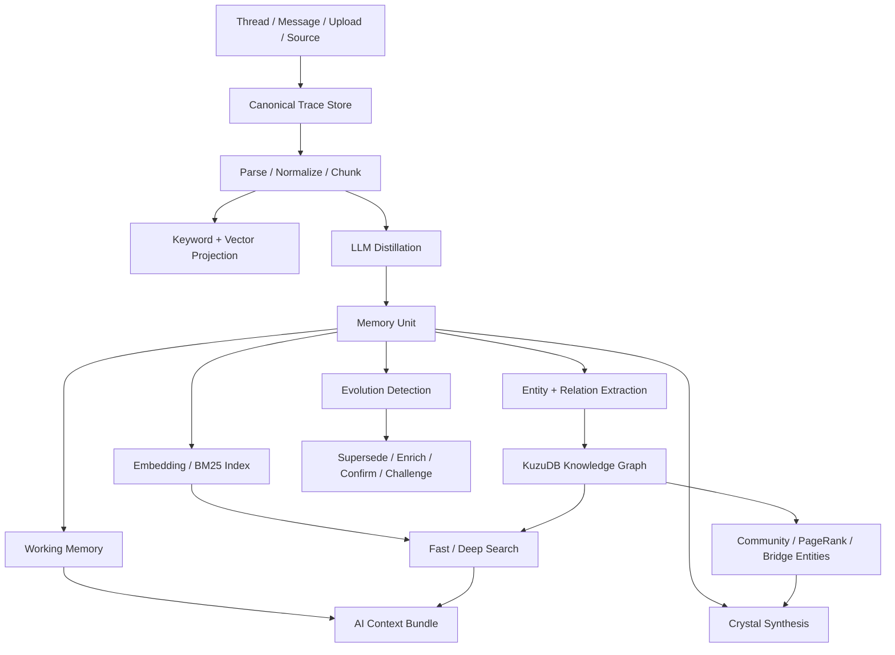
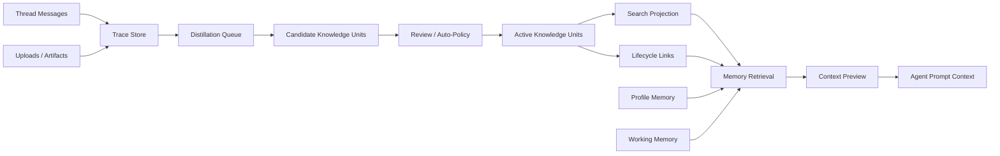

# Nowledge Memory 项目分析与 DeerFlow 借鉴设计

> 生成日期：2026-07-12  
> 分析对象：[Nowledge Memory 中文文档](https://mem.nowledge.co/zh/docs)  
> 分析目的：理解其产品模型、可能实现原理，并提炼 DeerFlow 记忆系统可借鉴的设计。

## 结论摘要

Nowledge Memory 值得重点参考。它不是一个简单的“向量库 + RAG”项目，而是一套围绕个人长期记忆构建的本地优先知识操作系统。它最有价值的地方，是把原始会话、文档、长期记忆、知识图谱、工作记忆、AI 注入上下文和可追溯来源拆成了清晰层级。

对 DeerFlow 来说，最值得借鉴的不是一次性引入图数据库或复杂 Crystal 机制，而是先补上三件基础能力：

1. 把“用户画像记忆”和“任务/知识型记忆”分开。
2. 让每条长期记忆都有明确 provenance，包括 thread、message、upload、chunk 或 artifact 来源。
3. 引入记忆生命周期，例如 `active`、`superseded`、`deprecated`、`challenged`，避免旧结论和新结论混在一起。

## 项目定位

官方文档把 Nowledge Memory 定位为本地优先的个人知识和记忆系统。桌面端、MCP、API 都围绕同一组本地 REST 接口工作，默认服务地址是 `127.0.0.1:14242`，并强调数据保留在用户设备上，远程 LLM 是可选能力。参考：[API 文档](https://mem.nowledge.co/zh/docs/api)。

它的核心产品对象包括：

- `Threads`：保存完整会话流。
- `Library Sources`：保存完整文档和资料来源。
- `Memories`：从会话或文档中提炼出来的长期、原子化记忆。
- `Entities / Graph`：实体、关系、演化链和图谱上下文。
- `Crystals`：从多个相关记忆中综合出的高阶结论。
- `Working Memory`：面向当前空间和近期任务的短期工作上下文。
- `Spaces`：按项目、生活、工作或 agent 隔离默认读写范围。
- `Context Preview`：展示 AI 实际会收到哪些记忆上下文。

这个分层很关键：它没有把所有东西都压扁成一堆 embedding，而是保留了“原始证据”和“长期结论”的边界。

## 官方确认的核心设计

### 1. Trace、Unit、Crystal 三层模型

Nowledge 的知识流可以概括为：

- `Trace`：原始会话、消息、文档、代码文件、上传文件。
- `Unit`：从 Trace 中提炼出来的 Memory，例如事实、偏好、决策、计划、流程、学习、上下文、事件。
- `Crystal`：从多个 Memory 归纳出的综合性知识，也以 Memory 形式存储，并通过 `is_crystal=true` 标记。

官方 Memory 文档明确提到 Memory 是持久化的独立单元，具备 `title`、`content`、`type`、`labels`、`importance` 等字段，并且建议连接器先搜索再决定新增或更新，避免重复记忆。参考：[Memories](https://mem.nowledge.co/zh/docs/memories)。

这比 DeerFlow 当前 Memory V2 更通用。DeerFlow 当前的模型主要围绕用户画像、偏好、兴趣、沟通风格、技能使用习惯和近期关注点展开，定义位于 `backend/packages/harness/deerflow/agents/memory/models.py`。它适合“了解用户”，但还不是完整的“知识记忆”。

### 2. Thread 和 Source 保留原始证据

Nowledge 的 Thread 用来保存完整对话流，Memory 则是从 Thread 中提炼出的长期结论。官方文档还强调，大会话会通过延迟、渐进式后台提炼处理，而不是一次性塞进前台请求。参考：[Threads](https://mem.nowledge.co/docs/threads)。

Library Source 则保留完整文档，经过解析、切块、向量索引、关键词索引后，可以进一步由 AI 提议抽取 Memories。官方把“可搜索文档”“AI 研究文档”“抽取成结构化记忆”分成三个状态。参考：[Library](https://mem.nowledge.co/zh/docs/library)。

这个设计对 DeerFlow 很重要。DeerFlow 现在有 thread、upload、artifact，但 Memory V2 更多是从用户消息中滚动生成画像。下一步应该让 upload chunk、artifact、thread message 都能成为 Memory 的 source reference。

### 3. 混合检索，而不是只靠向量

Nowledge 的搜索架构最多并行使用六类策略：

- semantic vector search
- full-text / CJK search
- entity search
- community search
- label search
- graph traversal

Fast 模式偏向低延迟，Deep 模式会增加 LLM 意图分类、HyDE、rerank 和更复杂的策略权重。参考：[Search Architecture](https://mem.nowledge.co/docs/concepts/search-architecture)。

官方还说明检索得分会考虑语义相似度、时间衰减、使用频率、重要性下限、置信度、Crystal boost、演化链等因素。参考：[Search Relevance](https://mem.nowledge.co/docs/search-relevance)。

这说明它的 retrieval 不是单一 embedding nearest neighbor，而是一个多信号排序系统。

### 4. 知识演化和软删除

Nowledge 把知识变化建模成显式关系，例如：

- `Replaces`
- `Enriches`
- `Confirms`
- `Challenges`

废弃或被替代的 Memory 不会直接消失，而是保留在图谱历史和 provenance 中。相关 API 包括 supersede 和 deprecate。参考：[Supersede Memory](https://mem.nowledge.co/docs/api/memories/memory_id/supersede/post)、[Deprecate Memory](https://mem.nowledge.co/docs/api/memories/memory_id/deprecate/post)。

这对 agent 系统特别关键。长期记忆最麻烦的问题不是“记不住”，而是“记住了过期内容”。显式 lifecycle 比靠 prompt 说“请判断是否过期”可靠得多。

### 5. 本地存储和可重建索引

服务部署文档暴露了它的本地数据布局：

```text
~/.local/share/NowledgeGraph/
  nowledge_graph_v2.db/   # KuzuDB graph
  search_index/           # LanceDB vector + BM25
  db_version.json
```

参考：[Server Deployment](https://mem.nowledge.co/docs/server-deployment)。

Docker 文档进一步说明，数据、配置、缓存是分开的：data 不可替代，config 有价值，cache 可以重建。embedding 模型和搜索投影属于可重建缓存。参考：[Docker](https://mem.nowledge.co/de/docs/docker)。

这个原则非常值得 DeerFlow 借鉴：canonical data 和 search projection 要分离。不要让向量库成为唯一事实来源。

## 推导的实现原理

下面是根据公开文档、API 字段和部署结构推导出的实现流程，不等同于官方源码确认。



可以推导出它大概率有两套数据形态：

- canonical store：Memory、Thread、Source、Entity、Edge、Space、Profile 等事实数据。
- projection store：向量索引、BM25 索引、社区划分、PageRank、decay cache 等可重建投影。

搜索时大致会按以下方式合并信号：

```text
score =
  semantic_similarity
  + keyword_score
  + entity_match
  + graph_proximity
  + label_match
  + community_relevance
  + recency_decay
  + frequency_signal
  + importance_floor
  + confidence_signal
  + crystal_boost
  + temporal_match
```

官方没有公开完整权重，这里只表达信号构成。文档确认的点是：Fast/Deep 分层、多策略搜索、时间衰减、频率、重要性、置信度、图谱和 Crystal boost 都参与相关性计算。

## 与 DeerFlow 当前 Memory V2 的差异

| 维度 | Nowledge Memory | DeerFlow 当前状态 | 借鉴方向 |
| --- | --- | --- | --- |
| 记忆对象 | fact、preference、decision、plan、procedure、learning、context、event | interest、preference、profile、communication_style、skill_usage、top_of_mind、correction | 增加通用 `KnowledgeUnit`，保留现有 `ProfileMemory` |
| 来源证据 | Thread、message、source、chunk、provenance | daily、legacy、manual 为主 | source ref 扩展到 thread message、upload chunk、artifact |
| 检索方式 | semantic、BM25、entity、graph、label、community | 固定顺序注入，偏画像摘要 | 加入 query-specific retrieval |
| 生命周期 | supersede、deprecate、confirm、challenge | soft delete、manual item、daily rollup | 引入显式演化关系 |
| 用户可见性 | Context Preview、review、dismiss、resolve | 主要是注入后的结果，预览较弱 | 做 AI 上下文预览和证据回溯 |
| 存储结构 | canonical data + rebuildable index | 文件 JSON/JSONL，简单可靠 | 先保持文件事实源，再增加索引投影 |
| 空间隔离 | Spaces 控制默认读写，实体图谱全局 | per-user 文件路径 | 引入 project/space scope，跨空间共享显式授权 |

DeerFlow 已经有不错的基础：`DailyPersonSummary` 提供了按天证据层，`MemorySourceEvent` 是 append-only audit，`storage_v2.py` 已经有软删除和 per-user 文件隔离。这些都能接住 Nowledge 风格的下一层演进。

## DeerFlow 最值得借鉴的设计

### 1. 拆分 Profile Memory 和 Knowledge Memory

当前 DeerFlow 的 Memory V2 更像“用户长期画像”。建议新增 `KnowledgeUnit`，不要把项目决策、流程、文档结论、代码约束塞进用户画像里。

建议字段：

```text
KnowledgeUnit
  id
  user_id
  tenant_id
  space_id
  type                  # fact / decision / plan / procedure / learning / context / event
  title
  content
  labels
  importance
  evidence_confidence
  review_status         # candidate / reviewed / dismissed
  lifecycle             # active / superseded / deprecated
  source_refs
  event_time
  temporal_precision
  recorded_at
  updated_at
```

同时保留现有画像型记忆，用于用户偏好和沟通风格。

### 2. SourceRef 升级为一等公民

每条记忆应该能回答“为什么我知道这件事”。建议把来源统一成：

```text
KnowledgeSourceRef
  source_type           # thread_message / upload_chunk / artifact / manual / daily_summary
  source_id
  thread_id
  message_id
  upload_id
  artifact_id
  chunk_id
  quote_or_excerpt
  created_at
```

这会直接提升可调试性和用户信任感。以后用户问“你为什么记得这个”，DeerFlow 可以给出来源，而不是只给一个黑盒结论。

### 3. 引入 Candidate / Reviewed 流程

Nowledge 的后台智能会提议抽取记忆、关系、Crystal，但重要写入最好经过 review。DeerFlow 可以先做轻量版：

- 自动抽取先进入 `candidate`。
- 高置信、低风险内容可自动激活。
- 涉及身份、偏好、长期规则、项目决策的内容需要用户确认。
- 被 dismiss 的 candidate 保留审计记录，避免反复提出。

### 4. 增加记忆生命周期

建议第一版只做三种关系：

- `supersedes`：新记忆替代旧记忆。
- `deprecates`：旧记忆不再使用，但保留历史。
- `challenges`：新证据和旧记忆冲突，需要确认。

检索默认只返回最新 active 记忆，除非用户明确要求看历史。

### 5. 做 Context Preview

Nowledge 的 Context Preview 非常适合 agent 产品。DeerFlow 可以在运行前展示：

- 本次会注入哪些用户画像。
- 本次会注入哪些项目记忆。
- 本次会读取哪些上传文件或 artifact 摘要。
- 哪些记忆因为过期、空间不匹配或低置信度被排除。

这会把 memory 从“神秘 prompt 注入”变成可检查的工程对象。

### 6. Fast / Deep 两级检索

DeerFlow 不必一开始实现完整图谱检索。建议分阶段：

- Fast：keyword + metadata + simple vector，低延迟，用于大多数请求。
- Deep：LLM query rewrite、HyDE、rerank、source citation，用于复杂研究或低置信结果。

第一版即使只有 BM25 + metadata，也已经比固定顺序注入更聪明。

### 7. Working Memory 按 Space 维护

Nowledge 的 Working Memory 是每日、每空间的活跃主题、未解决事项、最近变化和高频内容。DeerFlow 可以把它作为 session start summary：

```text
WorkingMemory
  user_id
  space_id
  active_topics
  unresolved_flags
  recent_changes
  pinned_context
  generated_at
```

这比每次从长期记忆里全量选更稳定，也更节省 token。

### 8. 数据事实源和索引投影分离

短期不建议 DeerFlow 直接引入 KuzuDB + LanceDB 双数据库组合。更稳的路径是：

- JSON/SQLite/Postgres 保存 canonical memory。
- SQLite FTS 或 Tantivy 做关键词索引。
- 后续再加向量索引。
- 图谱晚一点引入，先做 source refs 和 lifecycle。

原则是：索引坏了可以重建，事实数据不能丢。

## 不建议直接照搬的地方

### 1. 使用频率不等于真实性

Nowledge 文档提到置信度会受使用和图谱影响，并且搜索出现会更新 access count。这个机制有实用价值，但也会带来反馈循环：越常被搜到的记忆越常被强化。

DeerFlow 建议拆成三个字段：

- `evidence_confidence`：证据可信度。
- `usage_strength`：使用频率。
- `retrieval_freshness`：最近访问或相关性热度。

不要让“常用”直接变成“更真”。

### 2. 全局实体图谱需要多租户边界

Nowledge 的 Spaces 默认影响读写范围，但实体图谱是全局设计。这对个人本地产品是合理的，但 DeerFlow 如果面向多用户或团队，必须把 `tenant_id`、`user_id`、`space_id` 放进实体和关系的访问控制里。

否则项目 A 的实体关系可能通过 graph traversal 泄露到项目 B。

### 3. 自动抽取容易污染长期记忆

自动从会话和文档提炼记忆很诱人，但 agent 对话里有大量临时想法、假设、草稿和被推翻的方案。DeerFlow 应该先做 review-first，尤其是项目决策、用户偏好和长期规则。

### 4. Crystal 需要版本化

Crystal 是很好的设计，但自动综合结论会漂移。建议 DeerFlow 如果实现 Crystal，需要记录：

- source unit ids
- model name
- prompt version
- generation time
- review status
- previous crystal id

否则以后很难解释为什么综合结论发生变化。

### 5. 双数据库架构有运维成本

KuzuDB + LanceDB 很漂亮，但对 DeerFlow 当前阶段可能过重。优先做数据模型和检索接口，后续再替换底层索引实现。架构上给图谱和向量留接口即可。

## 建议实施路线

### P0：先补记忆骨架

- 新增 `KnowledgeUnit` 和 `KnowledgeSourceRef`。
- 增加 `candidate / reviewed / dismissed` 状态。
- 增加 `active / superseded / deprecated` lifecycle。
- 手动保存、搜索、更新、废弃记忆。
- Context Preview 展示本次会注入的记忆。
- 先用关键词和 metadata 搜索，不急着上图谱。

### P1：让会话和文档进入记忆流水线

- Thread distillation：从会话提炼 decision、plan、learning、procedure。
- Upload chunk source：文档切块可作为 source ref。
- Fast search：BM25 + metadata + optional vector。
- Working Memory：按 user + space 生成近期上下文。
- Space scope：项目级读写范围。

### P2：引入知识演化

- 检测新旧记忆冲突。
- 支持 supersede、deprecate、challenge。
- 默认检索只返回 latest active memory。
- 提供“为什么这条记忆被替换”的证据链。

### P3：再做图谱和 Crystal

- 实体和关系抽取先 preview，不直接写入。
- 用户确认后写入图谱。
- 基于多个来源生成 Crystal。
- Crystal 必须可追溯、可 dismiss、可版本化。

## 推荐的 DeerFlow 目标架构



这个架构和 Nowledge 的思路一致，但更适合 DeerFlow 当前阶段：先把证据、生命周期和检索打稳，再上图谱和高阶综合。

## 最终评价

Nowledge Memory 对 DeerFlow 的参考价值很高，尤其适合作为 Memory V3 或 Knowledge Memory 的方向样本。

综合评分：

| 维度 | 评分 | 说明 |
| --- | --- | --- |
| 知识建模 | 9/10 | Trace、Unit、Crystal 分层清楚 |
| Agent 集成 | 9/10 | MCP、API、Context Preview、Working Memory 都围绕 agent 使用 |
| 来源追溯 | 8.5/10 | provenance 和演化链设计完整 |
| 检索架构 | 8.5/10 | 多策略检索成熟，但实现复杂 |
| 本地优先和可迁移 | 9/10 | canonical data 与 cache 分离，导出友好 |
| 稳定性风险 | 7/10 | 0.10 是大规模引擎重写，需关注新架构稳定性 |
| DeerFlow 借鉴价值 | 9/10 | 非常适合作为长期记忆系统演进参考 |

一句话总结：Nowledge Memory 最值得学的是“把记忆当成有来源、有生命周期、有检索解释的知识对象”，而不是“给聊天记录做 embedding”。DeerFlow 如果沿着这个方向演进，Memory 会从 prompt 辅助功能变成真正可维护的知识基础设施。
