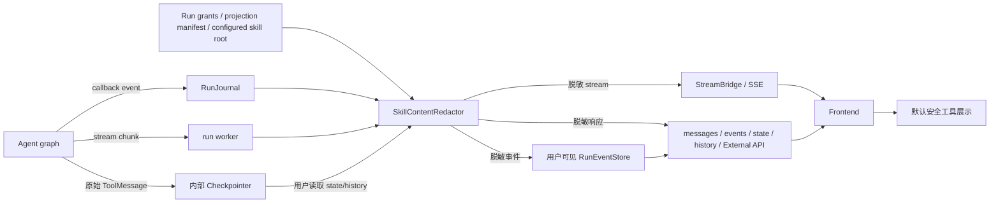

# Skill 执行内容脱敏 Spec

## 状态

- 状态：Implemented（代码 Review V2 Passed）
- 日期：2026-07-13
- 优先级：P0
- 关联设计：[`2026-06-15-skill-sharing-permissions-design-v2.md`](./2026-06-15-skill-sharing-permissions-design-v2.md)
- 实施记录：[`../execution/2026-07-13-skill-execution-content-redaction-implementation.md`](../execution/2026-07-13-skill-execution-content-redaction-implementation.md)
- 代码审查：[`2026-07-13-skill-execution-content-redaction-code-review-v2.md`](./2026-07-13-skill-execution-content-redaction-code-review-v2.md)（初审：[`2026-07-13-skill-execution-content-redaction-code-review.md`](./2026-07-13-skill-execution-content-redaction-code-review.md)）
- 影响范围：Agent runtime、RunJournal、StreamBridge、RunEventStore、Gateway 用户可见 API、前端工具执行记录、日志与 tracing

## 摘要

当前工具执行记录会把 `read_file` 的原始结果直接渲染到页面。当 Agent 按系统提示读取 `/mnt/skills/**/SKILL.md` 时，完整 Skill 指令会进入 `ToolMessage.content`，随后被写入 RunEventStore，并经实时流、历史消息和执行记录页面返回给用户。

本 Spec 选择“内部原始状态与用户可见事件双轨”的修复方式：模型和 checkpointer 继续持有 Skill 原文，以保证 Agent 能正常执行；所有普通用户可访问的持久化、流式和查询边界只输出脱敏后的 Skill 执行事件。前端同时改为默认安全的工具展示策略，作为纵深防御，而不是权限边界。

本次修复适用于 public 和 custom Skill。普通执行记录不应显示任何 Skill bundle 原文；需要查看 Skill 内容的用户必须通过显式的 Skill 内容接口或编辑器，并经过对应内容读取权限校验。

## 背景与问题

### 当前行为

1. Agent 调用 `read_file` 读取 Skill：

   ```json
   {
     "name": "read_file",
     "args": {
       "description": "Load data analysis skill",
       "path": "/mnt/skills/public/data-analysis/SKILL.md"
     }
   }
   ```

2. `read_file` 返回完整文本，LangGraph 将其包装为 `ToolMessage`。
3. `RunJournal.on_tool_end()` 使用 `ToolMessage.model_dump()` 写入 RunEventStore。
4. Gateway 的 SSE、run messages、run events、thread state/history 等边界返回原始消息。
5. `WorkspaceToolExecutionPanel` 通用地渲染工具参数和结果，单项最多展示 20,000 字符。

主聊天中的 `read_file` 专用展示只显示描述和路径，但新增加的执行记录面板绕过了这套专用展示逻辑。因此该问题不是 `read_file` 自身异常，而是原始内部消息被当作用户可见数据使用。

### 风险等级

- 当前仅使用 public Skill 时：内部实现细节泄露和明显的产品体验缺陷。
- 存在 private/custom Skill 时：Skill 作者的指令、流程、模板和 supporting files 可能泄露。
- 开放“可使用但不可读取内容”的共享权限后：构成直接的内容读取权限绕过，因此是该能力上线前的阻断项。
- 风险不限于截图页面。即使前端隐藏内容，用户仍可能从浏览器网络请求、SSE、messages/events API 或历史状态中取得原文。

### 根因

系统目前缺少“内部执行消息”和“用户可见消息”的明确边界：

- `read_file` 的真实返回值同时承担模型输入和 UI 数据两种职责。
- RunEventStore 同时存储用户消息与调试事件，但没有 Skill 内容分级。
- `serialize()` 只负责结构序列化，没有、也不应该承担缺少运行上下文的权限判断。
- 前端执行记录使用通用 JSON 查看器，默认展示未知工具的全部参数和结果。

## 目标

### 功能目标

1. Agent 仍能读取完整 Skill bundle 并据此完成任务。
2. 普通用户可见的执行记录只显示 Skill 名称、执行状态和安全摘要，不显示 Skill 原文。
3. 实时流、历史消息、run events、checkpoint/state/history、External API、日志和 tracing 使用一致的脱敏规则。
4. 新写入 RunEventStore 的用户可见事件不再包含 Skill 原文。
5. 已存在的历史原始事件在读取时完成脱敏，无需等待离线迁移。
6. 保持 `tool_call_id`、消息顺序、执行状态和分页语义兼容。
7. 前端对所有工具采用默认安全展示策略，未知工具不能自动获得原始详情展示能力。

### 非目标

- 不保证 LLM 永远不会在最终回答中复述或改写 Skill 指令。模型已经读取原文，这不是纯事件脱敏能够建立的安全保证。
- 不在本 Spec 中完成 Skill sharing、ACL、revision pin 或 run projection 的全部实现。
- 不删除模型运行所需的原始 checkpoint 消息。
- 不提供普通用户查看原始 run/debug state 的新入口。
- 不通过简单降低 UI 截断长度解决问题。
- 不把 Skill 原文视为可对恶意模型严格保密的商业机密；这类逻辑应实现为后端受控工具或工作流服务。

## 威胁模型与信任边界

### 需要防护的读取者

- 拥有会话/run 读取权限、但没有 Skill 内容读取权限的登录用户。
- 被分享 Skill 的“仅可使用”用户。
- 通过浏览器开发者工具直接查看网络响应的普通用户。
- 通过 External API 使用 Skill 的 API key 调用者。

### 受保护内容

- `SKILL.md` 全文。
- Skill bundle 下的 references、scripts、assets、模板和其他 supporting files。
- 能还原上述内容的工具参数、工具结果、异常、日志和 trace payload。
- 内部 storage key、revision location、owner 路径等非安全 metadata。

### 普通用户可见的安全信息

- Skill 安全展示名称和可选的稳定 ID。
- public/custom 分类；仅在该字段已被授权为安全 metadata 时返回。
- “已加载 Skill 指令”一类固定摘要。
- 工具执行状态、开始/结束时间、错误状态；错误详情必须经过脱敏。

## 需求

### 安全要求

- 用户可见边界不得出现完整或截断后的 Skill 内容；截断不是脱敏。
- 脱敏判断必须在服务端完成，前端路径判断只能作为纵深防御。
- 新运行优先使用 run grant 与 projection manifest 识别 Skill 文件；当前尚未具备 manifest 时，可使用经过规范化的配置路径作为兼容分类器。
- 工具调用和配对结果必须通过 `(run_id, tool_call_id)` 关联，不能只判断结果文本。
- 未知消息结构、未知 stream mode 或脱敏异常必须 fail closed，不能回退为原始 payload。
- 脱敏逻辑不得修改传给模型或写入 checkpointer 的对象。
- 日志、指标和错误信息不得再次记录被脱敏的原始内容。

### 兼容性要求

- 用户可见消息继续满足 LangChain/LangGraph Message 的现有结构。
- 保留原 `tool_call_id`，避免工具状态、消息合并和历史去重失效。
- 不改变非 Skill 工具在后端消息协议中的业务语义。
- 旧历史事件即使没有新增 metadata，也必须获得保守脱敏。
- memory、JSONL 和 DB 三种 RunEventStore 后端行为一致。

### 非功能要求

- 脱敏复杂度应为单批消息线性扫描，避免对每条 ToolMessage 重复扫描完整历史。
- 对最多 200 条消息的普通分页响应，服务端脱敏新增 p95 延迟目标不超过 10ms；最终阈值以基准测试校准。
- 流式脱敏不得破坏事件顺序，也不得额外缓存 Skill 原文。
- 运行时脱敏状态按 run 隔离；不同 run 中相同 `tool_call_id` 不得串联。
- 需要提供脱敏数量、分类失败、fail-closed 和旧数据回退命中的无敏感指标。

## 方案比较

### 方案 A：仅修改前端

做法：在执行记录中对 `read_file` 或 `/mnt/skills` 路径隐藏结果。

优点：改动小、可以快速消除截图中的现象。

缺点：SSE、API、历史记录和浏览器网络响应仍返回原文；不能作为权限边界；`bash`、`grep`、subagent 等路径仍可泄露。

结论：仅作为紧急止血和纵深防御，不作为最终方案。

### 方案 B：让 `read_file` 对 Skill 返回占位文本

优点：源头不再产生原文 ToolMessage。

缺点：模型无法获得 Skill 指令，直接破坏 Skill 执行；若额外通过系统消息注入，原文仍会进入其他流式和 tracing 边界。

结论：拒绝。

### 方案 C：用户可见边界统一脱敏，内部状态保留原文

优点：不影响模型执行；覆盖 UI、流、API、历史与持久化；可与未来 Skill grant/projection 权限模型衔接。

缺点：需要在多个输出边界接入同一脱敏服务；短期内内部 checkpoint 与用户事件存在双轨数据。

结论：采用。

## 总体架构



核心原则：原始内容只沿内部执行路径流动；凡是面向普通用户的边界，都必须经过同一个服务端 redactor。

## 核心组件设计

### `SkillContentRedactor`

建议新增：

`backend/packages/harness/deerflow/skills/privacy.py`

建议接口：

```python
@dataclass(frozen=True)
class SkillExecutionDescriptor:
    skill_name: str
    category: str | None = None
    skill_id: str | None = None
    skill_handle: str | None = None
    version_seq: int | None = None


class SkillContentRedactor:
    def observe_message(self, message: Any, *, run_id: str) -> None: ...
    def redact_message(self, message: Any, *, run_id: str) -> Any: ...
    def redact_messages(self, messages: list[Any], *, run_id: str) -> list[Any]: ...
    def redact_stream_payload(self, mode: str, payload: Any, *, run_id: str) -> Any: ...
    def redact_event_batch(self, events: list[dict]) -> list[dict]: ...
```

实现约束：

- 所有方法返回副本，不原地修改 graph/checkpointer 对象。
- 流式实例在单个 run 生命周期内维护敏感 `tool_call_id` 索引。
- 批量/历史接口采用两阶段扫描：先建立调用索引，再替换调用参数和配对结果。
- `serialize()` 保持纯机械序列化；redactor 必须在调用 `serialize()` 前执行，因为序列化层没有授权上下文。

### 敏感调用分类

分类优先级从高到低：

1. run projection manifest：路径落在本次 run 的 Skill 投影中。
2. run grants：通过稳定 Skill 标识和投影信息识别。
3. 当前版本兼容分类：工具类型 + 规范化路径落在 `AppConfig.skills.container_path` 下。
4. 旧数据保守回退：缺少配对调用时，名为 `read_file` 的 ToolMessage 结果默认隐藏；其他可疑调用按 run 级索引补查。

必须覆盖：

- `read_file`
- `ls`、`grep`、`glob`
- 引用 Skill 投影的 `bash`
- subagent 内部 Skill 读取和注入消息
- 未来新增的 Skill bundle 读取工具

路径匹配必须规范化分隔符、`.`/`..`、重复斜线和大小写策略，并验证“位于根目录下”，不能使用简单的 `contains("/mnt/skills")`。

对于分页导致调用与结果不在同一页的情况：

- 新事件写入 `metadata.skill_execution`，避免查询时重新推断。
- 旧事件按 `(run_id, tool_call_id)` 加载并缓存配对调用；不能因页边界而把原始结果返回。

### 用户可见消息格式

为保持现有 Message 协议兼容，用户可见副本保留消息类型、工具名和 `tool_call_id`，但替换敏感参数和结果：

```json
{
  "type": "tool",
  "name": "read_file",
  "tool_call_id": "call-1",
  "content": "Skill instructions loaded.",
  "additional_kwargs": {
    "visibility": "redacted",
    "event_type": "skill_execution",
    "skill_execution": {
      "skill_name": "data-analysis",
      "category": "public",
      "summary": "Loaded skill instructions"
    }
  }
}
```

配对的 AI tool call 对用户可见时调整为：

```json
{
  "name": "read_file",
  "id": "call-1",
  "type": "tool_call",
  "args": {
    "description": "Load data analysis skill",
    "skill_name": "data-analysis",
    "redacted": true
  }
}
```

不得返回原始绝对宿主路径、storage key、revision location 或 supporting file 内容。是否展示 category、skill ID、version 等字段由 Skill metadata 权限模型决定；无法确认安全时省略。

### RunJournal 与 RunEventStore

`RunJournal` 构造时接收 run-scoped redactor。回调仍可使用原始消息计算内部 token、状态和执行结果，但进入 `_put()` 缓冲区前必须产生用户安全副本。

采用以下持久化原则：

- RunEventStore 的 `category="message"` 默认视为用户可见数据，只写脱敏后的 Skill 调用与结果。
- 普通 trace 也不得写入 Skill 原文；如果未来确实需要原始调试事件，应使用独立的受限存储、独立权限和审计，不复用当前普通 run events API。
- checkpointer 继续保存模型运行所需的原始消息，但任何用户可见 state/history 路由必须读时脱敏。
- 新事件增加安全 metadata，供分页、重放和历史读取稳定识别。

### StreamBridge

`run_agent()` 为每个 run 创建一个 redactor，并在 `bridge.publish()` 前调用 `redact_stream_payload()`。

覆盖所有支持的模式：

- `messages-tuple`
- `values`
- `updates`
- `checkpoints`
- `tasks`
- `debug`
- `custom`

未知 mode 在包含消息或工具 payload 时必须 suppress/fail closed，并发布不含原始数据的通用 `redaction_error`；不能因为兼容性问题直接透传。

subgraph 流必须使用同一父 run redactor，并把 namespace 纳入内部关联键，避免不同 subagent 的调用 ID 冲突。

### Gateway API

以下接口或服务必须调用同一 redactor，而不是各自实现字符串替换：

- thread/run messages
- run events
- thread state
- thread history
- checkpoint/state/history 兼容接口
- External API 的 run 输出、错误和调试字段
- share/export 中可能包含消息或事件的接口

对 RunEventStore 的查询仍需进行读时脱敏，作为以下场景的防线：

- 修复上线前已写入的原始历史事件。
- 部分 worker 尚未升级的滚动发布窗口。
- callback 或新事件类型遗漏写时脱敏。

任何内部 state/debug 管理接口如需原始数据，必须另行设计独立权限、break-glass reason 和审计记录；不在普通 `runs:read` 权限中开放。

### 日志与 tracing

- redactor 只能记录调用 ID、Skill 安全标识、命中规则和结果状态，不能记录原始 args/result。
- 受保护 Skill run 默认禁止第三方 exporter 采集原始 prompt、tool payload 和 checkpoint。
- 如果 exporter 无法在采集前可靠脱敏，则该 run 禁用对应原始 tracing，而不是导出后再清洗。
- 增加以下建议指标：
  - `skill_redaction_events_total{boundary,tool}`
  - `skill_redaction_fail_closed_total{boundary}`
  - `skill_redaction_legacy_fallback_total{tool}`
  - `skill_redaction_errors_total{boundary}`

指标标签不得包含用户输入、路径、Skill 原文或高基数字段。

## 前端设计

### 默认安全的 Tool Display Policy

`WorkspaceToolExecutionPanel` 不再默认调用 `formatJson(execution.args/result)`。新增工具展示策略：

```ts
type ToolDisplayPolicy = {
  showRawArgs: boolean;
  showRawResult: boolean;
  safeArgKeys?: readonly string[];
};
```

规则：

- 默认策略：不展示原始 args/result，只显示工具名称、描述和状态。
- `read_file`：显示安全路径或 Skill 名称；永不显示文件内容。
- `write_file`、`str_replace`：不显示正文参数，只显示安全路径与操作摘要。
- `bash`：默认不显示完整命令和 stdout；如产品需要展开，必须先提供专用脱敏器。
- 其他工具只有在显式注册安全 renderer 后，才允许展示指定字段。
- 收到 `additional_kwargs.visibility="redacted"` 时显示“内容已隐藏”，不能提供展开原文的交互。

服务端脱敏是安全边界；前端策略用于防止后端遗漏时直接把任意工具 payload 变成页面内容。

### 文案建议

- 标题：`Load data analysis skill`
- 类型：`read_file`
- 状态：`完成`
- 结果：`已加载 Skill 指令，内容已隐藏`

无需展示原始 `/mnt/skills/.../SKILL.md` 路径；如路径用于产品解释，只展示安全的 Skill 名称。

## 数据流

### 新运行

1. worker 从 `RunContext.app_config` 和未来 run grant/projection manifest 构建 `SkillContentRedactor`。
2. Agent 获取原始 Skill 内容并写入内部 graph state/checkpoint。
3. redactor 观察 AI tool call，记录 `(run_id, namespace, tool_call_id) -> SkillExecutionDescriptor`。
4. RunJournal 写事件前替换敏感调用参数和 ToolMessage 内容。
5. worker 发布 stream chunk 前生成脱敏副本。
6. 前端只接收脱敏消息，并根据 Tool Display Policy 安全渲染。

### 历史运行

1. Gateway 从 RunEventStore 或 checkpointer 读取历史。
2. redactor 先扫描 AI tool calls 和已有 `metadata.skill_execution`，构建关联索引。
3. 替换同一调用的参数、结果和错误内容。
4. 返回脱敏副本；底层历史对象不被修改。

### 分页历史

1. 对新事件直接使用持久化的 `metadata.skill_execution`。
2. 对旧事件按 run 建立短生命周期的敏感调用索引。
3. ToolMessage 在当前页找不到 AI 调用时，不得直接透传；`read_file` 结果保守隐藏，其他类型执行关联补查或 fail closed。

## 失败模式

| 失败模式 | 风险 | 处理方式 |
|---|---|---|
| redactor 抛异常 | 原文可能被透传 | 当前边界 fail closed；隐藏工具 payload，保留不含敏感内容的通用状态 |
| projection manifest 缺失 | 无法权威判断路径 | 使用配置根路径兼容分类；记录无敏感指标；共享权限上线前必须补齐 manifest |
| 调用与结果跨分页 | 结果失去分类 | 使用持久化 metadata；旧数据按 run/tool_call_id 补查并缓存 |
| ToolMessage 为 list/dict 等结构 | 局部替换遗漏内容 | 敏感结果整体替换，不尝试局部清洗 |
| subagent 复用 tool_call_id | 错配或漏配 | 关联键加入 run ID 和 subgraph namespace |
| 新工具读取 Skill | 分类器未覆盖 | Skill projection 访问是主判断；未知访问投影的工具默认敏感 |
| 未知 stream mode | 递归结构泄露 | 不透传消息型未知 payload，输出安全错误并告警 |
| 滚动发布期间旧 worker 写入原文 | 新旧行为混合 | 所有读取接口保留读时脱敏，直到完成全量升级和历史处理 |
| 第三方 tracing 自动采集 | 绕过 Gateway | 受保护 run 禁止原始采集，或在 exporter 前使用同一 redactor |

## 测试策略

所有测试使用唯一标记，例如：

`SECRET_SKILL_MARKER_123_DO_NOT_EXPOSE`

### 单元测试

建议新增：

- `backend/tests/test_skill_content_redactor.py`
- `backend/tests/test_run_journal_skill_redaction.py`
- `backend/tests/test_run_stream_skill_redaction.py`
- `backend/tests/test_thread_run_skill_redaction.py`
- `frontend/tests/unit/components/workspace/chats/workspace-tool-execution-panel.test.ts`

覆盖：

- public/custom `SKILL.md`。
- supporting files、references、scripts 和 assets。
- `read_file`、`ls`、`grep`、`glob`、`bash` 和 subagent。
- Windows/Linux 分隔符、路径规范化、`..`、重复斜线和大小写策略。
- ToolMessage 的字符串、list、dict 内容。
- tool call 与结果跨页、乱序、重复 ID 和缺失配对调用。
- 未知 stream mode 和 redactor 异常的 fail-closed 行为。
- redactor 不修改原始消息对象。
- 非 Skill 工具的后端协议保持不变。

### 集成测试

启动真实或最小化 run，确认唯一标记：

- 存在于模型内部工具结果，并能影响后续 Agent 行为。
- 不存在于 RunEventStore 新写入的 message/trace。
- 不存在于 SSE 的所有支持模式。
- 不存在于 run messages/events。
- 不存在于 thread state/history/checkpoint 用户响应。
- 不存在于 External API 响应和错误。
- 不存在于普通日志和 tracing exporter payload。

### 前端与 E2E

- 执行记录展开后不出现唯一标记。
- Network fixture 即使错误地包含原文，默认 Tool Display Policy 也不渲染它。
- Skill 执行仍显示名称、状态和“内容已隐藏”摘要。
- 历史恢复和实时流展示一致。
- 普通非 Skill 工具的状态、分页和消息合并不回归。

## 验收标准

1. 在普通用户可访问的浏览器 DOM、SSE、API、history/state、run events、日志和 tracing 中全局搜索唯一标记，结果为 0。
2. Agent 内部测试证明模型仍收到唯一标记，并能遵循其中一条测试指令。
3. `tool_call_id`、消息顺序、历史分页和执行状态保持正确。
4. 新事件写入 RunEventStore 前已经脱敏；读取接口仍能遮蔽旧原始事件。
5. redactor 出错时没有任何原始 payload 被返回。
6. 未经显式注册的前端工具 renderer 不展示原始参数或结果。
7. owner 需要查看 Skill 原文时，只能通过受权限保护的 Skill 内容接口或编辑器，而不是执行记录。

## 实施拆分

### Phase 0：前端紧急止血

- 引入默认安全 Tool Display Policy。
- `read_file` 永不渲染结果；Skill 调用显示固定摘要。
- 添加截图同型前端回归测试。

该阶段消除当前页面泄露，但不能单独关闭安全问题。

### Phase 1：服务端公共脱敏组件

- 新增 `deerflow.skills.privacy.SkillContentRedactor`。
- 实现消息批量扫描、调用关联、路径规范化和安全消息格式。
- 为当前配置根路径与旧消息提供兼容分类。

### Phase 2：写入与实时边界

- worker 创建 run-scoped redactor。
- RunJournal 写 RunEventStore 前脱敏。
- StreamBridge publish 前脱敏所有模式。
- tracing 采用同一策略或对受保护 run 禁用原始采集。

### Phase 3：查询与历史边界

- messages/events/state/history/checkpoint/External API 统一接入读时脱敏。
- 解决分页配对和旧事件回退。
- 增加滚动发布兼容测试。

### Phase 4：未来权限模型对接

- 使用 run grant 与 projection manifest 替代配置路径作为主分类依据。
- subagent 显式继承脱敏上下文。
- 引入受审计的 admin/debug 原始数据访问方案；在此之前不开放普通入口。

## 预计代码改动

| 文件/模块 | 变更 |
|---|---|
| `backend/packages/harness/deerflow/skills/privacy.py` | 新增 run-scoped Skill redactor、分类与安全消息模型 |
| `backend/packages/harness/deerflow/runtime/journal.py` | 写 RunEventStore 前脱敏 |
| `backend/packages/harness/deerflow/runtime/runs/worker.py` | 构建 redactor，并在 StreamBridge 前脱敏 |
| `backend/app/gateway/routers/thread_runs.py` | messages/events 读时脱敏 |
| `backend/app/gateway/routers/threads.py` | state/history/checkpoint 读时脱敏 |
| External API 相关 service/router | 输出和错误脱敏 |
| tracing 初始化/导出层 | 禁止或脱敏受保护 run 的原始 payload |
| `frontend/src/components/workspace/chats/workspace-tool-execution-panel.tsx` | 默认安全 Tool Display Policy 与 Skill 占位展示 |
| `frontend/src/core/messages/utils.ts` | 如需要，提供返回完整 ToolMessage 的配对辅助函数 |
| backend/frontend tests | 唯一标记、跨边界和 fail-closed 回归测试 |
| `backend/CLAUDE.md`、相关用户文档 | 实施完成后同步内部架构与用户可见行为 |

## 发布与迁移

推荐发布顺序：

1. 先发布前端止血。
2. 发布所有用户可见查询接口的读时脱敏。
3. 发布 RunJournal 写时脱敏和 StreamBridge 实时脱敏。
4. 确认所有 worker 升级后，验证新事件不再落原文。
5. 评估对旧 RunEventStore 数据执行一次性离线清理；清理前保留备份和 marker 扫描报告。

安全脱敏默认强制开启，不提供普通配置开关。若上线出现兼容问题，只能回滚到仍保持读时脱敏的版本，不能通过关闭脱敏恢复原始返回。

## ADR-SSCR-001：采用内部/用户可见事件双轨

### 状态

Accepted

### Context

Skill 原文是模型执行输入，但不应成为普通用户的工具执行详情。当前同一 ToolMessage 同时服务模型状态、事件存储、API 和 UI，导致保密边界缺失。

### Decision

保留原始 Skill 内容于内部 graph/checkpointer；在 RunJournal、StreamBridge 和 Gateway 查询边界使用统一 `SkillContentRedactor` 生成用户安全副本。RunEventStore 的普通 message/trace 只写安全事件。

### Positive consequences

- 不破坏 Agent Skill 执行。
- 为 Skill sharing 的“可使用、不可读内容”语义建立必要基础。
- 实时、历史、API 和 UI 使用同一策略。
- 旧数据可通过读时脱敏立即得到保护。

### Negative consequences

- 存在内部原始 checkpoint 与用户事件双轨，需要明确维护边界。
- 多个输出入口需要接入统一组件并持续维护测试矩阵。
- 旧事件分页关联会增加少量查询和缓存复杂度。

### Alternatives considered

- 仅前端隐藏：无法保护网络与 API，拒绝作为最终方案。
- 修改 `read_file` 返回值：破坏模型执行，拒绝。
- 仅对原始数据加密：授权用户仍能从 API 获得解密后的内容，不能解决本问题。

## Review 重点

1. 是否接受 RunEventStore 普通 message/trace 只保存脱敏事件，原始运行状态仅保留在内部 checkpointer？
2. 用户可见 ToolMessage 是否保留原工具名和 `tool_call_id`，通过 `additional_kwargs.skill_execution` 表达脱敏状态？
3. 当前版本是否需要同时覆盖 `bash`、subagent 和 tracing，还是先以 `read_file` + 所有用户 API 为最小 P0 上线范围？
4. 历史 RunEventStore 原文是在读时长期遮蔽，还是后续执行一次性物理清理？
5. owner 的执行记录是否也始终隐藏 Skill 原文，仅允许通过 Skill 编辑器/内容接口显式查看？

上述五项的初审结论见 [`code-review`](./2026-07-13-skill-execution-content-redaction-code-review.md)；修复后复审结论与合并 checklist 见 [`code-review-v2`](./2026-07-13-skill-execution-content-redaction-code-review-v2.md)。
