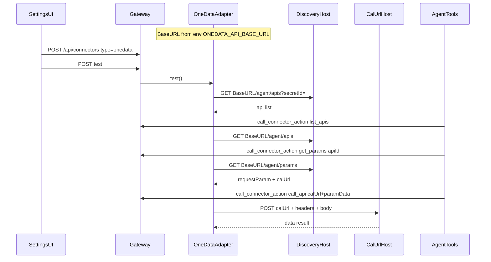

# OneData 连接器实现计划

## 已确认约定

- 表单**不填** Base URL；只填 `secretId` / `secretKey`
- **`onedata.list_apis` / `onedata.get_params`**：发现服务 Base URL 从 **环境变量**读取（如 `ONEDATA_API_BASE_URL`），再拼 `/agent/apis`、`/agent/params`
- **`onedata.call_api`**：**不再回打发现服务**；直接使用 `onedata.get_params` 返回的完整 **`calUrl`** 做 POST
- **不做** HMAC 与字段加解密；请求头 `sign` **直接传 `secretKey`**
- 响应字段名与对方对齐，使用 **`calUrl`**

## 调用链路

## 1. 添加连接器 UI（按类型分支）

改 [`frontend/src/components/workspace/settings/connector-settings-page.tsx`](frontend/src/components/workspace/settings/connector-settings-page.tsx)：

- 类型选择保留；创建时可选 `onedata`
- **`onedata` 表单字段**：名称 / 显示名 / `secretId` / `secretKey`（编辑时 secretKey 空=保留原值）
- **隐藏** database 字段：host / port / database / ssl / maxRows / allowedSchemas
- 凭据：inline —— `username`←`secretId`，`password`←`secretKey`（UI 文案为 secretId/secretKey）
- `buildConfig`：`config: {}`；policy 用轻量 timeout，不套 SQL 字段
- 测试连接走现有 test API；i18n 补中英标签

## 2. 后端类型注册 + Adapter

**Registry** — [`registry.py`](backend/packages/harness/deerflow/connectors/registry.py)：注册 `onedata`，capabilities：

`["onedata.list_apis", "onedata.get_params", "onedata.call_api"]`

**新文件** [`adapters/onedata.py`](backend/packages/harness/deerflow/connectors/adapters/onedata.py)：

| Capability / 方法 | Base / URL 来源 | 行为 |
|------|------|------|
| `test` / `onedata.list_apis` | `os.environ["ONEDATA_API_BASE_URL"]` | `GET {base}/agent/apis?secretId=` |
| `onedata.get_params` | 同上 | `GET {base}/agent/params?secretId=&apiId=`，响应含 `calUrl` |
| `onedata.call_api` | **args.calUrl**（全路径） | `POST calUrl`，不访问发现服务 |

**环境变量**（发现专用，不进连接器表单）：

- 名：`ONEDATA_API_BASE_URL`
- 示例值：`http://share-onedata-api-ent4.prd.yumc.local/v1`
- 缺失时：test / list_apis / get_params 明确报错（提示配置 env）

**`onedata.call_api` args**：

- **必填**：`calUrl`（来自上一步 get_params）、`paramData`（可为 `{}`）
- **可选**：`pageSize` / `pageNum` / `orderBy` / `maxSize` / `hasTotal`

**请求头**：

- `Content-Type: application/json`
- `secretId` / `timestamp`（毫秒）/ `sign: <secretKey>`（明文）

**Body**：`{ "paramData": {...}, ...分页字段 }`；直接返回对方 JSON。

**凭据**：现有 secret store，`username`→secretId，`password`→secretKey。

## 3. Agent 使用方式

复用 [`call_connector_action`](backend/packages/harness/deerflow/connectors/tools.py)：

1. `onedata.list_apis` → 接口列表  
2. `onedata.get_params`，`args={apiId}` → 入参/出参 + **`calUrl`**  
3. `onedata.call_api`，`args={calUrl, paramData, ...}` → **直接 POST calUrl**

## 4. 配置开关

- `enabled_types` 增加 `onedata`（`connectors_config.py` / `config.example.yaml` / `config.yaml`）
- 文档与 env 示例中写明 `ONEDATA_API_BASE_URL`

## 5. 文档与测试

- 更新 [`agent-api.md`](docs/design/onedata/agent-api.md)：`calUrl` 字段；本项目 `sign=secretKey`
- 更新 [`CONNECTORS.md`](backend/docs/CONNECTORS.md)：env + 三步 capability
- 单测（mock httpx）：
  - list/get_params 请求打到 `ONEDATA_API_BASE_URL`
  - call_api **只**请求传入的 `calUrl`，header `sign==secretKey`
  - 未配置 env 时 list/get_params 失败信息清晰

## 成功标准

- 设置页仅需名称 + secretId + secretKey
- 发现接口依赖 env Base URL；业务调用只依赖 get_params 返回的 `calUrl`
- 无表单 Base URL；无 HMAC/加解密
