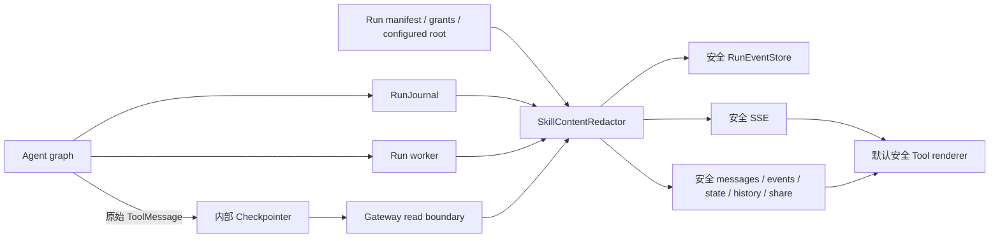

# Skill 执行内容脱敏实施记录

## 状态

- 状态：Completed（代码 Review V2 Passed）
- 完成日期：2026-07-13
- 优先级：P0
- 对应 Spec：[`../design/2026-07-13-skill-execution-content-redaction-spec.md`](../design/2026-07-13-skill-execution-content-redaction-spec.md)
- 代码审查：[`../design/2026-07-13-skill-execution-content-redaction-code-review-v2.md`](../design/2026-07-13-skill-execution-content-redaction-code-review-v2.md)
- ADR：`ADR-SSCR-001` 已由 Proposed 更新为 Accepted

## 结论

执行记录泄露 Skill 原文的问题已按 Spec 的 Phase 0 至 Phase 4 顺序完成修复。系统现在采用“内部原始状态 / 用户可见安全副本”双轨：Agent 与内部 checkpointer 继续持有完整 Skill 内容，RunEventStore、SSE、Gateway 查询接口、公开分享和前端执行记录只接收服务端脱敏后的副本。

修复覆盖 public/custom Skill、Skill bundle supporting files、`read_file`、`ls`、`grep`、`glob`、`bash`、未来投影访问工具、subgraph namespace、旧事件跨页关联以及 redactor 异常时的 fail-closed 行为。

## 实施架构



核心约束：

- 原始 Skill 内容只沿 Agent graph 和内部 checkpoint 路径流动。
- `SkillContentRedactor` 在普通用户可见边界统一生成深拷贝，不原地修改 LangChain/LangGraph 消息。
- `serialize()` 和 `serialize_channel_values()` 继续只负责机械序列化，调用前必须完成脱敏。
- 关联键为 `(run_id, namespace, tool_call_id)`，避免跨 run 或 subagent 串联。

## 分阶段实施结果

### Phase 0：前端紧急止血

`WorkspaceToolExecutionPanel` 已改为默认安全展示：

- 未注册工具默认隐藏全部 args/result。
- `read_file` 永不显示文件内容；Skill 读取只显示安全名称和“已加载 Skill 指令，内容已隐藏”。
- `write_file`、`str_replace`、`ls` 只显示安全路径/描述摘要。
- `bash` 及其他未知工具不展示完整命令、stdout 或任意结果。
- execution panel 与主聊天统一复用 `getToolDisplayPolicy()`；显式识别 `visibility=redacted`，优先显示服务端提供的安全 `skill_name`，不再渲染 raw bash 命令或受保护绝对路径。

即使前端收到错误包含 marker 的 fixture，DOM 也不会渲染原始内容。该策略是纵深防御，服务端仍是实际安全边界。

### Phase 1：公共脱敏组件

新增 `deerflow.skills.privacy.SkillContentRedactor`，实现：

- manifest、run grant、配置 Skill root、旧消息回退的分级识别。
- Windows/Linux 分隔符、大小写、重复斜线、`.`/`..` 和根目录包含关系规范化。
- AI tool call 与 ToolMessage 两阶段扫描和稳定关联。
- 固定结果 `Skill instructions loaded.`，保留消息类型、工具名和 `tool_call_id`。
- 只输出安全 `skill_execution` metadata；清空 provider 附带字段、response metadata 和 artifact。
- `task` / subagent 调用删除原始 prompt，父 run ToolMessage 统一替换为固定成功/失败摘要；原始结果、artifact、metadata 以及后续 trace/error 均 fail closed，只保留安全 `subagent_execution` 状态。
- 所有 stream mode 和未知嵌套消息结构递归脱敏；异常时返回不含原 payload 的 `redaction_error`。
- 提供进程级低基数指标快照，固定输出 `skill_redaction_events_total`、`skill_redaction_fail_closed_total`、`skill_redaction_legacy_fallback_total` 和 `skill_redaction_errors_total`；boundary/tool label 使用固定白名单。

### Phase 2：写入、实时流和 tracing

- `RunJournal` 在事件进入 buffer/store 前调用 run-scoped redactor；新写入的 message/trace 不再包含 Skill 原文。
- `run_agent()` 在每次 `StreamBridge.publish()` 和序列化之前脱敏 `messages-tuple`、`values`、`updates`、`checkpoints`、`tasks`、`debug`、`custom` 等 payload。
- 外部 callback 仅保留显式声明 `deerflow_skill_content_safe=True` 的实现，避免第三方 tracer 在脱敏前采集 prompt、工具结果或 checkpoint。
- 运行异常对 SSE、Run 状态和日志只输出通用消息及异常类型，不输出异常正文或 traceback，避免工具内容经异常再次泄露。

### Phase 3：查询、历史和公开边界

新增 Gateway 统一适配层 `app.gateway.skill_redaction`，并接入：

- thread/run messages 与 run events；
- thread state、history、checkpoint 兼容响应；
- thread/stateless run wait 响应；
- public share 响应；
- 新旧 worker 混合发布期间的读时防线。

旧 RunEventStore 数据按 run 建立短生命周期索引。当前页只有结果、没有调用时，会向前补查旧页；`read_file` 也参与跨页配对，因此已确认的普通 `/mnt/user-data/**` 读取保持原业务结果。若仍无法定位，`read_file`、`grep`、`glob`、`ls`、`bash` 孤儿结果统一 fail closed。返回顺序、分页游标与 `tool_call_id` 保持不变。

External API V1 当前只返回最终 answer 和通用运行错误，不暴露原始工具消息或 debug state；运行失败正文已在 worker 边界统一安全化。Spec 明确将模型在最终 answer 中主动复述 Skill 内容列为非目标。

### Phase 4：权限模型扩展点

- `from_run_context()` 支持 `skill_projection_manifest.entries` 和含 `projection_root` 的 `skill_grants`。
- 投影描述可携带安全的 `skill_name`、`category`、`skill_id`、`skill_handle` 和 `version_seq`。
- Gateway 会剥离客户端通过 `RunCreateRequest.context` 或 `config.context` 注入的 manifest/grants；仅允许上游授权解析器写入服务端可信 `request.state.skill_projection_manifest` / `request.state.skill_grants`，随后深拷贝到运行上下文。
- subgraph namespace 纳入关联键；同一 run 内复用 `tool_call_id` 不会跨 subagent 错配。
- 在不可变 projection/grant 全量上线前，保留规范化配置根路径作为兼容分类器。

## 用户可见消息契约

脱敏后的工具结果保持现有 Message 结构，例如：

```json
{
  "type": "tool",
  "name": "read_file",
  "tool_call_id": "call-1",
  "content": "Skill instructions loaded.",
  "additional_kwargs": {
    "visibility": "redacted",
    "event_type": "skill_execution",
    "skill_execution": {
      "skill_name": "data-analysis",
      "category": "public",
      "summary": "Loaded skill instructions"
    }
  },
  "response_metadata": {},
  "artifact": null
}
```

配对 AI tool call 的绝对路径、命令和其他原始参数会被替换为 `description`、安全 Skill metadata 与 `redacted: true`。

## 安全处理清单

| 风险面 | 落地处理 |
|---|---|
| UI 通用 JSON viewer | 默认拒绝显示，按工具显式注册安全摘要 |
| SSE/stream mode | publish 和 serialize 前统一递归脱敏 |
| 新 RunEventStore 数据 | RunJournal buffer/store 前脱敏 |
| 旧历史数据 | Gateway 读时两阶段扫描与跨页补查 |
| checkpoint/state/history | 保留内部原文，用户读取边界生成安全副本 |
| public share | 复用 Gateway redactor，不直接序列化 checkpoint 消息 |
| provider metadata/artifact | 敏感消息使用安全白名单，不继承原字段 |
| exception/log | 通用错误正文，只记录异常类型，不记录原异常和 traceback |
| tracing callbacks | 默认禁用不具备安全声明的外部 callback |
| redactor 异常 | fail closed，返回固定 `redaction_error` |

## 代码变更索引

| 模块 | 变更 |
|---|---|
| `backend/packages/harness/deerflow/skills/privacy.py` | 核心分类、关联、消息/事件/流脱敏 |
| `backend/packages/harness/deerflow/runtime/journal.py` | RunEventStore 写入前脱敏 |
| `backend/packages/harness/deerflow/runtime/runs/worker.py` | run-scoped redactor、SSE、callback 和异常边界 |
| `backend/app/gateway/skill_redaction.py` | Gateway 安全序列化、旧数据跨页回退 |
| `backend/app/gateway/services.py` | 剥离客户端 projection/grant，注入服务端可信运行上下文 |
| `backend/app/gateway/routers/{thread_runs,runs,threads,shares}.py` | 用户可见 API 和分享边界接入 |
| `frontend/src/core/tools/display-policy.ts` | execution panel 与主聊天共享的默认安全 Tool Display Policy |
| `frontend/src/components/workspace/{chats, messages}` | 显式 redacted 展示、安全 Skill 名称、禁止 raw command/path |
| `backend/tests/test_*skill_redaction.py` | 核心、Journal、stream、share 回归 |
| `frontend/tests/unit/components/workspace/chats/workspace-tool-execution-panel.test.ts` | DOM 纵深防御回归 |

## 验证结果

统一 marker：`SECRET_SKILL_MARKER_123_DO_NOT_EXPOSE`。

### 自动化测试

- 后端相关跨层测试：`220 passed`。
- 前端单元测试：`40 files / 249 tests passed`。
- TypeScript：`tsc --noEmit` 通过。
- 前端目标文件：ESLint 与 Prettier 通过。
- 后端目标文件：Ruff format 与 Ruff check 通过。

后端全量离线套件也已执行。当前工作区存在与本改动无关的认证模块未提交修改，同时 Windows 沙箱禁止部分目录 `chmod`，因此全量套件仍包含认证断言和 filesystem permission 失败；本次变更覆盖的相关测试集独立全部通过。

### 性能基准

环境：本地 Windows/Python 3.12，200 条消息（100 组 Skill tool call/result），500 次独立 redactor 样本。

| 指标 | 结果 |
|---|---:|
| p50 | 2.749ms |
| p95 | 3.935ms |
| max | 36.561ms |

Spec 对 200 条普通分页响应的 p95 目标为不超过 10ms，本次基准满足目标。max 为非稳态单次调度抖动，不作为 p95 验收指标。

## 验收映射

1. marker 在前端 DOM、SSE、messages/events、state/history、public share、日志和 callback 测试中均为 0 次出现。
2. 原始 LangChain/字典消息保持未修改，证明 Agent/checkpoint 内部仍可持有完整结果。
3. `tool_call_id`、消息顺序、分页返回和 namespace 隔离均有回归覆盖。
4. 新事件写前脱敏；旧事件读时脱敏并支持跨页配对。
5. redactor 抛错时返回固定安全 payload，日志不包含异常正文。
6. 未注册前端工具 renderer 不显示原始 args/result。
7. 执行记录始终隐藏 Skill 原文；内容读取仍走现有受权限保护的 Skill 编辑器/API。

## 发布与迁移

建议按以下顺序发布：

1. 先发布前端默认安全展示和 Gateway 读时脱敏。
2. 再发布所有 worker 的 RunJournal/StreamBridge 写时与实时脱敏。
3. 确认所有 worker 完成滚动升级后，抽样扫描新 RunEventStore 数据和 SSE 响应中的 marker。
4. 读时脱敏长期保留，作为旧数据、滚动升级和未来事件类型遗漏的防线。
5. 如需物理清理旧 RunEventStore 原文，另行制定备份、扫描报告和不可逆清理方案；本次不删除内部 checkpoint 原文。

安全脱敏没有普通配置开关。发生兼容问题时，不允许通过关闭脱敏恢复原始用户响应。

## 已知边界与后续项

- 本修复不保证模型不会在最终自然语言回答中主动复述或改写 Skill 指令；这是 Spec 明确的非目标。
- 原始 checkpoint 仍属于高敏内部状态，不得新增普通 `runs:read` 原始 debug 接口。
- 仓库当前没有统一 Prometheus/OpenTelemetry exporter；四个指标已通过 `get_skill_redaction_metrics_snapshot()` 提供进程级快照。后续接入统一 exporter 时直接映射这些固定名称，禁止路径、用户输入和 Skill 原文作为 label。

### 代码 Review 闭环（2026-07-13）

复审结论见 [`../design/2026-07-13-skill-execution-content-redaction-code-review-v2.md`](../design/2026-07-13-skill-execution-content-redaction-code-review-v2.md)；初审问题清单见 [`../design/2026-07-13-skill-execution-content-redaction-code-review.md`](../design/2026-07-13-skill-execution-content-redaction-code-review.md)。

| ID | 严重度 | 处理结果 |
|---|---|---|
| P2-1 | Medium | 已解决：五类孤儿上下文工具结果统一 fail closed，并覆盖 state 回归 |
| P2-2 | Medium | 已解决：`task` args/result/metadata/trace/SSE 统一脱敏 |
| P2-3 | Medium | 已解决：`read_file` 跨页补查可恢复普通文件读取语义 |
| P2-4 | Medium | 已解决：只接受服务端可信 request state 注入，客户端伪造被剥离 |
| P3-1 / P3-2 | Low | 已解决：共享前端展示策略覆盖 execution panel 与主聊天 |
| P3-3 | Low | 流程项：合并时只挑选本功能文件 |
| P3-4 | Low | 后续项：scheduler 路径尚未调用 `inject_server_skill_context` |
