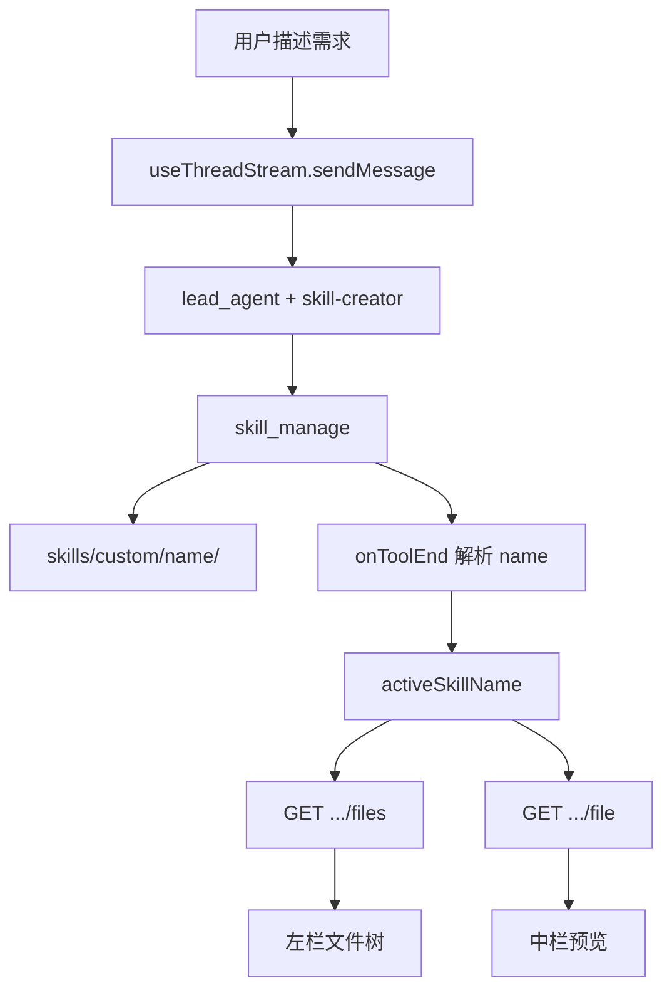

# 通过对话创建 Skill — DeerFlow 设计文档

> 本文档描述 DeerFlow 项目中「对话生成 Skill」工作台的实现规格，与代码库保持一致。
>
> 最后更新：2026-06-04

---

## 一、功能全景

用户在 Skill 管理页点击「AI 创建」，进入三栏工作台，通过 LangGraph 多轮对话生成 custom skill，实时预览文件树与 SKILL.md，满意后一键启用。

```
用户点击「AI 创建」
    → 进入 /workspace/skills/ai-create/new
    → 右栏对话：context.skill_name = "skill-creator"
    → lead_agent 调用 skill_manage 写入 skills/custom/<name>/
    → 左栏文件树 + 中栏预览自动刷新
    → 用户点击「完成」→ PUT /api/skills/{name} 启用 → 返回 Skill 列表
```

---

## 二、布局（对齐原型）

三栏从左到右：**文件树 | 文件预览/编辑 | 对话**。

```
┌──────────────┬────────────────────────────┬─────────────────────────┐
│ ← Skill 名称 │  [SKILL.md ×]  工具栏       │  未命名话题    [新][历史] │
├──────────────┼────────────────────────────┼─────────────────────────┤
│ 文件  🔍 ↻   │                            │                         │
│ .magic/      │  元数据卡片 + Markdown 预览 │  空态 / 消息列表         │
│  skills/     │  或 Textarea 编辑          │                         │
│   SKILL.md   │                            │                         │
│   references/│                            │                         │
├──────────────┤                            │  ┌───────────────────┐  │
│ ⚙ 设置       │                            │  │ 输入框 + 模型选择  │  │
│ 📤 完成      │                            │  └───────────────────┘  │
│  [未发布变更] │                            │                         │
└──────────────┴────────────────────────────┴─────────────────────────┘
```

栏宽可拖拽（`react-resizable-panels`），默认约 22% / 43% / 35%。

---

## 三、技术栈（DeerFlow）

| 层面 | 技术 |
|------|------|
| 框架 | Next.js 16 App Router + React 19 |
| 状态 / 数据 | TanStack Query + React hooks |
| 对话 | LangGraph SDK `useStream`（`useThreadStream`） |
| UI | Tailwind CSS 4 + shadcn/ui |
| Markdown | Streamdown |
| 路由 | `/workspace/skills/ai-create/new`（新建）<br>`/workspace/skills/ai-create/[thread_id]`（已有 thread） |

---

## 四、需求清单

### 4.1 入口

| ID | 需求 | 验收 |
|----|------|------|
| F01 | Skill 管理页「AI 创建」菜单 | 跳转 `/workspace/skills/ai-create/new` |
| F02 | 404 修复 | 上述路由可正常渲染工作台 |

### 4.2 对话（右栏）

| ID | 需求 | 验收 |
|----|------|------|
| F10 | LangGraph 多轮对话 | 复用 `InputBox` + `MessageList` |
| F11 | skill-creator 模式 | `context.skill_name: "skill-creator"` |
| F12 | 空状态 | 「Chat to Build Great Skills」+ 副标题 + 拼图图标 |
| F13 | 过渡动画 | 空态 ↔ 消息列表 `duration-300` 淡入位移 |
| F14 | 首条 prompt 预填 | i18n `inputBox.createSkillPrompt` |
| F15 | thread URL | 首条消息后 `replaceState` → `/ai-create/[thread_id]` |

### 4.3 文件树（左栏）

| ID | 需求 | 验收 |
|----|------|------|
| F20 | 展示 custom skill 目录 | `GET /api/skills/custom/{name}/files` |
| F21 | 展开/收起 | 箭头旋转动画，状态会话内记忆 |
| F22 | 点击打开 Tab | 中栏激活对应文件 |
| F23 | 选中高亮 | 当前文件 `bg-sky-50` |
| F24 | 新增高亮 | agent 写入后短暂「新」标记 |
| F25 | 搜索 / 刷新 | 顶部图标，Query `placeholderData` 防闪烁 |
| F26 | 空态 | 「开始对话以生成 Skill 文件」 |

### 4.4 预览/编辑（中栏）

| ID | 需求 | 验收 |
|----|------|------|
| F30 | 多 Tab | 可关闭，dirty 显示 `•` |
| F31 | SKILL.md 预览 | Streamdown + frontmatter 元数据卡片 |
| F32 | 在线编辑 | Textarea + 保存 → `PUT /api/skills/custom/{name}` |
| F33 | 工具栏 | 复制、刷新、AI 编辑按钮（视觉） |

### 4.5 快捷操作

| ID | 需求 | 验收 |
|----|------|------|
| F40 | 设置 | 弹窗编辑 display_name / description（写回 SKILL.md frontmatter） |
| F41 | 完成 | `PUT /api/skills/{name}` 启用，跳转列表 |
| F42 | 未发布 Badge | 有 custom skill 未启用或有 dirty Tab 时显示琥珀色标签 |

---

## 五、后端能力

### 5.1 配置

`config.yaml`：

```yaml
skill_evolution:
  enabled: true  # 挂载 skill_manage 工具，允许 agent 写 skills/custom/
```

### 5.2 对话路由

无需独立 skill-creator graph。通过 run `context` 白名单键 `skill_name` 强制只加载 public skill `skill-creator`，agent 使用 `skill_manage` 落盘。

`/mnt/skills` 对 sandbox **只读**；禁止用 `write_file` 写 skill 目录。

### 5.3 REST API

| 方法 | 路径 | 用途 |
|------|------|------|
| GET | `/api/skills/custom` | 列表（轮询兜底检测新 skill） |
| GET | `/api/skills/custom/{name}` | 读 SKILL.md |
| GET | `/api/skills/custom/{name}/files` | 文件树列表 |
| GET | `/api/skills/custom/{name}/file?path=` | 读任意 skill 内文件 |
| PUT | `/api/skills/custom/{name}` | 保存 SKILL.md |
| PUT | `/api/skills/{name}` | 启用/禁用 |

`skill_manage` 支持：`create` | `patch` | `edit` | `write_file` | `remove_file` | `delete`。

---

## 六、数据流



**activeSkillName 追踪：**

1. `onToolEnd` 解析 `skill_manage` 的 `input.name` 或输出文案。
2. 兜底：轮询 `GET /api/skills/custom`，取最新 custom skill。
3. 文件变更：`useCustomSkillFiles` 每 3s 轮询 + `placeholderData` 平滑刷新。

---

## 七、前端文件结构

```
frontend/src/
├── app/workspace/skills/ai-create/
│   ├── page.tsx                    # redirect → /new
│   ├── new/
│   │   ├── layout.tsx              # ChatProviders
│   │   └── page.tsx
│   └── [thread_id]/
│       ├── layout.tsx
│       └── page.tsx
├── components/workspace/skills/ai-create/
│   ├── skill-ai-create-workspace.tsx   # 三栏主容器
│   ├── skill-file-tree.tsx
│   ├── skill-file-viewer.tsx
│   ├── skill-conversation-panel.tsx
│   ├── skill-quick-actions.tsx
│   └── utils.ts
└── core/skills/
    ├── api.ts                      # list/read/update custom skill
    └── hooks.ts                      # useCustomSkillFiles 等
```

### Provider 依赖

`ChatProviders`（`SubtasksProvider` + `ArtifactsProvider` + `PromptInputProvider`）+ 页面内 `ThreadContext.Provider`。

---

## 八、UI 样式速查

| 元素 | 类名 |
|------|------|
| 页面背景 | `bg-[#fafafa]` |
| 卡片容器 | `rounded-lg border border-gray-200 bg-white shadow-xs` |
| Skill 名称按钮 | `h-9 rounded-lg border px-2.5 shadow-xs hover:bg-gray-50` |
| 文件选中 | `bg-sky-50 text-sky-700` |
| 新增标记 | `bg-amber-100 text-amber-600` |
| 未发布 Badge | `bg-amber-50 text-amber-500` |
| AI 编辑按钮 | `bg-violet-600 hover:bg-violet-700 text-white` |
| 空态标题 | `font-['Poppins'] text-3xl` |
| 对话过渡 | `transition-all duration-300 ease-out` |

---

## 九、与旧版参考文档的差异

| 旧设计（其他产品） | DeerFlow 现状 |
|-------------------|---------------|
| MobX Store | TanStack Query + hooks |
| `topicMode: SkillCreator` | `context.skill_name: "skill-creator"` |
| `project_id` + topics 文件轮询 | custom skill REST + 3s Query 轮询 |
| `skill_config.yaml` | 无；启用态在 `extensions_config.json` |
| 发布到技能市场 + 审核 | 「完成」= 启用 custom skill |
| 中栏对话 / 右栏详情 | **左树 / 中预览 / 右对话**（对齐原型） |

---

## 十、验证清单

- [ ] `/workspace/skills/ai-create/new` 可打开，三栏布局正常
- [ ] 发送消息后 LangGraph 流式返回
- [ ] agent 创建 skill 后左栏出现文件树，中栏自动打开 SKILL.md
- [ ] 编辑并保存 SKILL.md 成功
- [ ] 「完成」后 skill 在列表中且为启用态
- [ ] `backend/tests/test_skills_custom_router.py` 通过
- [ ] `frontend` `pnpm check` 通过

---

## 十一、开发注意事项

1. **thread 导航**：首条消息后使用 `history.replaceState`，勿用 Next.js `router.push`（避免 stream 状态丢失）。
2. **skill_evolution**：必须为 `true`，否则 agent 无 `skill_manage` 工具。
3. **保存范围**：当前 Gateway 仅 `PUT` 整份 SKILL.md；其他文件只读预览。
4. **InputBox**：必须在 `ThreadContext` + `PromptInputProvider` 内。
5. **文件树性能**：稳定 `key`、Query `placeholderData`、展开态本地 Set 记忆。
