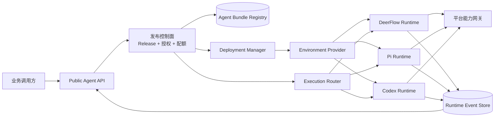
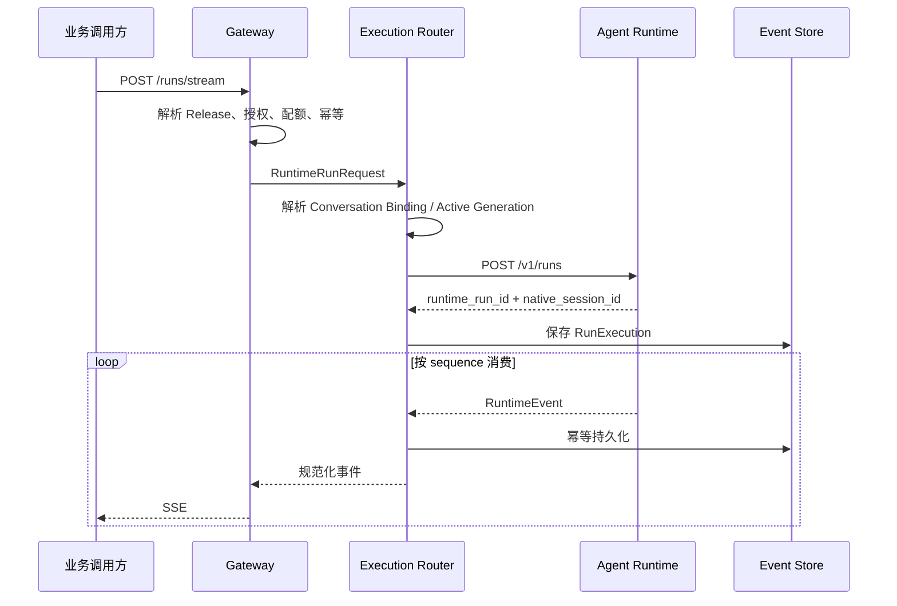
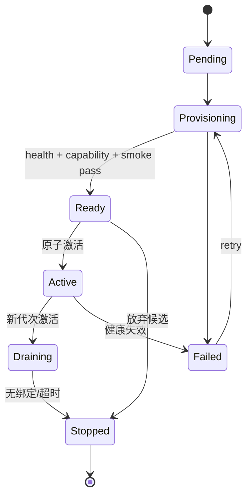
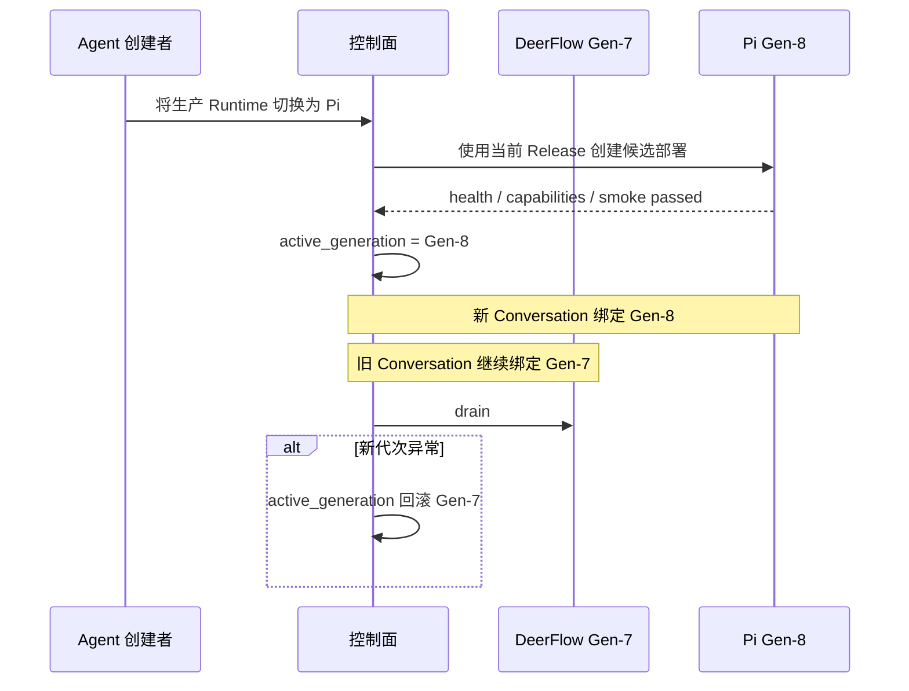

# DeerFlow 可插拔 Agent Runtime 与独立部署架构设计

**状态：** 评审草案

**日期：** 2026-09-15

**适用范围：** DeerFlow 新项目中的“用户创建并发布、供业务系统调用的 Agent”

**相关文档：**

- [现有多租户 Agent 发布方案](./2026-07-12-multi-tenant-agent-publishing-design.md)
- [可交互目标架构图](../../pluggable-agent-runtime-architecture.html)
- [架构图源文件](../../pluggable-agent-runtime-architecture.json)
- [neutree-ai/agent-platform](https://github.com/neutree-ai/agent-platform)
- [fastclaw-ai/fastclaw](https://github.com/fastclaw-ai/fastclaw)

**文档关系：** 本文是现有多租户 Agent 发布方案的第二阶段演进设计。本文明确替代旧方案中“保留共享 DeerFlow/LangGraph 执行平面”和“每 Agent 独立部署不在范围内”的约束；旧方案的 Agent、Release、凭据、配额和业务 API 设计继续有效。

---

## 1. 执行摘要

DeerFlow 已经具备较完整的 Published Agent 控制面：Agent 草稿、不可变 Release、API Key、会话、Run、配额、Skill 和 Connector 授权。当前真正需要重构的不是“重新做一套 Agent 平台”，而是把执行能力从 Gateway 进程和 DeerFlow/LangGraph 实现中拆出来，形成可独立部署、可替换框架、可治理的 Agent 执行面。

本方案的核心结论是：

1. **保留现有 Published Agent、Release 和业务 API，新增独立执行面。** 业务调用方继续使用稳定的 Agent API，不感知底层是 DeerFlow、Pi 还是 Codex。
2. **Release 描述“Agent 是什么”，Deployment 描述“Agent 在哪里、用什么框架运行”。** Runtime 类型不进入业务请求，也不固化到 Agent Release 中。
3. **框架切换是一次蓝绿部署，而不是一次请求参数切换。** 新会话进入新部署代次，已有会话默认继续绑定旧代次，避免原生 Session 状态不兼容。
4. **定义平台自己的 Runtime Protocol 和 Runtime Event。** DeerFlow、Pi、Codex 都通过 Adapter 实现统一协议，框架私有事件不能继续直接泄漏到业务 API。
5. **Agent 配置被打包为不可变、可签名、无长期密钥的 Agent Bundle。** 独立 Runtime 通过短期令牌获取 Bundle，并通过平台能力网关访问模型、MCP、Connector 和 Artifact。
6. **第一阶段先抽接口、不改变行为；第二阶段再把 DeerFlow Runtime 外置。** 这样可以用现有回归测试证明协议边界正确，再接入 Pi 和 Codex。

目标形态不是“Gateway 能启动不同 CLI”，而是“DeerFlow 是控制面和业务入口，DeerFlow/Pi/Codex 是可独立演进的执行引擎”。

## 2. 需要解决的问题

### 2.1 当前耦合

当前 Published Agent 的业务模型与权限模型已经成型，但一条 Run 的后半段仍绑定 DeerFlow/LangGraph：

- `PublishedAgentContext` 同时混合 Agent 定义、调用身份、授权、配额和运行参数；
- `build_published_run_config()` 直接构造 LangGraph `RunnableConfig`；
- Gateway 的 `resolve_agent_factory()` 最终固定到 `make_lead_agent`；
- `_start_run_scoped()` 在 Gateway 内创建本地 `asyncio.Task`；
- `run_agent()` 负责创建 LangGraph Runtime、挂载 checkpointer/store、调用 `agent.astream()` 并翻译事件；
- 当前 `RunManager` 能取消本地 Task，但还不能把“远端 Runtime 的执行句柄”作为一等对象管理；
- Gateway 启动时直接持有 StreamBridge、checkpointer、store、RunEventStore 和 RunManager，控制面与执行面的故障域重叠。

这导致以下业务问题：

- 用户创建的 Agent 不能形成真正独立的运行单元；
- 升级 DeerFlow 或 LangGraph 可能影响全部已发布 Agent；
- 无法在不修改业务入口的前提下切换 Pi、Codex 等执行框架；
- Gateway 扩缩容、重启与 Agent Run 的生命周期相互牵制；
- 框架事件、会话状态和平台事件缺乏稳定边界；
- 运行框架的资源、镜像、版本、健康状态和回滚无法按 Agent 治理。

### 2.2 两类 Agent 必须区分

本设计只针对数据库中的 **Published Agent**，即对业务暴露稳定 `agent_id`、API Key、Conversation 和 Run 的 Agent。

仓库中基于 `users/{user_id}/agents/{name}/`、`config.yaml`、`SOUL.md` 的旧自定义 Agent 属于另一套创作/本地配置机制。它可以作为 Bundle 构建的数据来源之一，但不能继续充当线上部署模型。两者不应在领域模型和接口命名中混用。

## 3. 现状代码边界

| 现有能力 | 代码位置 | 设计判断 |
| --- | --- | --- |
| 稳定 Published Agent 身份 | `backend/packages/harness/deerflow/persistence/published_agent/model.py` | 保留，继续作为业务身份 |
| 不可变 Agent Release | `backend/packages/harness/deerflow/persistence/agent_release/model.py` | 保留，并扩展为 Agent Bundle 的来源 |
| 可信发布上下文 | `backend/packages/harness/deerflow/publishing/context.py` | 拆为定义、授权、运行请求三个对象 |
| LangGraph 运行配置 | `backend/packages/harness/deerflow/publishing/runtime_policy.py` | 下沉到 DeerFlow Runtime Adapter |
| Agent Factory 解析 | `backend/app/gateway/services.py` | 由 Execution Router / Runtime Driver 取代 |
| Run 创建与本地 Task | `backend/app/gateway/services.py` | 改为提交远端执行并持久化 Runtime Handle |
| LangGraph 执行循环 | `backend/packages/harness/deerflow/runtime/runs/worker.py` | 第一阶段包进 LocalDeerFlowDriver，后续移入独立镜像 |
| Sandbox K8s provisioner | `docker/provisioner/app.py` | 继续负责工具沙箱，不直接充当 Agent Deployment Controller |

已有外部接口继续保持：

- `POST /api/v1/agents/{agent_id}/conversations`
- `POST /api/v1/agents/{agent_id}/runs`
- `POST /api/v1/agents/{agent_id}/runs/wait`
- `POST /api/v1/agents/{agent_id}/runs/stream`
- Run 查询与取消接口

本次重构优先改变接口之后的执行路径，不要求业务调用方迁移。

## 4. 参考项目给出的启发

### 4.1 Agent Platform：重点借鉴控制面与执行面

`neutree-ai/agent-platform` 最有价值的部分不是某个 Agent Core，而是它对运行单元的治理方式：

- 控制面通过统一 HTTP/SSE 边界管理不同 Agent Core；
- Agent 类型决定 Runtime 镜像和适配器；
- Environment Provider 抽象 apply/start/stop/destroy/observe/watch；
- 支持静态部署、扩缩容、Session Affinity 和 scale-to-zero；
- 不强行把不同 Core 的原生 Session 视为兼容状态。

本设计采纳它的三层思想：Environment Provider、Runtime Driver、Runtime Adapter。但不直接照搬 Workspace 模型，也不把 Kubernetes 作为第一阶段的前置条件。

### 4.2 FastClaw：重点借鉴业务 API 和事件恢复

`fastclaw-ai/fastclaw` 更接近一个 Agent SaaS 运行内核，其可借鉴点包括：

- 稳定 `agent_id`、用户映射、Session Key、API Key scope 和用量/配额；
- 面向上游业务的 OpenAI 兼容调用方式；
- 非 delta 事件持久化、单调序号、在线 fanout；
- 通过 `Last-Event-ID` 进行断线续传和事件重放；
- Sandbox Executor 与 Agent/Project/Session 作用域的隔离思路。

它的 Agent Manager 和 ReAct Loop 主要运行在同一 Go 进程内，`provider.Provider` 抽象的是模型供应商，并不是任意 Agent 框架，因此不适合作为 DeerFlow 的多 Runtime 边界直接照搬。

此外，FastClaw 的实现复用需要单独做许可证和商业使用评估。本方案只借鉴架构模式与协议语义，不直接复制受限实现。

### 4.3 综合判断

| 议题 | 主要参考 | DeerFlow 中的落点 |
| --- | --- | --- |
| 控制面/执行面分离 | Agent Platform | Deployment Manager + 独立 Runtime |
| 环境生命周期 | Agent Platform | Environment Provider |
| 多框架适配 | Agent Platform | Runtime Driver + Runtime Adapter |
| 业务侧稳定 Agent API | FastClaw + 现有 DeerFlow | 保持现有 Public Agent API |
| 事件序号与断线恢复 | FastClaw | Runtime Event Store + SSE cursor |
| 原生 Session 不兼容 | Agent Platform | Conversation Runtime Binding |
| 工具隔离 | FastClaw + 现有 Sandbox | Runtime 与 Sandbox 分离治理 |

## 5. 目标与非目标

### 5.1 目标

- 一个已发布 Agent 可以拥有独立部署、独立版本、独立资源和独立故障域；
- 同一个 Agent 可以从 DeerFlow 蓝绿切换到 Pi 或 Codex；
- Public Agent API、鉴权、配额、幂等和审计语义保持稳定；
- Runtime 可以部署在 Local、Docker 或 Kubernetes，且 Runtime 类型与运行环境正交；
- Gateway 重启后可以恢复事件消费、查询和取消远端 Run；
- Release、Runtime 镜像和 Deployment Generation 共同构成可审计、可回滚的执行快照；
- Skill、Connector、模型和工具权限在所有 Runtime 中保持平台统一授权；
- 为未来的 scale-to-zero、多副本和 Session Affinity 留出协议与数据模型空间。

### 5.2 非目标

- 第一阶段不实现不同框架原生 Session 的无损透明迁移；
- 第一阶段不同时支持多集群、多云和复杂自动扩缩容；
- 不把 Pi/Codex 的全部私有能力强行压平成完全相同的功能集合；
- 不允许业务调用方在每次 Run 请求中随意指定 Runtime；
- 不重做现有 Agent 发布、API Key、Conversation、配额和渠道系统；
- 不把现有 Sandbox Pod 直接改名为 Agent Runtime Pod；
- 不在 Agent Bundle、容器镜像或环境变量中注入长期 Connector 密钥。

## 6. 核心架构决策

### ADR-01：Runtime 选择属于 Deployment，不属于 Release

Agent Release 应保持执行框架中立，表达指令、模型别名、Skill、工具能力、Connector 授权和策略。Deployment 选择 Runtime Engine、镜像版本、环境、资源规格和副本数。

这样同一 Release 可以先在 DeerFlow 上运行，再用同样的 Bundle 在 Pi 上做兼容性验证。回滚也可以只切换 Deployment Generation，不需要伪造一个业务 Release。

### ADR-02：框架切换采用蓝绿部署

切换 DeerFlow → Pi 时：

1. 创建新的候选 Deployment Generation；
2. 用同一个 Release 构建/复用 Agent Bundle；
3. 启动 Pi Runtime，完成健康检查、能力校验和冒烟 Run；
4. 原子切换 Agent 的 active deployment generation；
5. 新建 Conversation 绑定新代次；
6. 旧 Conversation 默认继续路由到旧代次；
7. 旧代次排空后停止，或保留一段回滚窗口。

切换不是在正在执行的 Run 中更换 Adapter，也不是由请求参数临时决定。

### ADR-03：控制面拥有规范化历史，Runtime 拥有不透明原生 Session

平台数据库保存规范化 Conversation、消息、Runtime Event 和用量。Runtime 可以保存 Pi/Codex/LangGraph 的原生 Session，但平台只把 `native_session_id` 当作不透明句柄。

这使得审计和业务读取不依赖某个框架，同时明确承认不同框架的内部状态不能天然互换。

### ADR-04：Runtime 与 Sandbox 是两个安全边界

Agent Runtime 负责推理循环、会话编排和协议适配；Sandbox 负责执行不可信代码、浏览器、文件操作或其他高风险工具。独立部署 Runtime 不等于允许它访问宿主机。

第一版 Pi/Codex Runtime 可以在每 Agent 独立 Pod 内拥有受限的临时工作目录，但必须非 root、无宿主机挂载、限制网络和资源。需要更高权限的动作继续通过 Sandbox/Tool Gateway 执行。

### ADR-05：事件采用 at-least-once，平台按事件 ID 去重

Runtime Event 必须有单调 `sequence` 和稳定 `event_id`。Runtime 至少保存到平台确认的游标，Gateway/Event Consumer 可以断线重连。协议不追求分布式 exactly-once，而是通过幂等写入和游标实现最终唯一呈现。

## 7. 目标总体架构

完整交互图见 [可交互目标架构图](../../pluggable-agent-runtime-architecture.html)。



### 7.1 控制面

控制面继续运行在 DeerFlow Gateway/API 服务中，负责：

- Agent 草稿与不可变 Release；
- Agent Bundle 构建、签名和版本索引；
- API Key、外部调用身份、配额和幂等；
- Deployment 期望状态、发布激活、回滚和暂停；
- Conversation 到 Deployment Generation 的绑定；
- Run 状态、事件、用量、审计和业务查询；
- 向 Runtime 签发短期 Run Token。

控制面不再直接创建 LangGraph Agent，不持有 Pi/Codex 子进程，也不依赖框架私有 checkpointer 才能回答业务查询。

### 7.2 执行面

执行面由一个或多个独立 Agent Runtime 工作负载组成。每个工作负载包含：

- 统一 Runtime HTTP/SSE Server；
- 对应框架的 Runtime Adapter；
- 原生 Session 管理器；
- Bundle Loader 与摘要/签名校验；
- 平台能力客户端；
- 标准事件转换器；
- 健康、指标和诊断端点。

生产 Published Agent 默认采用 `isolated` 模式：一个 Agent Deployment 对应独立工作负载。后续可增加 `pooled` 模式用于草稿预览或低成本场景，但不能让 pooled 成为协议的隐含前提。

### 7.3 平台能力网关

Runtime 不直接获取创建者的长期 Secret，而是使用 Run Token 调用：

- Model Gateway：模型别名解析、配额、用量和供应商凭据；
- Tool/MCP Gateway：能力白名单、参数审计和 Connector 凭据代理；
- Artifact Service：上传、读取和授权下载；
- Sandbox Service：高风险工具与代码执行；
- Secret Broker：仅在无法代理的场景下签发短期、最小权限凭据。

## 8. 领域模型与职责拆分

### 8.1 拆分 `PublishedAgentContext`

当前上下文承担过多职责，建议拆成三个不可变对象：

```python
@dataclass(frozen=True)
class ResolvedAgentBundle:
    agent_id: str
    release_id: str
    bundle_uri: str
    bundle_digest: str
    required_capabilities: set[str]

@dataclass(frozen=True)
class RunAuthorization:
    owner_user_id: str
    credential_id: str | None
    external_actor_id: str
    allowed_capabilities: set[str]
    quota_reservation_id: str
    expires_at: datetime

@dataclass(frozen=True)
class RuntimeRunRequest:
    run_id: str
    conversation_id: str
    deployment_generation_id: str
    bundle: ResolvedAgentBundle
    authorization_token: str
    input_messages: list[CanonicalMessage]
    native_session_id: str | None
    idempotency_key: str
```

`ResolvedAgentBundle` 是“定义”，`RunAuthorization` 是“本次可以做什么”，`RuntimeRunRequest` 是“执行什么”。Runtime 不接收可以自行扩大权限的 owner、tool 或 connector 覆盖参数。

### 8.2 Agent Bundle

Release 构建后生成内容寻址的 Bundle：

```text
bundle/
├── manifest.json
├── AGENT.md
├── SOUL.md
├── policy.json
├── mcp.json
└── skills/
    ├── research/SKILL.md
    └── reporting/SKILL.md
```

`manifest.json` 示例：

```json
{
  "schema_version": 1,
  "agent_id": "agt_123",
  "release_id": "rel_456",
  "model_alias": "default-reasoning",
  "required_capabilities": ["messages", "streaming", "tools", "artifacts"],
  "optional_capabilities": ["steering", "reasoning_events"],
  "skill_revisions": ["skill_research@sha256:..."],
  "policy_ref": "policy.json"
}
```

Bundle 规则：

- 内容不可变并带 SHA-256 digest；
- 控制面签名，Runtime 拉取后校验；
- 不包含 API Key、Connector Secret、模型供应商密钥；
- Skill 必须固定到具体 revision；
- `model_alias` 由 Model Gateway 解析，避免 Bundle 绑定供应商密钥；
- 可声明必需/可选能力，用于部署前兼容性检查。

### 8.3 Runtime Engine 与 Deployment

- **Runtime Engine**：平台登记的运行引擎类型与版本，如 `deerflow:1.4`、`pi:0.52`、`codex-acp:0.9`。
- **Agent Deployment**：某个 Agent 在某个环境中的稳定部署槽位，如 `production`。
- **Deployment Generation**：一次不可变 rollout，固定 Release、Engine、镜像、资源和协议版本。
- **Conversation Runtime Binding**：Conversation 与 Deployment Generation/native session 的绑定。
- **Run Execution**：平台 Run 与远端 Runtime Run 的映射和恢复信息。

## 9. 三层可插拔接口

### 9.1 Environment Provider：在哪里运行

```python
class EnvironmentProvider(Protocol):
    async def apply(self, spec: DeploymentSpec) -> ObservedDeployment: ...
    async def start(self, deployment_id: str) -> None: ...
    async def stop(self, deployment_id: str) -> None: ...
    async def destroy(self, deployment_id: str) -> None: ...
    async def observe(self, deployment_id: str) -> ObservedDeployment: ...
    async def watch(self, deployment_id: str) -> AsyncIterator[DeploymentEvent]: ...
```

第一阶段实现：

- `LocalProcessEnvironmentProvider`：开发与迁移验证；
- `DockerEnvironmentProvider`：本地/单机生产验证；
- `KubernetesEnvironmentProvider`：生产独立部署。

Environment Provider 只处理工作负载生命周期，不理解 LangGraph、Pi RPC 或 Codex ACP。

### 9.2 Runtime Driver：控制面如何调用

```python
class RuntimeDriver(Protocol):
    async def get_info(self, endpoint: str) -> RuntimeInfo: ...
    async def start_run(self, request: RuntimeRunRequest) -> RuntimeHandle: ...
    async def stream_events(self, handle: RuntimeHandle, after: int) -> AsyncIterator[RuntimeEvent]: ...
    async def get_run(self, handle: RuntimeHandle) -> RuntimeRunStatus: ...
    async def cancel_run(self, handle: RuntimeHandle) -> None: ...
```

Driver 面向统一 Runtime Protocol。正常情况下 DeerFlow、Pi、Codex 可以共用 HTTP Driver；第一阶段保留 `LocalDeerFlowRuntimeDriver`，用于在同进程内调用现有 `run_agent()` 并证明接口拆分不改变行为。

### 9.3 Runtime Adapter：如何驱动具体框架

Adapter 位于独立 Runtime 内部：

- 把 `RuntimeRunRequest` 转换成框架输入；
- 管理框架原生 Session；
- 把 steer、follow-up、cancel 转换成原生命令；
- 把框架事件转换成 `RuntimeEvent`；
- 报告 Capability Matrix 和版本信息；
- 不负责平台 API Key、发布状态和拥有者配额决策。

## 10. Runtime Protocol

### 10.1 服务接口

```text
GET  /v1/info
GET  /v1/health
POST /v1/runs
GET  /v1/runs/{runtime_run_id}
GET  /v1/runs/{runtime_run_id}/events?after={sequence}
POST /v1/runs/{runtime_run_id}/cancel
POST /v1/runs/{runtime_run_id}/steer        # capability 可选
```

`GET /v1/info` 至少返回：

```json
{
  "protocol_version": "1.0",
  "runtime_type": "pi",
  "runtime_version": "0.52.0",
  "adapter_version": "1.0.0",
  "capabilities": {
    "streaming": true,
    "tools": true,
    "artifacts": true,
    "steering": true,
    "session_resume": true,
    "reasoning_events": true
  }
}
```

### 10.2 创建 Run

```json
{
  "run_id": "run_platform_123",
  "conversation_id": "conv_123",
  "deployment_generation_id": "dgen_9",
  "bundle": {
    "uri": "https://bundle-gateway/...",
    "digest": "sha256:..."
  },
  "authorization_token": "short-lived-jwt",
  "native_session_id": null,
  "input_messages": [
    {"role": "user", "content": [{"type": "text", "text": "..."}]}
  ],
  "idempotency_key": "...",
  "event_callback": null
}
```

响应：

```json
{
  "runtime_run_id": "rrun_abc",
  "native_session_id": "pi_session_xyz",
  "accepted_at": "2026-09-15T10:00:00Z",
  "event_cursor": 0
}
```

### 10.3 标准事件信封

```json
{
  "schema_version": 1,
  "event_id": "evt_01K...",
  "sequence": 42,
  "run_id": "run_platform_123",
  "conversation_id": "conv_123",
  "runtime_type": "pi",
  "type": "tool.completed",
  "timestamp": "2026-09-15T10:00:01Z",
  "visibility": "public",
  "payload": {}
}
```

首批事件类型：

- `run.started`、`run.completed`、`run.failed`、`run.cancelled`；
- `message.started`、`message.delta`、`message.completed`；
- `reasoning.delta`、`reasoning.completed`；
- `tool.started`、`tool.updated`、`tool.completed`、`tool.failed`；
- `question.requested`；
- `artifact.created`；
- `usage.updated`；
- `status.updated`。

事件约束：

- `sequence` 在单个 Runtime Run 内严格单调递增；
- 同一事件重放时 `event_id` 不变；
- Runtime 至少提供一段可配置的重放窗口；
- Gateway 按 `(run_id, event_id)` 幂等落库；
- SSE 使用 `event_id`/`sequence` 作为游标；
- delta 可以不长期保存，但完成态消息、工具结果、错误、用量必须持久化；
- `visibility=internal` 的推理或诊断事件不能直接返回给业务调用方。

### 10.4 前端兼容

当前前端和 StreamBridge 仍理解 LangGraph 的 `values`、`messages-tuple` 和 `custom` 模式。迁移期新增：

```text
RuntimeEvent -> LegacyLangGraphEventProjector -> 现有 StreamBridge / 前端
```

新的业务协议只依赖 RuntimeEvent。待前端切换完成后再移除兼容投影，避免把 LangGraph 事件重新定义成平台标准。

## 11. Run 执行与恢复

### 11.1 正常执行



### 11.2 Gateway 重启恢复

当前本地 `asyncio.Task` 不能再作为 Run 是否存在的依据。`run_executions` 是恢复索引：

- Gateway/Event Consumer 启动时扫描 `accepted/running/cancelling`；
- 根据 `runtime_endpoint + runtime_run_id + last_event_sequence` 重连；
- 先查询远端状态，再从最后游标继续消费；
- Runtime 已完成时补拉尾部事件并收敛平台状态；
- Runtime 不可达时进入 `runtime_unreachable`，不立刻错误地标记业务 Run 失败；
- 超过恢复窗口且无心跳后，由 reconciliation job 决定失败、重试或人工介入。

### 11.3 取消

取消流程从“设置本地 abort event”改为：

1. 平台将 Run 状态变更为 `cancelling`；
2. 通过 Driver 调用 Runtime cancel；
3. Runtime 终止原生 Run/子进程并发送 `run.cancelled`；
4. 平台幂等释放并发槽和未消费配额；
5. 超时后记录 `cancel_timeout`，由调和器继续处理。

## 12. 部署模型

### 12.1 状态机



`desired_state` 和 `observed_state` 分离。API 写入期望状态，Deployment Reconciler 通过 Environment Provider 收敛实际状态。

### 12.2 发布与激活

现有发布逻辑会创建 Release 后直接切换 `current_release_id`。外置 Runtime 后应调整为：

1. 创建不可变 Release；
2. 构建并签名 Bundle；
3. 创建候选 Deployment Generation；
4. 调和到 Ready；
5. 在一个数据库事务中更新：
   - `agent_deployments.active_generation_id`；
   - `published_agents.active_deployment_id`；
   - 为兼容现有代码同步更新 `current_release_id`；
6. 旧 Generation 进入 Draining。

因此，“发布”在产品界面上可以仍是一个动作，但后端必须区分 Release Created、Deployment Ready 和 Agent Activated。

### 12.3 框架切换



### 12.4 扩缩容边界

建议顺序：

1. 静态单副本独立部署；
2. 单副本 scale-to-zero；
3. 多副本 + Conversation Affinity；
4. 基于排队长度、并发 Run 和冷启动成本的自动扩缩容。

多副本前必须明确原生 Session 存储策略：共享存储、外部 Session Store，或通过一致性哈希/StatefulSet ordinal 固定副本。不能只增加 replicas 而忽略 Pi/Codex 子进程和本地 session-dir 的归属。

## 13. 会话绑定与跨框架迁移

### 13.1 默认策略：pinned

Conversation 第一次运行时绑定当前 active Deployment Generation：

```text
conversation_id -> deployment_generation_id -> runtime_type -> native_session_id
```

后续 Run 必须沿用该绑定。这样可以保证框架私有上下文、工作目录和工具状态连续。

### 13.2 可选策略：recreate

如果创建者要求把旧 Conversation 迁移到新 Runtime，只能执行显式“重建”：

1. 从平台规范化历史生成消息记录与可选摘要；
2. 创建新的 Runtime Session；
3. 注入允许迁移的历史和 Artifact 引用；
4. 记录 `migrated_from_binding_id` 和迁移边界；
5. 向调用方明确这是重建，不承诺原生状态等价。

不迁移的内容可能包括框架内部 planning state、未落库的 tool state、隐藏推理、进程内缓存和未上传的本地文件。

## 14. Runtime Adapter 设计

### 14.1 DeerFlow Adapter

第一步不拆进程，只新增 `LocalDeerFlowRuntimeDriver`：

- 包装现有 `build_published_run_config()`、`make_lead_agent` 和 `run_agent()`；
- 立即把输出转换为 RuntimeEvent；
- Public API 通过 Execution Router 调用 Driver；
- 建立新旧路径的契约测试。

接口稳定后构建 `deerflow-runtime` 镜像，把 Harness、LangGraph graph、checkpointer 适配和事件转换移入独立服务。Gateway 不再 import 具体 graph factory。

### 14.2 Pi Adapter

Pi 官方 RPC 模式适合被 Runtime Server 包装：

- Runtime 内按 Conversation/Session 管理 `pi --mode rpc` 子进程；
- 使用 JSONL stdin/stdout 发送 `prompt`、`steer`、`follow_up`、`abort`、`get_state` 等命令；
- `--session-dir` 放在受控持久卷或按会话分区的目录；
- 将 turn、message、tool execution 更新转换成 RuntimeEvent；
- 子进程退出时区分正常完成、用户取消、适配器错误和 Runtime OOM；
- 并发上限由 Runtime Pod 资源与 Session Process Pool 共同控制。

### 14.3 Codex Adapter

Codex Runtime 采用与 Agent Platform 类似的 ACP/桥接思路：

- Runtime Server 为每个 Session 管理 `codex-acp` 或等价桥接进程；
- 平台协议终止在 Runtime Server，不让 Gateway 直接管理 Codex 子进程；
- 将 ACP session/update、tool call、permission 和 completion 转换为 RuntimeEvent；
- 原生 session storage 与 Deployment Generation 一起管理；
- Codex 特有能力通过 Capability Matrix 暴露，不把私有事件字段带入平台核心模型。

### 14.4 Capability Matrix

部署前必须校验 Bundle 所需能力：

| 能力 | DeerFlow | Pi | Codex | 处理策略 |
| --- | --- | --- | --- | --- |
| message streaming | 必须 | 必须 | 必须 | 缺失则禁止部署 |
| tool calling | 必须 | 必须 | 必须 | 统一走 Tool Gateway |
| artifact | 支持 | 适配 | 适配 | 转平台 Artifact 引用 |
| steering | 可选 | 支持 | 依实现 | UI 按 capability 显示 |
| native session resume | 支持 | 支持 | 支持 | 只保证同 Runtime/Generation |
| reasoning events | 支持 | 支持 | 支持 | 受 visibility 策略约束 |
| sub-agent | DeerFlow 特有能力 | 视 Pi 能力 | 视 Codex 能力 | 不作为首版最小公分母 |

## 15. 数据模型

### 15.1 `runtime_engines`

| 字段 | 说明 |
| --- | --- |
| `id` | 引擎版本标识 |
| `runtime_type` | `deerflow` / `pi` / `codex` |
| `runtime_version` | 原生框架版本 |
| `adapter_version` | Adapter 版本 |
| `image_ref` | 固定 digest 的镜像 |
| `protocol_version` | Runtime Protocol 版本 |
| `capabilities_json` | 能力矩阵 |
| `config_schema_json` | 可配置项 schema |
| `status` | active/deprecated/disabled |

### 15.2 `agent_deployments`

一个 Agent 在一个环境中的稳定部署槽位。

| 字段 | 说明 |
| --- | --- |
| `id` | Deployment ID |
| `agent_id` | Published Agent |
| `environment_id` | local/docker/k8s 环境 |
| `name` | 如 production/staging |
| `desired_state` | running/stopped/destroyed |
| `observed_state` | provisioning/ready/active/draining/failed |
| `active_generation_id` | 当前承接新会话的代次 |
| `candidate_generation_id` | 正在发布的候选代次 |
| `last_error` | 结构化错误摘要 |
| `spec_version` / `observed_version` | 调和版本 |

### 15.3 `agent_deployment_generations`

| 字段 | 说明 |
| --- | --- |
| `id` | 不可变代次 ID |
| `deployment_id` | 所属部署槽位 |
| `generation` | 单调递增整数 |
| `release_id` | 固定 Agent Release |
| `runtime_engine_id` | 固定 Runtime Engine |
| `bundle_digest` | 固定 Bundle |
| `runtime_mode` | isolated/pooled |
| `resource_spec_json` | CPU/内存/临时盘等 |
| `endpoint` | Runtime 服务地址 |
| `created_at` / `ready_at` / `drained_at` | 生命周期时间 |

### 15.4 `conversation_runtime_bindings`

| 字段 | 说明 |
| --- | --- |
| `conversation_id` | 唯一 Conversation |
| `deployment_generation_id` | 固定部署代次 |
| `runtime_type` | 冗余审计字段 |
| `native_session_id` | 框架不透明 Session ID |
| `binding_status` | active/migrated/closed/orphaned |
| `migrated_from_binding_id` | 显式重建来源 |
| `created_at` | 绑定时间 |

### 15.5 `run_executions`

| 字段 | 说明 |
| --- | --- |
| `run_id` | 平台 Run ID，唯一 |
| `deployment_generation_id` | 执行代次 |
| `runtime_run_id` | 远端 Runtime Run ID |
| `native_session_id` | 本次返回的 Session ID |
| `runtime_endpoint` | 可恢复调用地址 |
| `last_event_sequence` | 已持久化游标 |
| `execution_status` | accepted/running/cancelling/terminal/unreachable |
| `lease_owner` / `lease_expires_at` | 事件消费者租约 |
| `heartbeat_at` | Runtime/Consumer 心跳 |

### 15.6 现有表变更

- `published_agents.active_deployment_id`；
- 保留 `current_release_id`，在激活事务中与 active generation 的 `release_id` 保持一致；
- 现有 Run 表增加或关联 `run_execution_id`；
- Event Store 增加 `(run_id, event_id)` 唯一约束和 `sequence` 索引；
- 审计表记录 release、generation、engine、image digest 和 protocol version。

## 16. 安全设计

### 16.1 短期 Run Token

控制面为每次 Run 签发短期 Token，建议包含：

- `agent_id`、`release_id`、`deployment_generation_id`；
- `run_id`、`conversation_id`；
- 允许的 capability/tool/connector scope；
- Bundle digest；
- audience、issuer、过期时间和 nonce。

Runtime 和平台能力网关都校验 Token。Token 不能换取其他 Agent 的资源，也不能在 Run 结束后长期使用。

### 16.2 工作负载隔离

- 每 Agent Deployment 使用独立 ServiceAccount/Workload Identity；
- 容器 non-root、只读 root filesystem、禁止 privileged；
- 禁止宿主机目录和 Docker socket 挂载；
- 设置 CPU、内存、进程数和临时盘限额；
- NetworkPolicy 默认拒绝，只允许控制面、能力网关、遥测和必要出站；
- Bundle 拉取使用一次性或短期签名 URL；
- 控制面到 Runtime 使用 mTLS 或集群 workload identity；
- Runtime 镜像固定 digest，并记录 SBOM/签名验证结果。

### 16.3 Secret 原则

- Connector 长期 Secret 保留在控制面/Secret Store；
- 优先由 Tool/MCP Gateway 代调用，Runtime 只看到结果；
- 模型供应商密钥由 Model Gateway 持有；
- 无法代理时只签发最小权限、短时有效的凭据；
- 日志、RuntimeEvent、Bundle 和 Artifact metadata 必须做 Secret/PII 清洗。

## 17. 可靠性与可观测性

### 17.1 关键指标

- `deployment_reconcile_total{runtime_type,result}`；
- `deployment_ready_seconds{runtime_type}`；
- `runtime_run_total{agent_id,runtime_type,status}`；
- `runtime_run_duration_seconds`；
- `runtime_event_lag_seconds`；
- `runtime_event_replay_total`；
- `runtime_disconnect_total`；
- `runtime_process_restart_total`；
- `conversation_binding_total{runtime_type,status}`；
- `capability_denied_total{capability}`；
- `bundle_verify_failure_total`。

### 17.2 Trace 关联

控制面、Runtime、Model/Tool Gateway 和 Sandbox 统一传播：

```text
correlation_id
agent_id
release_id
deployment_generation_id
run_id
conversation_id
runtime_run_id
native_session_id
```

外部响应只暴露安全的 correlation ID，不暴露内部 endpoint、镜像、owner ID 和 native session。

### 17.3 初始 SLO 建议

- 已在运行的 Runtime，Run 接受成功率 ≥ 99.9%；
- 事件游标恢复成功率 ≥ 99.9%；
- 正常取消在配置超时内收敛；
- Deployment 激活必须在 health、capability、smoke 三项通过后完成；
- 任一候选部署失败不能影响当前 active generation；
- 控制面重启不能丢失已持久化完成态事件。

具体数值需要结合现网基线确认，第一阶段先完成指标采集再固化告警阈值。

## 18. 失败模型与处理

| 故障 | 平台行为 |
| --- | --- |
| Runtime 创建失败 | 候选 Generation 标记 failed，不切 active 指针 |
| Runtime 健康检查失败 | 停止接收新会话；已有 Run 按恢复策略处理 |
| Gateway 与 Runtime 断连 | 使用 sequence 重连，不重复呈现已落库事件 |
| Gateway 重启 | 通过 run_executions 和租约恢复消费 |
| Runtime 进程重启 | 同 Generation 内尝试原生 Session 恢复；失败则明确 run/session 错误 |
| Bundle digest 不匹配 | 拒绝启动 Run，记录安全审计 |
| Capability 不满足 | 部署前失败，不把不兼容留到业务 Run |
| Tool Gateway 超时 | 产生标准 tool.failed，保留原生诊断为 internal |
| 旧 Generation 无法排空 | 达到策略阈值后人工处理或显式迁移/终止 |
| 事件重复 | Event Store 唯一约束去重 |
| 事件序号缺口 | 暂停推进游标，重拉缺口或将 Run 标为需要调和 |

## 19. API 与产品面变化

### 19.1 外部业务 API

保持现有路径和主体结构。可增补但不强制业务感知：

- Run 元数据中的安全 `runtime_status`；
- SSE 的稳定 `id` 字段用于重连；
- 标准错误码：`agent_deploying`、`runtime_unavailable`、`runtime_incompatible`；
- 不返回 runtime endpoint、native session、镜像和内部 Release。

### 19.2 Agent Studio/运维面

新增：

- Runtime Engine 选择；
- 当前 Runtime、版本、Deployment 状态和最近错误；
- 发布前 Capability Compatibility 报告；
- 候选部署、激活、回滚、停止和重新部署；
- Conversation 分布：旧/新 Generation 的绑定数量；
- Draining 进度；
- Runtime 级日志、指标和测试 Run。

产品文案应明确区分：

- “保存草稿”；
- “创建 Release”；
- “部署候选版本”；
- “激活为线上版本”；
- “切换运行框架”。

## 20. 实施路线

### 阶段 0：协议与代码边界

交付：

- `RuntimeRunRequest`、`RuntimeEvent`、`RuntimeHandle`；
- `RuntimeDriver`、`ExecutionRouter` 接口；
- `LocalDeerFlowRuntimeDriver` 包装现有执行路径；
- `PublishedAgentContext` 逐步拆分；
- 契约测试证明 Public Agent API 行为不变。

退出条件：业务 API 全量回归通过，Gateway 主流程不再直接选择 graph factory。

### 阶段 1：统一事件与恢复

交付：

- RuntimeEvent Store、单调 sequence 和幂等约束；
- LegacyLangGraphEventProjector；
- RunExecution、远端 Handle 和恢复游标；
- 取消、Gateway 重启恢复和断线重放测试。

退出条件：本地 DeerFlow 路径已完全通过新事件协议运行。

### 阶段 2：外置 DeerFlow Runtime

交付：

- `deerflow-runtime` 镜像和 HTTP/SSE Server；
- Docker Environment Provider；
- Bundle 拉取/校验；
- 平台能力网关最小闭环；
- 单 Agent 独立部署与回滚。

退出条件：至少一个 Published Agent 脱离 Gateway 进程独立运行，Gateway 重启不终止其 Run。

### 阶段 3：Deployment Control Plane

交付：

- Runtime Engine、Deployment、Generation、Conversation Binding 数据模型；
- Deployment Reconciler；
- Kubernetes Environment Provider；
- Ready 后原子激活、蓝绿和 Draining；
- Studio/运维接口。

退出条件：DeerFlow → DeerFlow 新版本可以完整蓝绿切换和回滚。

### 阶段 4：Pi Runtime

交付：

- Pi RPC Adapter 与 Session Process Manager；
- Pi Capability Matrix；
- Pi 事件、取消、steer、Session 恢复；
- DeerFlow → Pi 框架切换验证。

退出条件：同一 Release 可在 DeerFlow/Pi 部署，旧会话固定、 新会话切换、回滚均通过。

### 阶段 5：Codex Runtime

交付：

- Codex ACP Adapter；
- permission/tool/artifact 事件映射；
- Session 生命周期与恢复；
- Pi/DeerFlow/Codex 三引擎兼容性报告。

### 阶段 6：成本与规模优化

- scale-to-zero 与冷启动排队；
- 多副本 Session Affinity；
- pooled draft runtime；
- 事件总线替代 Gateway 内轻量 event pump；
- 多集群与容量调度。

## 21. 测试策略

### 21.1 契约测试

所有 Runtime Adapter 共用同一套黑盒测试：

- info/health；
- create/get/cancel Run；
- message/tool/artifact/usage 标准事件；
- sequence 单调、断线重放、重复事件去重；
- 同一 idempotency key 不重复创建 Run；
- 不支持的 capability 返回标准错误；
- Token 过期、错误 audience、错误 agent scope 被拒绝。

### 21.2 兼容回归

- Public Agent API 同步、异步、SSE 三种模式；
- API Key scope、配额预留/结算、审计；
- Skill 固定 revision；
- Connector 能力代理；
- Artifact 可见性；
- 现有 LangGraph 前端事件投影。

### 21.3 故障注入

- Gateway 在 Run 中途重启；
- Runtime 在 tool call 前后重启；
- 网络断开后恢复；
- 事件重复、乱序和缺口；
- 部署 readiness 失败；
- 候选 Generation 失败时 active generation 持续服务；
- scale-to-zero 冷启动超时；
- cancel 与 completed 竞态。

### 21.4 安全测试

- Bundle 篡改；
- 跨 Agent Token 重放；
- Tool/Connector 越权；
- Runtime 访问宿主机和非许可网络；
- 日志/事件 Secret 泄漏；
- 恶意 Skill、Prompt 和工具参数隔离。

## 22. MVP 验收标准

满足以下条件才算完成“独立部署 + 可切换框架”的最小闭环：

1. 现有业务 API 不增加 runtime 参数，已有调用方不改代码；
2. 一个 Published Agent 可以独立部署为 DeerFlow Runtime；
3. Gateway 重启不终止 Runtime，重启后可以继续读取事件；
4. 同一 Agent Release 可以创建 Pi 候选部署并完成 capability/smoke 校验；
5. 激活 Pi 后，新 Conversation 进入 Pi，旧 Conversation 仍进入原 DeerFlow Generation；
6. Pi 候选或激活后异常可以原子回滚；
7. Run cancel 可以终止远端原生执行并正确释放配额；
8. 事件重放不产生重复业务消息；
9. Bundle、镜像和部署代次可审计，Bundle 不包含长期 Secret；
10. DeerFlow 与 Pi 通过同一 Runtime 契约测试；
11. Runtime Pod 无宿主机权限，模型和 Connector 凭据由平台代理；
12. 运维面能看到部署状态、运行框架、版本、错误、Run 和 Draining 数量。

Codex 接入可作为紧接 MVP 的下一里程碑，但协议和数据模型必须在 MVP 中为其预留，不得通过 Pi 特例实现。

## 23. 风险与取舍

| 风险 | 影响 | 缓解方式 |
| --- | --- | --- |
| 每 Agent 独立部署成本高 | 空闲资源浪费、冷启动 | 先支持静态规格，后加 scale-to-zero/pooled draft |
| 多框架能力不对齐 | 同一 Release 行为不完全一致 | Capability Matrix + 部署前校验 + 明确可选能力 |
| 原生 Session 不可迁移 | 切换后旧会话滞留 | 默认 pinned，提供显式 recreate 和 Draining 策略 |
| 事件协议设计过度抽象 | 丢失框架特性 | 标准核心事件 + namespaced extension，禁止核心依赖扩展 |
| Gateway event pump 仍有耦合 | 大规模下连接数高 | MVP 用可恢复 pump，后续引入消息总线 |
| Runtime 镜像供应链复杂 | 安全与版本碎片 | 镜像 digest、签名、SBOM、Engine Registry、弃用策略 |
| Pi/Codex 进程与本地文件状态 | 多副本恢复复杂 | MVP 单副本；多副本前先完成 Session Affinity/共享状态 |
| 工具直接在 Runtime 执行 | 逃逸与数据泄漏 | 限制本地能力，高风险动作走 Sandbox/Tool Gateway |

## 24. 待评审决策

以下问题需要在详细实施前定案：

1. **第一生产环境：** 先 Docker 单机验证还是直接 Kubernetes？建议协议不绑定环境，生产实现优先 Kubernetes。
2. **MVP 隔离粒度：** 是否确认 Published Agent 默认一 Agent 一 Runtime 工作负载？本方案按“是”设计。
3. **Pi/Codex 本地 shell：** 只允许 Runtime Pod 内受限工作区，还是所有 shell 都强制经 Sandbox？建议按工具风险分级，宿主机访问始终禁止。
4. **事件保留：** delta 的重放窗口、完成态事件长期保留周期分别是多少？
5. **旧会话排空：** 允许旧 Generation 保留多久，超期后关闭还是显式 recreate？
6. **模型调用：** 第一版是否必须完成统一 Model Gateway，还是允许 Runtime 使用短期供应商 Token？建议优先 Gateway。
7. **发布 UX：** “发布 Release”和“部署激活”在产品上是一个按钮还是两个高级动作？后端必须保持两阶段。
8. **Codex 接入方式：** 采用 ACP 桥接进程还是其他受支持协议，需要在落地时根据选定 Codex 版本验证。
9. **FastClaw 借鉴边界：** 若复用任何源码或组件，需要法务确认许可证和商业服务限制。

## 25. 推荐评审顺序

跨团队沟通时建议依次确认：

1. 是否接受“Release 与 Deployment 分离”；
2. 是否接受“框架切换是蓝绿部署，旧会话默认 pinned”；
3. 是否接受“Public API 稳定，Runtime 统一 HTTP/SSE 协议”；
4. 是否接受“Runtime 和 Sandbox 分离，Secret 由平台代理”；
5. 确认 MVP 只做单副本独立部署，不提前承诺无状态多副本；
6. 最后再讨论 Kubernetes、Pi/Codex 具体 Adapter 和 UI 排期。

如果前四项不能达成一致，直接讨论某个 Runtime 的进程启动方式意义不大，因为系统仍会退化为 Gateway 对多个框架的硬编码集成。

## 26. 最终建议

DeerFlow 下一步应把现有 Published Agent 能力定位为 **Agent Control Plane**，而不是继续扩展一个越来越大的 LangGraph 执行入口。以 `ExecutionRouter + DeploymentManager + Runtime Protocol + Agent Bundle` 为核心建立执行边界，再按 Local DeerFlow、外置 DeerFlow、Pi、Codex 的顺序演进。

这一方案既保留现有发布、鉴权、配额和业务 API 的投入，也能让用户创建的 Agent 成为真正可部署、可升级、可回滚的运行单元。最重要的是，它把“切换框架”从一次危险的代码分支，变成了平台可观测、可验证、可回滚的部署操作。
